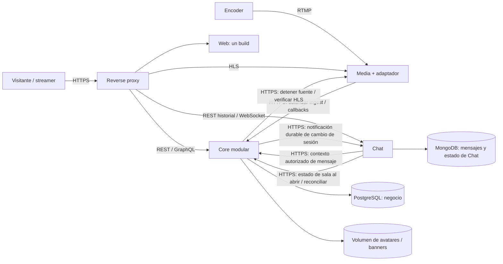

# Arquitectura de STREAMING

**Decisión:** [ADR-003](adr/ADR-003-servicios-cohesivos.md). **Alcance:** P1 y evolución.

## Unidades de ejecución

| Unidad | Responsabilidad y datos | Motivo de la frontera |
| --- | --- | --- |
| Web | Una aplicación y un build; rutas, formularios, player, chat y accesibilidad. Lenguaje candidato TypeScript; selección pendiente de ADR frontend. | Interfaz de usuario; los módulos de UI no son microfrontends. |
| Core | Núcleo modular Java/Spring: cuentas (autenticación y perfil), canales, catálogo, control de emisiones y consultas de descubrimiento. Una base PostgreSQL, un gestor de transacciones, un release. | Cuenta–perfil–canal y canal–configuración–catálogo requieren integridad local. La carga P1 no justifica distribuirlos. |
| Chat | Servicio de tiempo real; salas, mensajes, deduplicación, cuota global por cuenta, secuencias, historial y moderación/replay futuros. Go y MongoDB son candidatos compatibles con los requisitos; selección pendiente de ADR Chat. | Conexiones largas, fan-out, carga y fallo independientes del video y las APIs de negocio; uso NoSQL real para historial por sesión. |
| Media | Ingesta RTMP, HLS, detección de fuente, validación de reproducción y adaptación al contrato de Core. | Procesamiento audiovisual, ancho de banda, códecs y reinicio diferentes. No posee usuarios, sesiones de negocio ni permisos. Motor aún candidato: ADR multimedia pendiente. |
| Reverse proxy | Entrada HTTPS, encaminamiento, límites de transporte, Upgrade WS, forwarding confiable. | Infraestructura; no compone reglas de negocio ni coordina transacciones. |

Core y Chat son los dos procesos propios de lógica comunicados por HTTP. No es necesario contar el
motor multimedia, bases o proxy como lógica para satisfacer RNF-001/003. Los candidatos TypeScript, Java y Go deberán
aparecer en código real para cerrar RNF-007; esta tabla no acredita implementación. Se conserva la
interfaz GraphQL de descubrimiento por compatibilidad, implementada en Core sin otro runtime Kotlin.
REST y GraphQL sobre HTTP y WebSocket Upgrade se evidencian; la interpretación académica de RNF-006
sigue pendiente de confirmación del evaluador. SQL/YAML/HTML/CSS no cuentan como lenguajes generales.

## Vista C4/C&C

Dentro de Core, cuentas incluye Identity y Profile como responsabilidades internas; Canales,
Catálogo, Emisiones y Consultas son módulos. Una llamada local usa una interfaz de aplicación, no HTTP,
secretos de servicio, colas ni proyecciones de activación. Los repositorios permanecen encapsulados.
Una consulta pública de Core puede usar joins/vistas SQL revisados para leer información de varios
módulos; solo el dueño escribe sus tablas. Las claves foráneas dentro de PostgreSQL son deseables.
Chat nunca lee PostgreSQL; Core nunca lee MongoDB. No hay transacciones entre ambos almacenes.

## Invariantes y coordinación

- Registro: una transacción crea cuenta ACTIVE, perfil por defecto, canal y resultado idempotente.
  O todo confirma o nada queda público. No existen nuevos registros PENDING, saga de provisión,
  compensación ni cola de activación. Login sigue separado. IDs RF y límites de credenciales se conservan.
- Emisión: configuración, propiedad del canal, IDs de catálogo, cupos y estado se validan dentro de Core.
  `streamId` persiste; `sessionId` cambia por emisión. La disponibilidad viene de evidencia de Media.
- Descubrimiento: lectura SQL local paginada sobre cuentas/canales/metadata/leases; no índice distribuido
  ni suscripciones de identidad/perfil/canal/conteo. Los campos de frescura reflejan observaciones de
  Media y leases, no atraso de una réplica de Discovery.
- Chat: cada envío nuevo solicita a Core un contexto que verifica sesión de usuario, estado de emisión,
  autor público y timeline en una operación. Se conserva revocación en la siguiente autorización sin
  caché de permisos; se evita el recorrido por Identity, Profile y Streaming separados.
- Eventos de ciclo de vida Core→Chat solo facilitan `chat.ready`/READ_ONLY y avisos a conectados; no
  autorizan escrituras. Su caída no bloquea HLS; una autorización nueva consulta al dueño de estado.
- Integración es trabajo de contratos, infraestructura y evidencia. No es un servicio, workflow engine,
  BFF distribuido ni orquestador central. Core ejecuta casos de uso de datos que posee.

## Despliegue y aislamiento

Topología: proxy, Web, Core, Chat, Media, PostgreSQL y MongoDB. Core monta el volumen de
imágenes; Media necesita su almacenamiento de segmentos. Solo HTTPS web y listener RTMP son públicos.
Core escucha por defecto en 8081; Chat reserva 8085; Web reserva 3000. Los listeners HLS/RTMP finales
se fijarán en ADR multimedia. `/internal/*` no es accesible por el listener público; servicios usan TLS
privado y credenciales específicas por operación/consumidor. Las bases no exponen puertos públicos.

Core agrupa su reinicio, build y disponibilidad. No se promete reiniciar Profile/Taxonomy por separado.
Chat se escala independientemente; Media se dimensiona por bitrate/CPU. Más de una réplica Core exige
volumen compartido de imágenes y coordinación SQL del control de sesión; no basta replicar contenedores.
P1 parte de una réplica por proceso; los ejercicios de capacidad se diseñan antes de declarar RNF-015/016.
Una réplica adicional de Chat requiere orden por sala, dedupe y cuota compartidos; MongoDB por sí solo
no distribuye WebSockets. La implementación deberá demostrar partición/propietario de sala y fan-out.

Si Core cae, las APIs y nuevas autorizaciones de Chat/RTMP fallan cerradas; Media puede continuar una
reproducción existente mientras conserva la fuente, sin afirmar garantía de disponibilidad infinita.
Si Chat cae, HLS sigue. Una excepción de una consulta Discovery se aísla de otros endpoints; una caída
del proceso Core afecta todo Core. Se acepta ese alcance para P1 y no se vende aislamiento ficticio.

## Evidencia pendiente

Construir Chat/Web/Media e implementar catálogo, búsqueda y control de emisión en Core. Generar
schemas desde contratos, cerrar ADR multimedia/transporte, completar despliegue y medir el perfil de
SPEC-13. Los criterios de entrega se verifican por unidad y módulo, según SPEC-13.

Las lecturas SQL entre módulos Core usan vistas/proyecciones de lectura publicadas por el dueño,
columnas explícitas y permisos de solo lectura; no acceso irrestricto a tablas privadas. Son contrato
local versionado/revisado según RNF-041/042 y excluyen credenciales/secretos.
