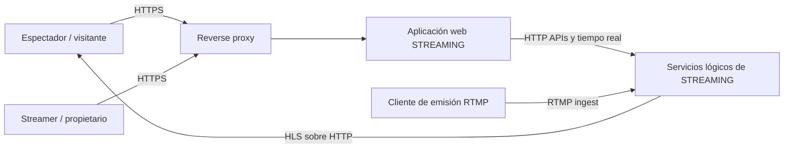
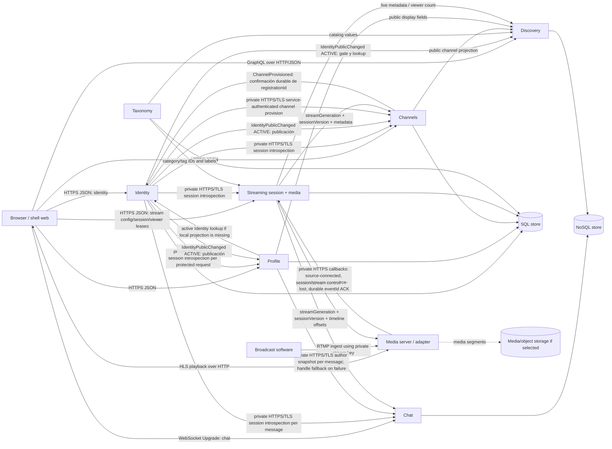

# Arquitectura C&C y despliegue — STREAMING

**Estado:** propuesta arquitectónica para revisión del equipo; no impone tecnologías por módulo.
**Alcance:** primera iteración; consultar [decisiones P1](decisiones_alcance_p1.md) y [mapa de módulos y SPEC](mapa_sdd_p1.md).

## Propósito y restricciones

Este documento hace explícitas las fronteras lógicas, responsabilidades, conectores y despliegue que
las SPEC por dominio deben respetar. Un módulo describe una responsabilidad; no implica por sí mismo
un microservicio ni un contenedor separado.

Las restricciones de la entrega que se deben evidenciar en la vista final son:

- frontend web;
- al menos dos procesos/componentes de lógica que se comuniquen por red;
- datos SQL relacionales y NoSQL, ambos con uso real y justificado;
- al menos dos tipos distintos de conectores basados en HTTP;
- tres lenguajes de propósito general distintos;
- ejecución orientada a contenedores, reinicio independiente y despliegue reproducible.

No contar HTML/CSS/SQL/YAML como lenguajes de propósito general. Confirmar con la guía y el docente
la interpretación de “dos tipos de conectores HTTP”; una API REST y un canal WebSocket (HTTP Upgrade)
son candidatos explícitos para documentar. RTMP no es HTTP.

## Vista de contexto (C4 nivel 1)



La emisión RTMP y la reproducción HLS son caminos de medios. No reemplazan la documentación de API,
chat, identidad ni conectores entre lógica y frontend.

## Vista de componentes y conectores (C&C)

La siguiente vista muestra responsabilidades lógicas y contratos. El modo de despliegue final puede
agrupar varios dominios en procesos, siempre que se cumpla la restricción de procesos independientes
y se documenten las fronteras reales.



**Interpretación:** las asociaciones entre dominios son contratos, no permisos para leer o modificar
tablas ajenas. La colocación de Chat o Discovery sobre NoSQL es solo una hipótesis de ajuste por
eventos/lectura; cada responsable debe comparar alternativas y justificarla. El requisito NoSQL no
autoriza a usarlo sin necesidad. El diagrama se debe actualizar cuando se conozcan las tecnologías y
fronteras reales.

## Responsabilidad y fuente de verdad

| Dominio | Datos/decisiones de su propiedad | No es dueño de |
| --- | --- | --- |
| Identity | cuenta, email canónico, hash de contraseña, handle inmutable, sesión y principal autenticado | nombre visible, avatar, descripción de canal, stream |
| Profile | nombre visible, bio, avatar | email, contraseña, handle, portada de canal |
| Channels | channelId, owner identity ID, descripción, banner y página pública | estado/ingestión de stream, nombre visible/avatar |
| Streaming | una configuración/streamId persistente por canal, clave de ingestión, sesiones/sessionId, fuente, estado, metadata LIVE y espectadores | catálogo maestro de categorías, contenido del chat |
| Chat | mensajes, sala por sesión, secuencia/offset y estado de escritura | sesión multimedia, identidad privada o perfil maestro |
| Taxonomy | vocabulario de categorías y etiquetas | asociaciones autoritativas de la emisión |
| Discovery | índice/proyección de búsqueda | autoridad original de canales, sesiones o taxonomía |

## Candidatos de conectores

| Conector | Origen → destino | Protocolo / semántica | Reglas que se deben fijar |
| --- | --- | --- | --- |
| REST | navegador → APIs de dominio | HTTPS, JSON, request/response | rutas, schemas, auth, errores, timeout, idempotencia, paginación |
| GraphQL | navegador → Discovery | HTTPS, JSON, consultas públicas `streams` y `channels` | schema, límites, filtros, cursor, freshness y errores de campo |
| WebSocket | navegador → Chat | HTTP Upgrade y flujo bidireccional | autenticación, canales/salas, heartbeat, reconexión, backpressure y orden |
| Media ingest | encoder → Streaming | RTMP | credenciales de ingestión, clave no filtrada, health y expiración |
| Media playback | player → Streaming | HLS sobre HTTP | playlist/segmentos, latencia, CORS/cache y cierre de sesión |
| Evento interno | productores → consumidores | a elegir: HTTP callback, broker u otro mecanismo | ID, versión, duplicados, reintentos, orden y reconciliación |

No hay selección de broker ni de gateway todavía. Contratos REST y WebSocket deben ser demostrables
en la arquitectura final si se usan como los dos tipos HTTP requeridos.

## Vista de despliegue

La topología final debe nombrar servicios, imágenes, puertos internos/externos, redes, health checks,
volúmenes y variables. Esqueleto para completar por el equipo:

```text
Browser / encoder
       |
  HTTPS :443
       |
  reverse-proxy (contenedor)
    |-- /              -> frontend-shell:<PORT>
    |-- /api/identity  -> identity:<PORT>
    |-- /api/...       -> domain API:<PORT>
    |-- /realtime/chat -> chat:<WS_PORT> (Upgrade)
    |-- /hls/          -> media delivery
    `-- /ingest/       -> RTMP ingest endpoint (separate listener/port)

logical services (at least two independently restartable processes)
       |-- SQL database
       |-- NoSQL database (purpose justified)
       `-- media/object storage if selected
```

Los nombres y puertos entre `<...>` son placeholders, no configuración ya existente. El proxy debe
servir el shell y conservar paths/headers de contrato, encaminando Upgrade para WebSocket. No exponer
puertos de bases de datos al navegador. Documentar TLS, CORS cuando haya más de un origen, health,
logs con correlación y recuperación tras reiniciar un solo proceso.

## Evidencia para la arquitectura inicial

- [ ] Diagrama C&C con componentes, conectores, protocolos, dirección y propiedad de datos.
- [ ] Diagrama de despliegue con contenedores, procesos, puertos y health checks.
- [ ] Justificación concreta del uso de SQL y NoSQL, con flujo/consulta real.
- [ ] Tabla que prueba los dos tipos de conectores HTTP y tres lenguajes del prototipo.
- [ ] Reinicio aislado probado para cada proceso requerido.
- [ ] Instrucciones probadas desde checkout limpio.
- [ ] ADR de cada elección tecnológica firmado por la persona responsable.

## Decisiones y preguntas pendientes

**Acordado:** arquitectura distribuida, frontend web, restricciones globales listadas arriba,
monorepo modular, autonomía tecnológica por módulo y ADR obligatorio.

**Pendiente del equipo:** procesos que agrupan dominios, lenguajes, persistencias, hostnames/puertos,
estilos/tecnologías de conector, imágenes de contenedor y broker si se requiere. Estas decisiones no
deben contradecir los contratos y se documentan en ADR antes de cerrar el diagrama final.
