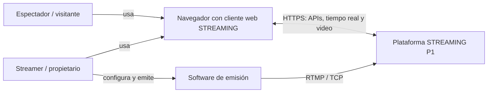
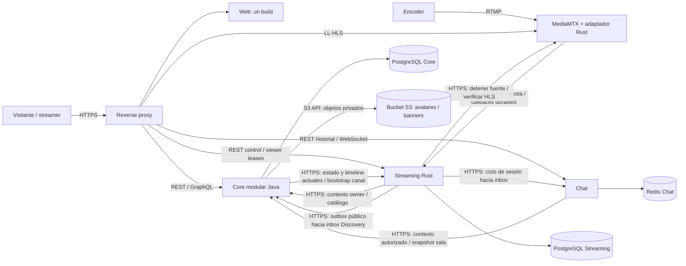

# Arquitectura de STREAMING

**Decisión:** [ADR-005](adr/ADR-005-streaming-rust-y-proyeccion-discovery.md). **Alcance:** P1 y evolución.

## Unidades de ejecución

| Unidad | Responsabilidad y datos | Motivo de la frontera |
| --- | --- | --- |
| Web | Una aplicación y un build; rutas, formularios, player, chat y accesibilidad. TypeScript candidato, sujeto a ADR frontend. | Interfaz de usuario con módulos internos. |
| Core | Java/Spring: Cuentas, Canales, Catálogo y Discovery. PostgreSQL propio y objetos de imagen en S3; registro en una transacción. | Integridad cuenta–perfil–canal y consultas SQL locales con proyección pública Streaming. |
| Streaming | Rust/Axum/Tokio/SQLx con pools y PostgreSQL privado: configuración, claves, sesiones, cupos, clock, generaciones, leases e inbox/outbox. | Autonomía de desarrollo, release y operación del control de emisiones; costo de coordinación aceptado en ADR-005. |
| Chat | Salas, mensajes, deduplicación, cuota, secuencias, historial y realtime; Go + Redis efímero según ADR Chat. | Conexiones largas, fan-out y fallo independientes de video; persistencia temporal propia. |
| Media | MediaMTX RTMP/LL-HLS y adaptador técnico Rust: autorización de fuente, señales, control y verificación audiovisual. | Códecs, CPU y ancho de banda; contenedores separados del API de negocio Streaming. |
| Reverse proxy | HTTPS, encaminamiento, límites, Upgrade WS y forwarding confiable. | Infraestructura con tabla explícita de upstreams. |

Core, Streaming y Chat son procesos propios de lógica comunicados por HTTP. TypeScript sigue
siendo candidato; Java, Rust y Go tienen código propio. Solo artefactos y ejecución cierran RNF-001/003/007.
Discovery conserva GraphQL dentro de Core. REST, GraphQL sobre HTTP y WebSocket Upgrade tienen evidencia
pendiente según SPEC-13; la interpretación académica de RNF-006 requiere confirmación del evaluador.
SQL/YAML/HTML/CSS no cuentan como lenguajes generales.

## Vista de contexto (C4 nivel 1)

El navegador y el codificador son sistemas externos. Proxy, Web, Core, Streaming, Chat, Media y
almacenes se detallan en la vista C&C.

## Método de la vista C&C

Un elemento arquitectónico se delimita por responsabilidades, frontera e interfaces. En una vista C&C,
un componente es un elemento computacional o almacén con presencia en ejecución, nombre funcional y
puertos; un conector es un camino de interacción en ejecución entre componentes y sus roles describen
cómo participan. La relación de attachment une un puerto del componente con un rol del conector. Por
eso una carpeta o endpoint por sí solo no demuestra que exista un componente, y una flecha sin
protocolo ni semántica no describe suficientemente un conector (Vergara Vargas, 2026a, diap. 2;
Vergara Vargas, 2026b, diap. 3–7). Esta lectura coincide con distinguir estructuras dinámicas por
sus elementos e interacciones en tiempo de ejecución (Rozanski & Woods, 2011, cap. 2).

En ejecución existen Web, Core, Streaming, Chat, Media, proxy y sus almacenes. Cuentas, Canales,
Catálogo y Discovery son módulos locales Core; sus llamadas usan interfaces de aplicación. Las flechas
representan protocolos y semántica entre procesos; la tabla identifica puertos y roles.

## Vista C4/C&C

Core comparte transacción y FK locales para cuenta/perfil/canal/catálogo. S3 es el proveedor de objetos
predeterminado: avatares y portadas se almacenan en el bucket privado; Core conserva las URLs públicas
`/api/profile/avatars/{key}` y `/api/channels/banners/{key}`, lee el objeto desde S3 y responde los
bytes. Las URLs no exponen endpoint, credenciales ni ACL del bucket. Filesystem sigue disponible como
alternativa explícita para desarrollo local y pruebas. Los repositorios están encapsulados; consultas usan vistas/DTO públicos con columnas
explícitas. Discovery combina datos
locales y su proyección SQL de Streaming. Cada servicio conserva sus credenciales y almacén privado;
ningún proceso consulta tablas ajenas ni mantiene transacciones entre bases.

## Puertos y conectores

| Interacción | Puerto iniciador / rol | Puerto receptor / rol | Protocolo y semántica |
| --- | --- | --- | --- |
| Web y APIs | Navegador / cliente | Proxy / entrada pública | HTTPS REST Core/Streaming, GraphQL Discovery y recursos Web. |
| Chat público | Navegador / cliente realtime | Chat a través de proxy / sala | WS Upgrade e historial REST; anónimo lee, envío autorizado por mensaje. |
| Ingesta | Encoder / publicador | Media / fuente | RTMP TCP separado; adaptador solicita autorización Streaming antes de aceptar. |
| Reproducción | Player / lector | Media a través de proxy / entrega | LL-HLS HTTPS; bytes entregados por MediaMTX. |
| Presencia del player | Player / cliente | Streaming / API de leases | Tras primer frame crea lease; heartbeat10s, cierre inmediato y expiry30s; conteo de reproducciones activas. |
| Contexto Chat | Chat / cliente privado | Core / API privada | Identidad/autor locales y estado/timeline Streaming actual por mensaje, sin caché de permisos. |
| Estado autoritativo | Core / cliente privado | Streaming / contexto y snapshots | HTTPS; contexto de sesión para Chat y batch público para bootstrap de canal. |
| Comandos protegidos | Streaming / cliente privado | Core / contexto owner | Sesión, propiedad y catálogo tipado; autorización acotada, sin lock entre bases. |
| Ciclo de sesión | Streaming / outbox | Chat / inbox | HTTPS idempotente, ACK durable, versiones/retry/DLQ; informativo para sala. |
| Proyección pública | Streaming / outbox y snapshot | Discovery en Core / inbox y staging | Snapshots completos/versionados; frescura <=5s, dedupe y reconstrucción consistente con watermark. |
| Señales Media | Adaptador Rust / cliente privado | Streaming / ingest y callbacks | HTTPS autenticado; intent/event IDs, generaciones y ACK tras persistir. |
| Control Media | Streaming / cliente multimedia | Media / control y HLS privado | Corte de fuente y comprobación de playlist/segmento/frame real. |
| SQL | Core o Streaming / cliente propio | PostgreSQL privado / almacén | Pool y transacciones locales; sin lectura ni FK entre bases. |
| Historial | Chat / cliente propio | Redis Chat / servidor | Persistencia antes de ACK; Core/Streaming no leen mensajes. |
| Imágenes | Core / cliente S3 | Bucket privado / almacén de objetos | PUT/GET/COPY/DELETE/LIST; Core publica las rutas de avatar/portada sin exponer el bucket. |

## Invariantes y coordinación

- Registro: cuenta ACTIVE, perfil, canal y resultado idempotente confirman juntos; fallo revierte todo.
- Emisión: Rust controla configuración, claves, cupos, estado y reloj. Core valida cada comando protegido.
  streamId persiste; sessionId cambia por emisión. LIVE/PLAYABLE requiere evidencia real Media.
- Viewer count: leases de reproducción mantenidos por Rust, anónimos e independientes de Chat.
  Cuenta instancias activas; no asegura personas únicas ni sirve como medida económica o permiso.
- Discovery: búsqueda/ranking/paginación SQL sobre datos Core y proyección pública Streaming. Observación/
  publicación <=2s y transporte/aplicación <=3s en perfil nominal; atraso marca UNKNOWN/frescura falsa.
  No autoriza Chat ni accede al SQL Streaming.
- Chat: cada envío nuevo obtiene contexto Core; Core consulta estado/timeline actual Streaming. Eventos
  Rust→Chat informan sala. La siguiente autorización tras logout/ENDED rechaza; operación en vuelo acotada.
- Bootstrap por handle: cuenta/perfil/canal locales y un batch Streaming; falla Streaming conserva canal
  y marca estado desconocido. El registro no depende de Streaming.
- Integración conecta contratos, infraestructura y evidencia después del desarrollo del módulo.
  Cada dueño conserva la lógica de sus casos de uso.

## Despliegue y aislamiento

Topología: proxy, Web, Core, Streaming, Chat, MediaMTX/adaptador Rust, PostgreSQL Core/Streaming,
Redis Chat (AOF) y bucket S3 privado para imágenes. Bases separadas con credenciales privadas pueden compartir motor físico sin compartir tablas.
Core accede a imágenes en S3; Media conserva segmentos. Solo HTTPS web y RTMP son públicos. Core8081,
Streaming8080, Chat8085 y Web3000; listeners Media/configuración final se verifican antes del despliegue.
/internal/* queda bloqueado públicamente. TLS privado y secretos específicos por consumidor/operación.

P1 inicia una réplica de control Streaming con anchors monotónicos. Pérdida de owner/clock termina
sesión sin renovar gracia; varias réplicas requieren fencing, enrutamiento de owner y transferencia probados.
Core replica sus módulos juntos; con S3 comparte objetos entre réplicas, mientras filesystem requiere
volumen de imágenes compartido. Chat requiere orden, cuota,
dedupe y fan-out compartidos antes de replicar; Media se dimensiona por bitrate/CPU. Contenedores en
un mismo host siguen compartiendo su capacidad física. SPEC-13 verifica escalado y límites.

Caída Core bloquea nuevos comandos protegidos y autorizaciones Chat. Caída Streaming bloquea su control
y nuevas autorizaciones Chat; Media puede conservar una fuente/reproducción existente sin garantía
indefinida. Caída Chat no corta HLS. Caída Discovery/receptor no revierte LIVE ni bloquea el consumidor
Chat; proyección atrasada degrada según frescura. Caída del proceso Core afecta a todos sus módulos.

## Validación de la arquitectura

La aceptación del sistema verifica los contextos Core, los clientes y snapshots Streaming,
el inbox/proyección Discovery, los consumidores Chat/Web y el transporte MediaMTX/adaptador.
SPEC-10 define los schemas neutrales; SPEC-12, el proxy y Web; SPEC-13, el despliegue,
la recuperación y el perfil de carga. La selección de una frontera requiere esta validación integrada.
Lecturas SQL Core usan vistas/DTO publicados, columnas explícitas y propiedad de escritura clara,
versionados según RNF-041/042 y sin secretos.

### Referencias metodológicas

La definición de componente, conector, puertos, roles y attachments sigue las diapositivas y el
Laboratorio 2 del curso; la nota de runtime y estructuras dinámicas se apoya en Rozanski y Woods. El
laboratorio solicita como entregable la vista C&C y la descripción de elementos (Vergara Vargas,
2026c, pp. 7–8).

1. Vergara Vargas, J. A. (2026a). *Architectural Elements, Relations and Properties* [Diapositivas de clase, curso 2026-II], diap. 2. Universidad Nacional de Colombia.
2. Vergara Vargas, J. A. (2026b). *Component-and-Connector (C&C) Structure* [Diapositivas de clase, curso 2026-II], diaps. 2–7. Universidad Nacional de Colombia.
3. Vergara Vargas, J. A. (2026c, 24 de septiembre). *Laboratory 2: Components and Connectors* [Guía de laboratorio, curso 2026-II], pp. 7–8. Universidad Nacional de Colombia.
4. Rozanski, N., & Woods, E. (2011). *Software Systems Architecture: Working with Stakeholders Using Viewpoints and Perspectives* (2.ª ed.). Addison-Wesley Professional.
