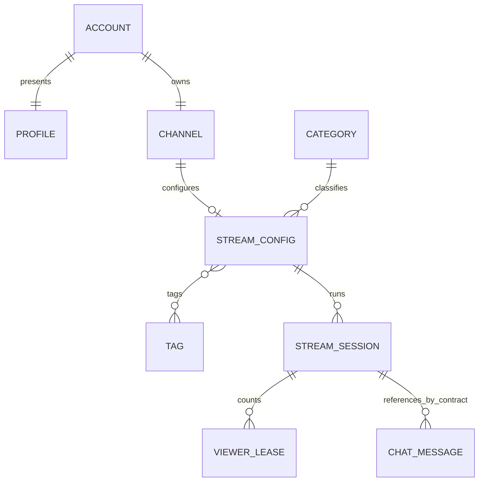

# Contratos y modelo de datos

**Arquitectura:** Core, Streaming, Chat y Media según ADR-005.
**Regla:** interfaces locales y FK dentro de Core. APIs de red entre unidades de ejecución; ADR-011 conserva excepcionalmente los contratos HTTP autenticados del adaptador Media sobre loopback dentro del proceso Streaming P1.

## Propiedad y modelo lógico



ACCOUNT, PROFILE, CHANNEL, CATEGORY y TAG están en PostgreSQL Core, con FK locales. STREAM_CONFIG, STREAM_SESSION y VIEWER_LEASE pertenecen al PostgreSQL privado de Streaming Rust. Las líneas entre CHANNEL/CATEGORY/TAG y STREAM_CONFIG representan referencias opacas de contrato, no FK entre bases. CHAT_MESSAGE pertenece a Chat/NoSQL. Discovery posee inbox y tablas de proyección pública de emisión en Core; no es autoridad de estado, metadata, permisos ni conteo.

| Dueño de escritura | Entidades | Lectores |
| --- | --- | --- |
| Cuentas/Identity dentro de Core | userId, email/handle canónicos, hash, sesión, operaciones idempotentes | Interfaces locales, DTO públicos; nunca email/hash/sesión en respuestas públicas |
| Cuentas/Profile dentro de Core | displayName, bio, avatar y profileVersion | Canal/consultas locales; Chat recibe snapshot autorizado |
| Canales dentro de Core | channelId, ownerUserId, descripción/banner y channelVersion | Consultas locales; contexto de owner Core para Streaming |
| Catálogo dentro de Core | categorías/tags con IDs, estado y catalogVersion | Consultas locales; contexto tipado y resolución de tombstones para Streaming |
| Streaming Rust | StreamConfig, secretos ingest, sesiones, cupos, clocks y leases/conteo | Consultas/player, contexto Chat y contratos Media |
| Discovery en Core | inbox y proyección pública de emisiones | GraphQL; reconstruible desde Streaming |
| Chat | mensajes, secuencia por sala, dedupe y cuota por cuenta | Web, replay/moderación futuros a través del dueño |
| Media | fuente, segmentos/manifiestos y señales técnicas | Streaming valida disponibilidad; HLS hacia player |

Cada repositorio escribe solo tablas de su módulo. Los casos de uso locales coordinan interfaces de
aplicación con una transacción Core; un read model local puede realizar joins SQL revisados. Ningún
servicio externo importa clases internas o lee tablas de otro. No hay HTTP Core→Core.

## Identificadores, versiones y tiempo

IDs públicos opacos y estables. userId/canal no cambian; handle es inmutable en P1. streamId identifica
configuración persistente y sessionId ejecución. streamGeneration inicia en 0 y aumenta por nueva
sesión; reconexión conserva generación/sesión. sourceGeneration cerca fuentes antiguas.
metadataVersion inicia en 1 y aumenta uno por cambio real; PATCH vacío da 422 EMPTY_PATCH y no-op no
incrementa. profileVersion/channelVersion inician en 0; suben por cambios reales, no por lecturas.
sessionVersion versiona estado/disponibilidad; countVersion es independiente. Mensajes usan sequence
estrictamente creciente por sessionId. No comparar versiones de agregados distintos.

Marcas de tiempo de servidor en UTC con zona explícita; reloj de cliente no es autoridad. El timeline
comienza en cero al primer LIVE reproducible, avanza durante LIVE/gracia, no se reinicia al reconectar
y queda congelado al terminar. `streamOffsetMs` es una coordenada aproximada de sesión; VOD futuro debe
mapearla al medio grabado. P1 no crea grabación ni promete sincronía de replay con archivo inexistente.

## Inventario de interfaces

Las interfaces requieren schema neutro, correlación y presupuesto acotado.

| Interfaz | Proveedor / consumidor | Semántica y fallo |
| --- | --- | --- |
| POST /api/identity/registrations; GET /api/identity/registrations/{id} | Core / Web | Resultado idempotente ACTIVE solo tras commit de cuenta/perfil/canal; no sesión; detalle abajo |
| POST /api/identity/sessions; DELETE /api/identity/sessions/current | Core / Web | Cookie opaca, revocación, CSRF y cuotas preservadas |
| GET /api/identity/public/handles/{handle}; /users/{userId} | Core / Web | Solo cuenta activa y datos públicos mínimos; 404 uniforme |
| GET /api/profile/users/{userId}; GET/PATCH /api/profile/me | Core / Web | Perfil público y edición self; validación local de sesión |
| POST /api/profile/me/avatar-uploads; GET /api/profile/avatars/{key} | Core / Web | Upload de un uso y URI pública Core a objeto inmutable en almacenamiento privado |
| GET /api/channels/by-owner/{userId} | Core / Web | Canal de cuenta activa; sin gate de evento |
| GET /api/channels/by-handle/{handle} | Core / Web | Canal + handle + perfil compuestos localmente; bootstrap incluye stream actual con estado autoritativo Streaming |
| PATCH /api/channels/{channelId}; POST /api/channels/{channelId}/banner-uploads | Core / Web | Propietario; descripción/banner, versión y reglas de imagen |
| GET /api/channels/banners/{key}; GET /api/channels/csrf | Core / Web | URI pública Core a objeto inmutable en almacenamiento privado; token de la misma seguridad CSRF Core |
| GET /api/taxonomy | Core / Web | IDs/labels activos y versión; validación local para Core y contexto privado para Streaming |
| POST/GET /api/channels/{channelId}/streams; PATCH /api/streams/{streamId} | Streaming / Web | Configuración persistente; contexto nuevo Core valida identidad/owner/catálogo |
| POST /api/streams/{streamId}/ingest-keys/rotate | Streaming / Web | Solo sin sesión activa; secreto una vez |
| GET /api/streams/{streamId}; GET/DELETE /api/streams/sessions/{sessionId} | Streaming / Web/player | Metadata/estado autoritativo y stop owner; no ingest secret |
| POST /api/streams/sessions/{sessionId}/viewer-leases; PUT /api/streams/viewer-leases/{leaseId}/heartbeat; DELETE /api/streams/viewer-leases/{leaseId} | Streaming / player | Lease anónimo de servidor, heartbeat 10 s, vencimiento 30 s |
| POST /api/discovery/graphql | Core / Web | streams/channels, filtros/ranking/paginación locales; schema conservado abajo |
| GET /api/chat/sessions/{sessionId}/messages; WS /realtime/chat/sessions/{sessionId} | Chat / Web | Historial 1–50, eventos/ACK, anónimo lee, autenticado escribe |
| POST /internal/core/chat/message-context | Core / Chat | Una autorización nueva por mensaje lógico: sesión usuario + estado emisión + autor + timeline; sin caché de permisos |
| GET /internal/core/chat/sessions/{sessionId} | Core / Chat | Snapshot de existencia/estado/generación y timeline para abrir/reconciliar sala; sin identidad privada |
| POST /internal/chat/session-events | Chat / Streaming | Notificación durable idempotente de estado de emisión; no autoriza escrituras |
| POST /internal/streaming/ingest/authorize | Streaming / adaptador Media | streamKey e ingestAttemptId; reserva idempotente de cupo en Streaming tras configuración autorizada |
| POST /internal/streaming/sessions/{sessionId}/source-connected; /playback-ready; /source-lost | Streaming / adaptador Media | ACK durable, generaciones/eventId/path validados; detalle abajo |
| POST /internal/core/streaming/owner-context | Core / Streaming | Identidad/owner y catálogo tipado por comando; sin permiso cacheado |
| POST /internal/core/streaming/catalog-values | Core / Streaming | Resolución batch de IDs/labels/tombstones; no autoriza cambios |
| GET /internal/streaming/sessions/{sessionId}/context | Streaming / Core | Estado/timeline actual para Chat, sin identidad/credenciales |
| POST /internal/streaming/channels/snapshots | Streaming / Core | Bootstrap público batch por channelId; ausencia explícita y sesión actual |
| POST /internal/core/discovery/stream-events | Core / Streaming | Inbox durable de snapshots públicos versionados; no autoridad de negocio |
| POST /internal/streaming/discovery/snapshots | Streaming / Core | Corte consistente paginado de configuraciones con watermark; reconstrucción |

`/internal/*` usa TLS privado y credenciales específicas por consumidor con permisos explícitos
por ruta; una credencial puede tener varias rutas autorizadas. El listener público lo bloquea. En P1 los contratos adaptador→Streaming se conservan sobre HTTP loopback autenticado dentro del mismo contenedor (ADR-011); TLS sigue siendo obligatorio al cruzar contenedores en producción. Bases y repositorios técnicos/de negocio permanecen separados.
Los módulos Core usan interfaces locales; no publican eventos de replicación interna ni requieren
provisión HTTP de canal. Los outboxes se reservan para efectos entre procesos y para los callbacks técnicos durables Media conservados por ADR-011.

## Registro y cuentas: transacción local

POST recibe email, handle, contraseña y Idempotency-Key UUID. Email recorta extremos y compara en
minúsculas, sin plegar puntos/+; handle 4–25 ASCII alfanumérico/underscore, canónico minúsculo, único e
inmutable. Contraseña 12–128 puntos de código Unicode exactos, sin trim/normalización/truncado ni reglas
de composición. Nunca se guarda reversible ni se imprime. Se conserva hash de clave y fingerprint
HMAC del payload; valores normalizados distintos con misma clave dan 409 IDEMPOTENCY_KEY_REUSED.

Una transacción SQL confirma cuenta, perfil inicial (displayName=handle, bio vacía, avatar nulo,
profileVersion=0), canal inicial (channelVersion=0) y operación idempotente. POST devuelve 201
{registrationId,status:"ACTIVE",userId,channelId}; no cookie de sesión. Misma clave/payload conserva IDs
sin otro efecto. Email/handle ocupados devuelven 409 REGISTRATION_UNAVAILABLE uniforme, sin fieldErrors
que revelen cuál existe. Un fallo hace rollback total; timeout/respuesta perdida se recupera repitiendo
la misma clave. El registro se confirma en una operación transaccional, sin estado público parcial.

GET por registrationId requiere la misma clave y devuelve 200 ACTIVE; desconocido/clave incorrecta
404 uniforme. Retener resultado treinta días desde commit; después GET da 404 y operación nueva usa
UUID nuevo. El shell recibe el resultado confirmado sin polling de estados parciales.

## Login, sesión y datos públicos

POST sessions recibe login (email o handle canónico, case-insensitive) y password exacta. Responde
200 {userId,expiresAtUtc}, cookie host-only stream_session Path=/, HttpOnly, SameSite=Lax, Secure en
HTTPS, Max-Age tiempo restante. Credencial opaca >=256 bits, solo hash en servidor; vida fija 24 h,
sin extensión. Login incorrecto 401 uniforme. Logout 204 idempotente, revoca inmediatamente; toda
validación posterior rechaza. Validaciones locales Core consultan interfaz de Cuentas, sin HTTP.
Mutaciones web/login/registro usan CSRF; GET /api/identity/csrf entrega el token de Spring Security.

Login: máximo cinco fallos por identificador normalizado y cincuenta por IP en ventana móvil de 15 min;
éxito reinicia contador del identificador. Registro: diez claves nuevas/IP/hora, retry de clave no
consume otra operación. Exceso 429 RATE_LIMITED + Retry-After; no bloqueo permanente. Concurrencia de
cuotas se resuelve en el dueño, no en un contador independiente por réplica.

Lookup público devuelve userId/handle sin email/hash/credenciales. Cuentas inexistentes/no activas dan
404 uniforme. Los perfiles y canales del nuevo registro están visibles después del mismo commit; no
reintentos de “canal activándose” ni gates de evento. Perfil sin personalización devuelve defaults;
un perfil perdido es una inconsistencia a reparar localmente, no justificación para consultar Identity
por red. Una caída SQL/Core devuelve 503, nunca un falso 404.

## Perfil y composición de canal

GET perfil público devuelve {userId,displayName,bio,avatarUri,updatedAtUtc,profileVersion}. GET/PATCH me
obtiene objetivo del principal, no userId cliente. PATCH permite displayName de 1–50 caracteres, bio
hasta 300 y avatarUploadId. Omitir conserva; displayName:null inválido, bio:null limpia; avatar null
retira, uploadId sustituye. Requiere campo editable; no-op conserva versión, error conserva estado.
Upload multipart file: JPEG/PNG/GIF decodificado real, <=10 MB, ancho y alto >=200 px obligatorios.
Respuesta 201 {uploadId,expiresAtUtc}, ligado al usuario, un uso, vence 15 min. URI de objeto opaca e
inmutable, no ruta física/nombre original. Reemplazo publica objeto nuevo antes de commit; fallo conserva
anterior; borrar antiguo/temporales después de commit y reconciliar huérfanos periódicamente.
`avatarUri` y `bannerUri` apuntan a las rutas públicas de Core (o a un CDN que las proxifique), no a
una URL directa del bucket. Con S3 el bucket permanece privado y Core obtiene y sirve los bytes.

`GET /api/channels/by-handle/{handle}` devuelve 200 con un DTO de composición pública:

```json
{"channel":{"channelId":"chn_…","ownerUserId":"usr_…","description":"","bannerUri":null,"channelVersion":0},"handle":"caster_01","profile":{"userId":"usr_…","displayName":"caster_01","bio":"","avatarUri":null,"updatedAtUtc":"2026-10-01T20:00:00Z","profileVersion":0},"stream":null,"streamStatusFresh":true,"availability":"OFFLINE"}
```

channel contiene exactamente los campos del ejemplo; description inicial vacía y bannerUri nulo.
profile tiene el mismo contrato que GET perfil público. streamStatusFresh/availability son campos obligatorios del bootstrap: snapshot confirmado usa su disponibilidad y true; ausencia confirmada de configuración usa OFFLINE/true. stream es null si no hay configuración;
si existe, contiene el snapshot público autoritativo obtenido por Core mediante batch de canales Streaming y un campo session con el snapshot de sesión/timeline (null antes de la primera emisión).
Session ENDED conserva su identidad y availability=OFFLINE; playbackUrl es null fuera de PLAYABLE.
Core obtiene cuenta/perfil/canal localmente y hace una consulta batch de snapshots públicos a Streaming para este bootstrap. Una respuesta confirma ausencia/configuración/sesión; falla Streaming devuelve stream:null, streamStatusFresh:false y availability:UNKNOWN, conservando el canal/perfil. No se interpreta el fallo como OFFLINE. Discovery no usa este batch por fila.
Handle se busca sin distinguir mayúsculas; inexistente/no activo da 404 uniforme, fallo Core/SQL 503.
Web usa el handle devuelto para redirigir casing a URL canónica con 308 y monta player/Chat desde
stream/sessionId. No entregar entidades de cuenta/ORM ni ejecutar un join entre servicios en el shell.

PATCH canal permite solo description (hasta 500 puntos de código; null limpia a cadena vacía) y
bannerUploadId (null retira). Campos omitidos se conservan; cuerpo vacío o campo ajeno da 400
VALIDATION_ERROR. Valida sesión local y propietario, bloquea la fila y aumenta channelVersion una
vez por cambio real; no-op/error conserva datos y versión. Responde los campos de channel del
bootstrap. Upload multipart file devuelve 201 {uploadId,expiresAtUtc}, ligado a owner/channel,
un uso y 15 min; JPEG/PNG/GIF reales <=10 MB. 1200×480 es una recomendación, sin mínimo obligatorio;
límite defensivo de 40 MP. Publicar antes de commit, conservar archivo anterior ante rollback y
reconciliar objetos sin referencias después de una gracia de un día. Las portadas se sirven en
/api/channels/banners/{key}. Cuenta/canal desconocidos dan 404; otro usuario 403, sin sesión 401,
CSRF inválido 403, carga inválida 400 INVALID_BANNER (413 si excede el límite HTTP).

## Semántica de emisión y reloj

Streaming controla PREPARING, LIVE, RECONNECT_GRACE, ENDED; disponibilidad PLAYABLE, RECONNECTING, OFFLINE.
LIVE requiere HLS confirmado; PREPARING máximo 30 s. Cupo global cinco y uno por canal cuenta
PREPARING/LIVE/gracia, se reserva atómicamente en SQL; sexto rechazo controlado. P1 una réplica de
Streaming no requiere consenso distribuido, pero timers/callbacks concurren: serializar transiciones con
estado/generaciones y bloqueo/CAS SQL. Una pérdida abre una única gracia de 30 s; reconexión gana solo
con HLS validado antes de 30 s. UTC deadline es informativo; propietario vigente usa monotónico.
Reinicio no da nueva gracia: recuperar restante mediante estrategia durable probada o terminar sesión.
Failover multi-réplica exige fencing/transferencia explicitados en ADR antes de habilitarlo.

## Callbacks Media y contratos de producto

**Callbacks del media adapter.** Las tres rutas internas de la tabla reciben JSON con campos comunes
`eventId` (UUID estable a través de reintentos), `streamId`, `sessionId`, `streamGeneration` y
`sourceGeneration`; solo `playback-ready` añade `playbackPath`. No reciben `occurredAtUtc`: Streaming
asigna `receivedAtUtc` con su reloj. Primer evento válido responde `202` solo después de guardar la
aceptación de forma durable y devuelve `{"accepted":true,"duplicate":false,"eventId":"…"}`; un
reintento con mismo eventId/payload responde `200` con el mismo resultado y `duplicate=true`. Si la
generación es vieja, devuelve `200 {"accepted":true,"ignored":true,"reason":"STALE_GENERATION"}`.
Reutilizar eventId con payload distinto da `409 EVENT_ID_CONFLICT`; sesión/stream no coincidentes dan
`409 SESSION_MISMATCH`; sesión finalizada da `410 SESSION_ENDED`; playbackPath inválido da
`422 INVALID_PLAYBACK_PATH`. El adapter limita cada intento HTTP a 2 s y, ante timeout de red, HTTP
408/429 o 5xx, reintenta con el mismo eventId tras 100, 250, 500, 1000 y 2000 ms; luego continúa cada
2000 ms por un máximo de 15 min desde el primer intento, también si la sesión termina. Cualquier 2xx
confirma el ACK y detiene reintentos; un 410 `SESSION_ENDED` cierra el callback como obsoleto y registra
esa resolución. Si no llega respuesta terminal durante 30 s, se genera una alerta deduplicada por
sessionId/sourceGeneration y se continúa intentando hasta el límite de 15 min; se exponen edad e
intentos como métricas. Al agotar ese plazo, o recibir un 409/422 u otro 4xx permanente, se guarda el
payload y eventId en una dead-letter durable y se detienen los reintentos automáticos. Un operador puede
redrivear el mismo payload y eventId tras corregir/recuperar el receptor (inicia una nueva ventana de
15 min) o cerrar el registro tras confirmar que es irrecuperable/obsoleto. No hay expiración automática
de la dead-letter; retención y umbral de capacidad se fijan en ADR operativo. El endpoint confirma
recepción durable, no disponibilidad de playback; solo la verificación de HLS permite pasar a PLAYABLE.

Los siguientes ejemplos son contratos semánticos, no una imposición de OpenAPI, lenguaje ni librería.
Todas las horas son UTC con `Z`, los IDs son opacos y los errores usan `{code, message, fieldErrors?,
requestId}`.

**Taxonomy.** `GET /api/taxonomy` devuelve IDs estables activos y versión del conjunto; el cliente no crea IDs:

Core implementa este catálogo en PostgreSQL/Flyway V3, conservando V1/V2. IDs semilla fijos
`cat_`/`tag_` más 32 hexadecimales; orden por nombre NFKC/minúsculas (`Locale.ROOT`) e ID.
Versión y valores de cada respuesta comparten una sentencia SQL. GET permite acceso anónimo,
usa `Cache-Control: no-cache` y no publica ETag. Fallo SQL: `503 CORE_UNAVAILABLE`, nunca listas
vacías de sustitución. `CatalogValues.find` es la interfaz local para tombstones;
`CatalogContexts` y `CatalogSelections` publican resolución y validación tipada.

```json
{"catalogVersion":12,"categories":[{"id":"cat_…","name":"Conversación","active":true}],"tags":[{"id":"tag_…","name":"Español","active":true}]}
```

Las categorías/etiquetas nuevas que ingrese el responsable en el catálogo aparecen en esta respuesta
sin reconstruir el cliente web. El orden es estable por nombre normalizado y luego ID. `catalogVersion`
empieza en 1 y aumenta exactamente uno al crear un valor o cambiar su etiqueta/estado. La baja es lógica:
ID y último nombre se conservan como tombstone mientras alguna StreamConfig los referencie; no se
borran físicamente. La lista pública incluye solo valores activos; el lookup interno por ID devuelve
también tombstones para mostrar metadata existente. Un valor inactivo no se puede seleccionar en una
configuración nueva ni en un campo explícito de un PATCH.

**Canal.** `POST /api/channels/{channelId}/banner-uploads` recibe multipart `file`; solo el owner
autenticado puede subir. Valida JPEG/PNG/GIF real, máximo 10 MB y tamaño recomendado 1200×480 px;
devuelve `201 {"uploadId":"upl_…","expiresAtUtc":"…"}`. El uploadId dura 15 minutos, queda ligado
al owner y channelId y se consume una sola vez. `PATCH /api/channels/{channelId}` edita
`description` y `bannerUploadId`; description es opcional y de hasta 500 caracteres. `channelVersion`
inicia en 0 al crear el canal y aumenta en uno solo cuando un PATCH cambia realmente description o
bannerUri; una repetición sin cambios conserva versión. El PATCH aplica de forma atómica solo los campos presentes al estado persistido más reciente; actualizaciones concurrentes se serializan, cambios aceptados en campos distintos se conservan y, si compiten sobre el mismo campo, prevalece el último commit. Omitir un campo
conserva su valor; `description:null` lo limpia; omitir bannerUploadId conserva el banner, `null` lo
elimina y un uploadId lo sustituye. Requiere al menos un campo. La respuesta `200`
contiene `{channelId, ownerUserId, description, bannerUri, channelVersion}`. No se reemplaza el recurso
anterior si validación o persistencia fallan.

**Configuración e inicio de emisión.** Cada canal tiene cero o una configuración persistente de
stream; esta se crea con `POST /api/channels/{channelId}/streams` y
`{"title":"En vivo","categoryId":"cat_…","tagIds":["tag_…"]}`. `title` requerido (1–100 caracteres),
`categoryId` obligatorio y activo, `tagIds` 0–5 IDs únicos activos. La creación inicia
`metadataVersion=1`. La solicitud requiere
`Idempotency-Key`; si ya existe para ese canal se devuelve `200` con la configuración existente y sin
secreto, en vez de crear otra. La primera respuesta `201` contiene `streamId`, campos guardados,
`metadataVersion`, `rtmpUrl` y `streamKey` secreta. Solo se muestra esa vez. Si se pierde, owner puede rotarla
OFFLINE con `POST /api/streams/{streamId}/ingest-keys/rotate`, que invalida la anterior y la muestra
una vez. Al encoder se le configura rtmpUrl y streamKey como password RTMP; el secreto nunca se
incluye en URL, respuesta pública, evento ni log.

El media adapter llama por HTTPS/TLS en red privada a `POST /internal/streaming/ingest/authorize` en
cada intento RTMP válido. Una
clave válida reserva un cupo y crea (o reanuda dentro de RECONNECT_GRACE) un sessionId en PREPARING;
Streaming asigna sourceGeneration monotónica por streamId y solo acepta eventos de la generación
vigente. Clave inválida da `401 INVALID_STREAM_KEY`; otra fuente concurrente para el canal da `409
CHANNEL_ALREADY_ACTIVE`; al alcanzar cinco sesiones reservadas da `409 LIVE_SESSION_LIMIT`. El body
usa transporte interno autenticado y nunca se guarda en logs. Cada slot cuenta desde PREPARING hasta
ENDED, incluyendo LIVE y RECONNECT_GRACE; al acabar PREPARING sin HLS en 30 s, Streaming finaliza la
sesión y libera el cupo. Esto evita sesiones atascadas. `MediaSourceConnected` confirma conexión real
RTMP. Cuando `MediaPlaybackReady` se valida con playlist HLS y al menos un segmento reproducible,
Streaming pasa a LIVE/PLAYABLE y empieza el timeline; inicio y HLS deben completar dentro de 30 s
desde autorización. Disconnect de una sesión LIVE genera `MediaSourceLost` y la gracia de 30 s; una
reconexión válida mantiene el mismo sessionId. Stop voluntario usa
`DELETE /api/streams/sessions/{sessionId}`. Tras ENDED/OFFLINE, el mismo streamId y metadata pueden
servir para la siguiente emisión, que obtiene otro sessionId.

`GET /api/channels/{channelId}/streams` permite al owner volver a cargar la configuración sin mostrar
el secreto. `PATCH /api/streams/{streamId}` acepta uno o más campos de metadata, valida el objeto
completo y actualiza atómicamente antes de RTMP o durante LIVE; éxito devuelve metadataVersion nueva.
Omitir un campo conserva su valor aunque su asociación vigente haya sido desactivada; si el cliente
envía `categoryId` o `tagIds`, todos los IDs enviados deben seguir activos. `tagIds:[]` elimina todas
las etiquetas; categoryId no se puede limpiar. Un patch vacío da 422 `EMPTY_PATCH`. Cambiar título/categoría/tags no
cambia sessionId ni reloj del timeline; al guardar, Streaming confirma metadataVersion nuevo y outbox de proyección; lecturas autoritativas ven el commit y Discovery refleja la versión dentro de 5 s mediante inbox.

**Error común.** Ejemplo de error de campo sin filtrar datos privados:

```json
{"code":"INVALID_FILTER","message":"Uno o más filtros no están disponibles.","fieldErrors":{"categoryId":"UNKNOWN_OR_INACTIVE"},"requestId":"req_…"}
```

**Lectura del player.** `GET /api/streams/{streamId}` entrega el estado vigente de configuración/sesión
y `statusFresh`. `streamGeneration` vale 0 antes de la primera emisión y conserva la última generación
después de ENDED; `sessionId` y `sessionVersion` son `null` solo si aún no hubo sesión. Ejemplo LIVE:

```json
{"streamId":"str_…","channelId":"chn_…","sessionId":"ses_…","streamGeneration":3,"title":"Título","category":{"id":"cat_…","name":"Conversación"},"tags":[],"status":"LIVE","availability":"PLAYABLE","statusFresh":true,"viewerCount":3,"countVersion":12,"viewerCountObservedAtUtc":"2026-09-26T20:00:05Z","metadataVersion":7,"sessionVersion":4}
```

Ejemplo de configuración aún no emitida: `{"streamId":"str_…","channelId":"chn_…","sessionId":null,"streamGeneration":0,"status":"OFFLINE","availability":"OFFLINE","statusFresh":true,"metadataVersion":1,"sessionVersion":null}`.

`GET /api/streams/sessions/{sessionId}` entrega disponibilidad, `playbackUrl` solo si es PLAYABLE,
`timelinePositionMs`, `timelineSampledAtUtc`, `metadataVersion`, `sessionVersion`, `viewerCount`,
`countVersion` y `viewerCountObservedAtUtc`. En PREPARING, RECONNECTING o ENDED no debe
retornar un URL como si el medio fuera reproducible.

**Playback lease.** Crear lease solo después del primer frame reproducible y mandar un `Idempotency-Key`
aleatorio en header para que una respuesta perdida no duplique el lease. Ejemplo de response:

```json
{"leaseId":"lease_…","leaseToken":"opaque-secret","sessionId":"ses_…","heartbeatEverySeconds":10,"expiresAfterSeconds":30}
```

El token se manda únicamente en `Authorization: ViewerLease <leaseToken>` al heartbeat/cierre; no se
expone en URL, logs, Discovery ni Chat. El navegador puede renovar o cerrar solo el lease que posee;
una sesión finalizada hace expirar todos sus leases. Una respuesta exitosa al heartbeat devuelve
`{"leaseId":"lease_…","sessionId":"ses_…","expiresAtUtc":"…"}`; token inválido/expirado da
`401`, lease inexistente o sesión finalizada da `404`/`410` según el recurso siga disponible, nunca
renueva el conteo.

`viewerCount` es una estimación operativa de instancias con lease vigente y puede inflarse con tráfico
automatizado: P1 no demuestra criptográficamente que una persona vio el primer frame. Solo se usa para
ordenar Discovery y mostrar audiencia aproximada; no controla autorización, pagos ni beneficios. La
mitigación antiabuso más fuerte (por ejemplo, telemetría de entrega HLS firmada y rate limits en edge)
queda fuera de P1 y debe acordarse antes de usar la métrica para decisiones económicas o de seguridad.

Streaming calcula el conteo desde leases vigentes y conserva countVersion/observedAtUtc en su SQL. Cambios se agrupan como máximo 1/s; observación/publicación <=2 s en perfil normal y entrega/aplicación <=3 s para frescura total <=5 s. StreamDiscoverySnapshot transporta el snapshot público hacia la proyección Core. ENDED invalida leases en Streaming; su snapshot elimina la elegibilidad reproducible. Conteo observado >5 s se marca viewerCountFresh=false. La proyección requiere dedupe, versiones y reconstrucción conforme a la sección de eventos; countVersion nunca se compara con sessionVersion.

## Chat REST, WebSocket y contexto autorizado

GET messages acepta limit entero 1–50 (default 50), últimos N por sesión en sequence ascendente y
snapshotSequence. Anónimo puede leer. Abrir WS y esperar chat.ready antes del historial; fusionar por
(sessionId,sequence), sin huecos/duplicado visible. PREPARING devuelve 409 CHAT_NOT_OPEN; LIVE/gracia
sala OPEN; ENDED READ_ONLY. Desconexión de Chat no interrumpe HLS. Origin WS debe ser el origen web
configurado, también para anónimos; cookie no es suficiente para aceptar un Origin no permitido.

Cliente envía {type:"message.send",clientMessageId:UUID,text}. Normalizar NFC, recortar whitespace
Unicode, 1–500 puntos de código; nunca HTML ejecutable. No aceptar userId/autor/hora/offset/sequence
de cliente. Cuota global por cuenta: un mensaje aceptado en toda ventana móvil 1000 ms, sin burst.
Dedupe (sessionId,userId,clientMessageId) mientras se retenga el mensaje; repetido devuelve mismo ACK.
Verificar sesión vigente antes de recuperar un ACK para no revelar datos a credencial revocada.

Para cada mensaje nuevo validado, Chat llama una sola vez a POST /internal/core/chat/message-context
con {sessionId,clientMessageId} y X-Session-Credential (cookie opaca), X-Service-Name:chat y token privado.
Core valida sesión de usuario y autor localmente; consulta GET /internal/streaming/sessions/{sessionId}/context para el estado/timeline autoritativo de cada mensaje. No lee la proyección Discovery para autorizar. Solo LIVE/gracia habilita writeAllowed=true; ENDED devuelve contexto autenticado con
writeAllowed=false y denialCode=CHAT_READ_ONLY, PREPARING con CHAT_NOT_OPEN. Esto permite recuperar
un ACK previo sin autorizar una escritura nueva después del fin. Devuelve {userId,handle,displayName,avatarUri,profileVersion,sessionId,streamGeneration,
sessionVersion,availability,authorizedAtUtc,timelinePositionMs,timelineSampleVersion,writeAllowed,denialCode}. Esta última
versión equivale al sessionVersion del snapshot. Sin perfil personalizado, displayName=handle/avatar=null;
no existe una dependencia Profile HTTP cuyo timeout deba tolerarse.

No cachear contexto para nuevos envíos. Cuota y persistencia pertenecen a Chat, no al endpoint Core.
Chat, con el userId confiable, busca primero un resultado de dedupe existente: lo retorna aunque
writeAllowed=false; si no hay resultado, verifica writeAllowed antes de cuota/commit. El mismo
clientMessageId con texto canónico distinto produce MESSAGE_ID_CONFLICT, no otro mensaje.
El contexto no es token reusable por el navegador ni permiso para otros mensajes/sesiones. Presupuestos
objetivo a validar con carga: connect <=100 ms, respuesta <=300 ms, total <=400 ms; sin retry automático
del comando de envío. El hop Core→Streaming tiene presupuesto total <=200 ms incluido en esos 400 ms; falla/timeout devuelve STREAMING_UNAVAILABLE y cero persistencia de mensaje nuevo. Si Core no responde, frame CORE_UNAVAILABLE y cero persistencia; sesión inválida
AUTH_REQUIRED; envío nuevo ENDED CHAT_READ_ONLY; PREPARING CHAT_NOT_OPEN; timeline inválido TIMELINE_UNAVAILABLE.
El timeout elegido debe revisarse con evidencia, manteniendo p95 de entrega Chat <1 s ni ocultar errores.

Chat asigna hora de persistencia y conserva el offset del snapshot autorizado (no inventa un reloj del
cliente). Rechaza contexto si el round-trip más tiempo hasta intentar persistir supera 500 ms, usando
monotónico local; devuelve TIMELINE_UNAVAILABLE y permite reintento con mismo clientMessageId. No
extrapola permisos. Una escritura ya autorizada antes de logout/ENDED puede confirmar dentro de ese
presupuesto; toda autorización posterior observa revocación/fin. Esta carrera de operación en vuelo
es explícita: no se promete transacción distribuida Core–Chat ni revocación retroactiva de commits.

Chat persiste mensaje, dedupe, secuencia y efecto de cuota atómicamente antes del ACK en Redis
([ADR-010](adr/ADR-010-chat-go-redis-efimero.md)): un script Lua por envío, con AOF `appendfsync always`
y `noeviction`. Unicidad: (sessionId,sequence) por contador `INCR` y ID de Stream `0-<sequence>`;
(sessionId,userId,clientMessageId) por hash de dedupe. El historial se lee del Stream de la sala en
orden de sequence. No se persiste la credencial de usuario. Los mensajes confirmados no se recortan
mientras la sala existe. Retención efímera: al conocer ENDED, todas las claves de la sala (estado,
sequence, dedupe y mensajes) expiran a los 5 minutos; después el historial queda vacío.

message.accepted al emisor incluye clientMessageId,messageId,sessionId,sequence,serverCreatedAtUtc;
message.created publica snapshot del autor/texto/offset a conectados. Dedupe también en cliente.
Una falla después de commit antes de broadcast se recupera con outbox/dispatcher de Chat o mecanismo
durable equivalente: nunca ACK de mensaje que se puede perder silenciosamente. Entrega de red puede
repetirse y no es exactly-once. Replica/fan-out necesita propietario/orden de sala y cuota compartida;
no basta otra instancia con contadores en memoria.

Errores tras Upgrade son frame {type:"error",clientMessageId,code,retryAfterMs?}; antes del Upgrade
son HTTP. RATE_LIMITED expone retryAfterMs. No convertir error de Core en anonimato aceptado ni en 404.
GET snapshot privado de sesión al abrir/reconciliar incluye estado, generaciones, versión y timeline,
sin identidad privada. Historia de sala ya conocida ENDED puede leerse sin Core mientras Chat conserva
su estado; apertura de sesión desconocida con Core o Streaming caído falla 503, no “sala vacía”.

## Eventos durables entre procesos P1

Streaming guarda cambios de sesión destinados a Chat en outbox SQL dentro del commit. Dispatcher llama
POST /internal/chat/session-events con {eventId,eventType,schemaVersion,aggregateId,sequence,
occurredAtUtc,producer:"streaming",payload:{streamId,sessionId,streamGeneration,sessionVersion,status,
availability}}. aggregateId=session:{sessionId}, sequence=sessionVersion. Chat ACK después de inbox
persistida; aplica generación mayor y versión mayor dentro de esa sesión. Se deduplica eventId;
reutilizar ID/payload distinto da 409. Duplicado no reabre ni duplica sala. Estado de escritura siempre
se consulta a Core por contexto, así que un evento tardío no concede permiso.

Timeout por intento 1 s; retry de red/408/429/5xx con backoff 1/2/5/10 s, luego 10 s, hasta 15 min;
respetar Retry-After, alerta deduplicada al atraso >5 s. Al agotar/permanente, retener en dead-letter
durable para redrive con mismo ID; no TTL automático ni pérdida silenciosa. GET snapshot repara
estado de sala conocida al reconectar; Streaming conserva outbox sin ACK y un snapshot de sesiones por IDs. Core delega snapshots de sala a Streaming; no usa Discovery como permiso.
Para recuperar tras pérdida total de Chat, implementar enumeración paginada privada de sesiones con
watermark/snapshot antes de declarar reconstrucción automática; no simularla con lookups puntuales.
Esta enumeración recupera inventario/lifecycle, no texto ni ACK de mensajes. Mensajes con ACK se
restauran desde AOF/backup del dueño Chat dentro de la retención de ADR-010; tras ENDED no se
extiende la ventana de 5 minutos por replay o restauración. La evidencia distingue reinicio con
volumen conservado, recuperación desde backup y pérdida irrecuperable de datos sin backup.
Un broker futuro requiere ADR y un problema medido; no bus universal inicial.

## Contextos privados Core–Streaming

Las rutas Core usan TLS privado y X-Service-Name:streaming/X-Service-Token con permiso por ruta. `CORE_STREAMING_SERVICE_TOKEN` autoriza únicamente los POST `owner-context`, `catalog-values` y `stream-events` (este último es el que Streaming usa para entregar snapshots a Discovery), y coincide con `STREAMING_CORE_SERVICE_TOKEN` del cliente Rust. La credencial opcional y distinta `CORE_STREAMING_CATALOG_SERVICE_TOKEN` autoriza solo el POST `catalog-values`; usarla en `owner-context` o `stream-events` devuelve `401 SERVICE_UNAUTHORIZED` incluso con sesión válida. No hay permisos implícitos sobre otras rutas. Streaming transmite la cookie opaca en X-Session-Credential solo durante la llamada; no se persiste, registra ni incluye en fingerprint/eventos. Rutas privadas Streaming usan TLS y Authorization: Bearer específico por consumidor/operación; Core llama al corte de Discovery con `CORE_STREAMING_CONSUMER_TOKEN` (igual a `STREAMING_CORE_CONSUMER_TOKEN`) contra `CORE_STREAMING_BASE_URL`, el listener privado de Streaming. El proxy público bloquea /internal/*.

**Owner context.** POST /internal/core/streaming/owner-context acepta {commandId:UUID,operation,channelId,categoryId?,tagIds?}, con operation en CREATE_CONFIG/PATCH_METADATA/ROTATE_KEY/STOP_SESSION. Core valida sesión vigente/cuenta activa y propiedad usando sus módulos locales. IDs presentes deben existir, estar activos y ser del tipo CATEGORY/TAG correspondiente; 0–5 tags distintos. CREATE exige categoría; PATCH solo valida campos explícitos. Core devuelve {commandId,operation,userId,channelId,authorizedAtUtc,catalogVersion,category?,tags?}; valores tienen {id,kind,name,active}. Otro owner 403, sesión inválida 401, desconocido 404, IDs inválidos 422, Core caído 503/timeout 504. Core nunca genera ni recibe streamKey.

Streaming verifica que el contexto corresponde al comando/canal, no acepta owner del cliente y confirma en <=1 s desde comenzar la consulta usando monotónico local. Timeout/contexto vencido falla cerrado sin mutación; no cachear contextos entre comandos ni reintentar ciegamente. Rotación/stop resuelven primero el channelId desde su recurso persistido. Una revocación/inactivación posterior a autorización puede coincidir con un commit dentro de ese segundo; la siguiente autorización rechaza. No hay lock o transacción entre Core y Streaming.

**Labels/tombstones.** POST /internal/core/streaming/catalog-values acepta {ids:[ID]} hasta 50 y devuelve {catalogVersion,values:[{id,kind,name,active}]}, incluidos tombstones de IDs asociados. Streaming conserva labels asociados en sus datos para lectura pública ante caída Core. Desactivar no borra ID/último label; un PATCH de título conserva asociaciones inactivadas y una edición explícita requiere contexto activo. No reinterpretar CATEGORY como TAG ni generar vocabulario propio.

Detalles del proveedor Core: batch de 1–50 entradas; IDs no vacíos de hasta 64 caracteres.
Se deduplican IDs exactos conservando la primera aparición; un ID desconocido rechaza todo el
batch con `422 INVALID_TAXONOMY`/`fieldErrors.ids`, sin éxito parcial. Los IDs de categorías y tags
son disjuntos: un registro SQL interno de identidad/tipo con clave única los reserva al insertar,
en la misma transacción, incluyendo valores inactivos. No se impone un prefijo al consumidor.
Categoría explícita nula/vacía es inválida; `tagIds: []` es válido y `null` no.
Owner context deduplica tags antes del máximo de cinco; campos ausentes no aparecen en la respuesta.
El cliente Rust envía selecciones sin duplicados. Las dos respuestas privadas usan `no-store`.
Credencial de servicio ausente/incorrecta: 401; entrada por puerto público: 404 aun con token válido.
JSON/operación/commandId malformados: 400; error SQL: 503. El envelope conserva
`code,message,requestId,fieldErrors`, sin SQL ni secretos. Configuración/TLS en el runbook Core.

**Sesión para Chat.** GET /internal/streaming/sessions/{sessionId}/context devuelve {streamId,sessionId,streamGeneration,sessionVersion,status,availability,timelinePositionMs,timelineSampledAtUtc}; reloj actual del owner, sin permiso de usuario. PREPARING y ENDED son respuestas de estado, no una sesión LIVE inventada; desconocida 404, owner/clock no verificable 503. Core compone writeAllowed y autor solo para el mensaje solicitado. El contexto Core se entrega después de esas lecturas, con presupuesto agregado de Chat; no hay atomicidad entre revocación Core y fin Streaming.

**Bootstrap canal.** POST /internal/streaming/channels/snapshots acepta {channelIds:[ID]} hasta 50; devuelve un resultado por ID con {channelId,configured,stream,session,observedAtUtc}. configured=false confirma ausencia; si true, stream/session siguen los DTO públicos autoritativos de Streaming, sin secretos. Core usa batch de un canal para bootstrap y preserva cuenta/perfil/canal ante falla Streaming con streamStatusFresh=false/availability=UNKNOWN. Discovery hace búsqueda/ranking sobre proyección SQL, sin llamadas por fila.

## Proyección pública Streaming → Discovery

POST /internal/core/discovery/stream-events recibe el envelope {eventId,eventType:"StreamDiscoverySnapshot",schemaVersion:1,aggregateId:"stream:<streamId>",sequence:projectionVersion,occurredAtUtc,producer:"streaming",payload}. El payload completo es:

```json
{"streamId":"str_example","channelId":"chn_example","projectionVersion":7,"discoveryPosition":41,"metadataVersion":3,"title":"Conversación","category":{"id":"cat_example","name":"Conversación"},"tags":[],"sessionId":"ses_example","streamGeneration":2,"sessionVersion":4,"status":"LIVE","availability":"PLAYABLE","startedAtUtc":"2026-10-03T20:00:00Z","stateObservedAtUtc":"2026-10-03T20:00:02Z","viewerCount":8,"countVersion":5,"viewerCountObservedAtUtc":"2026-10-03T20:00:02Z"}
```

Antes de primera sesión: sessionId/sessionVersion/startedAtUtc son null, generación 0, OFFLINE/OFFLINE y conteo 0. ENDED conserva sessionId/generaciones/versiones, availability=OFFLINE y conteo 0. RECONNECT_GRACE se proyecta como status=LIVE/availability=RECONNECTING. No payload contiene ingest key/hash/endpoint privado, user email, credencial, lease token, permisos ni timeline periódico.

Streaming guarda configuración/estado/conteo y la intención de snapshot en la misma transacción. Cambios de metadata/estado producen snapshot; para todas las configuraciones se observa/publica también sin cambios con cadencia <=2 s, incluidos OFFLINE/ENDED. Conteo cambia como máximo 1/s y se observa con margen <=2 s; sin sesión activa se observa cero. projectionVersion crece por stream en cada snapshot, independientemente de metadataVersion/sessionVersion/countVersion. discoveryPosition crece globalmente en orden de commits, serializado con fila SQL de secuencia transaccional; no usar una secuencia SQL asignada antes de commit como watermark. La outbox tiene delivery/ACK independiente por consumidor.

Core valida envelope/IDs/tipos/versiones y aplica la fila con su registro de inbox en una sola transacción antes de responder 202; mismo eventId/payload devuelve 200; ID reutilizado con contenido distinto 409; inválido 422; JSON malformado 400. `sequence` debe ser igual a `projectionVersion` y `aggregateId` a `stream:<streamId>`. El inbox conserva solo identidad y hash del evento durante una hora (cubre la ventana de reintentos de 15 min); los conflictos se conservan con su payload. Los instantes pueden llegar con `Z` o con desfase `+00:00`. Aplicación SQL e indicador procesado son atómicos. Solo projectionVersion mayor reemplaza toda la fila; duplicados/versiones viejas se ignoran sin regresión. Igual versión con contenido distinto es conflicto observable y DLQ. Canal aún no resuelto conserva inbox pendiente, no inventa cuenta/canal ni bloquea su registro. Core combina proyección con los datos públicos locales y reconoce catálogo/tombstones; no modifica autoridad Streaming.

En el perfil normal, desde commit de cambio hasta consulta visible <=5 s: observación/publicación <=2 s y transporte/aplicación <=3 s. statusFresh usa stateObservedAtUtc y solo es true si edad <=5 s; viewerCountFresh usa viewerCountObservedAtUtc con el mismo límite. Guardar received/appliedAtUtc no rejuvenece observaciones del productor. La ausencia de fila de una configuración no acredita OFFLINE: channels devuelve UNKNOWN/statusFresh=false; ningún registro necesita esperar una proyección. Un corte completo confirma ausencia solo a capturedAtUtc y pierde frescura a los 5 s; la reconciliación de ausencia también debe sostener el presupuesto normal sin HTTP por fila. Atraso/desconexión excluye filas no confirmadas de streams y muestra availability=UNKNOWN en channels, nunca OFFLINE inventado. Las filas ENDED no son reproducibles aunque un snapshot viejo llegue después. Medir edad de snapshot/cola, procesamiento y lag; alerta deduplicada cuando supera 5 s.

Entrega HTTPS: timeout 1 s; red/408/429/5xx reintenta 1/2/5/10 s y luego cada 10 s, respeta Retry-After y conserva eventId/payload durante 15 min. Cualquier 2xx confirma aceptación durable, no garantiza aplicación. 409/422 u otro 4xx permanente o ventana agotada pasan a DLQ durable sin TTL/retry automático; operador redrive con mismo ID/payload y nueva ventana o cierre justificado. Reconciliación puede restaurar una fila desde un snapshot más nuevo sin fabricar un ACK del delivery fallido. Caída de Discovery no bloquea LIVE/HLS ni entrega de lifecycle a Chat.

**Reconstrucción/reconciliación.** POST /internal/streaming/discovery/snapshots acepta {limit:1..50,cursor?}. Primera página materializa un corte consistente de todas las configuraciones públicas y última sesión, incluidos OFFLINE/ENDED; responde {snapshotId,watermark,capturedAtUtc,expiresAtUtc,items,nextCursor}. Cursor opaco ligado a snapshotId/limit; siguientes páginas comparten el mismo corte y watermark. El snapshot dura 5 min; vencido 410 SNAPSHOT_EXPIRED obliga a comenzar otro corte. watermark es discoveryPosition del mismo corte SQL, nunca posición de un evento sin commit.

Core mantiene la recepción de eventos activa y acumula las páginas del corte (en memoria al tamaño del prototipo; un almacén intermedio solo si el número de configuraciones lo exige) cada `discovery.reconcile-interval` (4 s por defecto, porque la ausencia de una configuración solo se acredita con un corte de menos de 5 s). Aplica eventos con discoveryPosition>watermark, respetando projectionVersion y conservando los más nuevos ya recibidos; filas ausentes solo se retiran dentro de ese corte, nunca por página vacía o timeout. Publica atómicamente la proyección reconciliada, con inbox/cursor de aplicación persistidos; recepción continúa durante rebuild. Reconstrucción fallida conserva la proyección anterior y su frescura real. Snapshot expirado reinicia sin perder inbox. Reconciliación periódica, incluida confirmación de ausencia de configuración, no debe exceder el presupuesto normal ni afirmar frescura desde una copia vieja. La aceptación incluye actualizaciones/ENDED concurrentes, respuesta perdida, duplicados, desorden y reinicio de consumidor.

## Errores, compatibilidad y fronteras

Envelope REST {code,message,fieldErrors?,requestId}; no stack, SQL, secretos, cookie ni email privado.
401 autenticación, 403 propiedad/permiso, 404 inexistente, 409 conflicto, 400/422 validación, 429 cuota,
503/504 indisponible/timeout. GraphQL mantiene extensions code/httpStatus/requestId; WS frames de error.
Mutaciones con idempotencia guardan payload fingerprint y resultado; no reintentar efectos externos
sin ID estable. Schemas versionados/aditivos, eliminación incompatible exige transición y evidencia
de retiro. Clases de aplicación locales no se publican como contrato entre lenguajes.

## Chat Replay futuro

P1 no conserva mensajes después de la retención de 5 minutos posterior a ENDED, así que no hay
historial para Replay. Cuando la fase lo implemente, Chat deberá definir en un ADR nuevo un almacén
duradero propio para mensaje/sesión/autor snapshot/texto/timestamp/sequence/offset y supresiones, con
su retención y borrado. Core conserva vínculo VOD–sesión y política de acceso. Media/Core publican
mapping temporal al VOD; Chat sirve ventanas/cursor por contrato, sin copia de tablas ni un servicio
Replay separado de moderación.

## Contratos de consulta y reglas de filtros

Discovery expone una única entrada `POST /api/discovery/graphql` con Content-Type
`application/json`; el body contiene `query`, `operationName` y `variables`. El shell usa consultas
GraphQL versionadas por el módulo; P1 requiere las operaciones `streams` y `channels` con la semántica
de abajo. GraphQL es la interfaz pública conservada; resolvers combinan proyección pública Streaming y datos locales de Core mediante SQL acotado.
No se mantiene un runtime Kotlin separado ni llamadas HTTP por fila. La librería concreta requiere ADR.

```graphql
type Query {
  streams(q: String, categoryId: ID, tagId: ID, limit: Int = 20, cursor: String): StreamConnection
  channels(q: String, limit: Int = 20, cursor: String): ChannelConnection
}

type StreamConnection {
  items: [LiveStream!]!
  nextCursor: String
  generatedAtUtc: DateTime!
  statusFresh: Boolean!
}

type LiveStream {
  streamId: ID!
  sessionId: ID!
  channel: PublicChannel!
  title: String!
  category: TaxonomyValue!
  tags: [TaxonomyValue!]!
  status: String!
  availability: String!
  viewerCount: Int!
  viewerCountFresh: Boolean!
  viewerCountObservedAtUtc: DateTime!
  startedAtUtc: DateTime!
  metadataVersion: Int!
  sessionVersion: Int!
  statusFresh: Boolean!
}

type ChannelConnection {
  items: [PublicChannelResult!]!
  nextCursor: String
  generatedAtUtc: DateTime!
  statusFresh: Boolean!
}

type PublicChannelResult {
  channelId: ID!
  userId: ID!
  handle: String!
  displayName: String!
  avatarUri: String
  status: String!
  availability: String!
  title: String
  channelVersion: Int!
  metadataVersion: Int
  sessionVersion: Int
  statusFresh: Boolean!
}

type PublicChannel { channelId: ID!, handle: String!, displayName: String!, avatarUri: String }
type TaxonomyValue { id: ID!, name: String! }
scalar DateTime
```

El shell solicita transmisiones así:

```json
{"operationName":"LiveStreams","query":"query LiveStreams($q:String,$categoryId:ID,$tagId:ID,$limit:Int,$cursor:String){streams(q:$q,categoryId:$categoryId,tagId:$tagId,limit:$limit,cursor:$cursor){items{streamId sessionId channel{channelId handle displayName avatarUri} title category{id name} tags{id name} status availability viewerCount viewerCountFresh viewerCountObservedAtUtc startedAtUtc metadataVersion sessionVersion statusFresh} nextCursor generatedAtUtc statusFresh}}","variables":{"q":"conversación","categoryId":"cat_…","tagId":"tag_…","limit":20,"cursor":null}}
```

Las búsquedas recortan `q`, normalizan a Unicode NFKC y comparan sin distinguir mayúsculas, conservando
las diferencias entre letras con/sin acento; la subcadena puede aparecer en cualquier posición y no
se tokeniza ni translitera. La consulta `streams` acepta
un categoryId y un tagId como máximo, y combina los dos filtros con AND. Los IDs deben existir y estar
activos en Taxonomy; un ID desconocido/inactivo produce error GraphQL de campo con
`extensions.code=INVALID_FILTER`, `extensions.httpStatus=422` y `extensions.requestId`; el error no se
interpreta como texto libre. Seleccionar varios tagIds queda fuera de P1. `limit` predeterminado 20,
máximo 50; valor inválido produce error `INVALID_LIMIT`/422. Solo incluye availability=PLAYABLE y
ordena `viewerCount DESC, startedAtUtc DESC, streamId ASC`. El cursor es opaco, enlazado al filtro y a
un snapshot/version de ranking; cursor inválido o de otros filtros produce `INVALID_CURSOR`/422.

La consulta `channels` busca subcadena normalizada en handle/displayName e incluye OFFLINE y LIVE,
incluido LIVE/RECONNECTING; los campos del perfil público pueden estar en fallback. El orden prioriza:
match exacto, prefijo y luego subcadena; dentro de cada clase, match de handle precede a displayName,
y el desempate es handle y userId ascendente. `streams` mantiene el orden de popularidad incluso con
`q`. Cada fila tiene `statusFresh`; en la conexión, `statusFresh=true` solo si todas las filas son
frescas (para cero filas es `true`). Un stream solo aparece si su estado PLAYABLE está confirmado; si no,
se excluye. Una fila de canal con estado no confirmado muestra availability=UNKNOWN y
`statusFresh=false`, sin inventar OFFLINE. Errores de autenticación no aplican porque ambas consultas son
públicas. El envelope GraphQL de error conserva `message` seguro, `path` y `extensions` con code,
requestId e httpStatus equivalente. Errores de sintaxis o variables faltantes son HTTP 400 con
`BAD_REQUEST`; fallos del servicio son HTTP 503/504 con requestId. Un error en un campo no descarta
datos de otros campos independientes de la misma consulta.

**Límites de consulta pública:** body JSON máximo 16 KiB; solo `streams` y `channels` pueden ser root
fields, cada uno una vez; no se permiten aliases, fragments ni introspection; `limit` máximo 50 por
conexión y suma de `limit` por request ≤100. Una petición que exceda forma/costo devuelve HTTP 422
`QUERY_LIMIT_EXCEEDED` antes de consultar SQL; también un cuerpo de más de 16 KiB y un `limit` mayor que 50. El endpoint acepta como máximo 600 requests por
IP confiable en una ventana móvil de 60 s, con burst de 20 (cubeta de 20 que repone 10 por segundo, más el tope móvil de 600); excederlo devuelve HTTP 429
`RATE_LIMITED` y `Retry-After`. La IP es la del socket salvo que el par directo esté en `core.trusted-proxies` (CIDR; vacío por defecto), en cuyo caso se usa la última entrada no confiable de `X-Forwarded-For`. SPEC-12 debe eliminar `X-Forwarded-For` aportado por el cliente y
establecer la IP confiable para que este límite no sea evadible mediante headers falsos.

```json
{"data":{"streams":{"items":[{"streamId":"str_…","sessionId":"ses_…","channel":{"channelId":"chn_…","handle":"caster_01","displayName":"Caster","avatarUri":null},"title":"Conversación en directo","category":{"id":"cat_…","name":"Conversación"},"tags":[{"id":"tag_…","name":"Español"}],"status":"LIVE","availability":"PLAYABLE","viewerCount":8,"viewerCountFresh":true,"viewerCountObservedAtUtc":"2026-09-26T20:00:00Z","startedAtUtc":"2026-09-26T19:00:00Z","metadataVersion":10,"sessionVersion":11,"statusFresh":true}],"nextCursor":null,"generatedAtUtc":"2026-09-26T20:00:00Z","statusFresh":true}}}
```

Vocabulario: `status` de un canal es `LIVE`, `OFFLINE` o `UNKNOWN`; `availability` es `PLAYABLE`, `RECONNECTING`, `OFFLINE` o `UNKNOWN`. Un canal sin fila de proyección es `OFFLINE` solo si un corte completo de menos de 5 s confirma que no tiene configuración; de lo contrario `UNKNOWN`. `limit` menor que 1 o sin sentido numérico válido produce `INVALID_LIMIT`; mayor que 50, `QUERY_LIMIT_EXCEEDED`. Un error de campo (`INVALID_FILTER`, `INVALID_LIMIT`, `INVALID_CURSOR`) responde HTTP 200 con `extensions.httpStatus=422` y deja intactos los demás campos; cuerpo, sintaxis o variables inválidos responden `400 BAD_REQUEST`; un Content-Type distinto de `application/json`, `415`. La consulta pública es de solo lectura, no usa la cookie de sesión y por eso queda fuera de la protección CSRF. El cursor de `streams` es `snapshotId.offset` sobre un snapshot de ranking de 5 min atado al filtro; expirado o de otro filtro da `INVALID_CURSOR`. El cursor de `channels` es de clave y no tiene estado. Sin coincidencias devuelve una conexión válida con `items: []` y `nextCursor: null`. Las lecturas de Discovery identifican la freshness de estado y conteo por fila; `statusFresh` y `viewerCountFresh` son señales independientes. Si no se puede confirmar el estado actual, no afirman PLAYABLE ni inventan OFFLINE: canales pueden tener availability=UNKNOWN con `statusFresh=false`; streams no confirmados se excluyen de resultados reproducibles. Si un proveedor falla, devolver error 503/504 con requestId; los root fields GraphQL independientes conservan los datos que sí se pudieron obtener.


Las lecturas SQL entre módulos Core usan vistas/proyecciones de lectura publicadas por el dueño,
columnas explícitas y permisos de solo lectura; no acceso irrestricto a tablas privadas. Son contrato
local versionado/revisado según RNF-041/042 y excluyen credenciales/secretos.

## Contratos generables P1

ADR-012 selecciona JSON Schema 2020-12 y SDL. Este bloque es fuente de generación, no un
segundo contrato en otra carpeta. `contracts/generate.py --check` valida ejemplos, privacidad,
inventario y drift. Los presupuestos de timeout describen al consumidor; reglas de Unicode,
permisos, reloj y durabilidad siguen la semántica anterior y requieren pruebas ejecutables.
Los errores enumerados describen la superficie común de fallo; cada código aplicable se verifica
contra su proveedor, no implica que todas las rutas produzcan todos los status. Cuerpos multipart
y binarios se describen para herramientas; no se convierten en JSON en la red. Respuestas aceptan
campos aditivos, pero datos públicos rechazan secretos mediante la comprobación de privacidad.

```p1-contracts
{
  "version": 1,
  "schemas": {
    "Error": {
      "type": "object",
      "properties": {
        "code": {
          "type": "string",
          "minLength": 1
        },
        "message": {
          "type": "string"
        },
        "requestId": {
          "type": "string"
        },
        "fieldErrors": {
          "type": "object",
          "additionalProperties": {
            "type": "string"
          }
        }
      },
      "required": [
        "code",
        "message",
        "requestId"
      ],
      "additionalProperties": true,
      "examples": [
        {
          "code": "CORE_UNAVAILABLE",
          "message": "Servicio no disponible.",
          "requestId": "req_fixture"
        }
      ]
    },
    "Csrf": {
      "type": "object",
      "properties": {
        "headerName": {
          "const": "X-XSRF-TOKEN"
        },
        "token": {
          "type": "string"
        }
      },
      "required": [
        "headerName",
        "token"
      ],
      "additionalProperties": true,
      "examples": [
        {
          "headerName": "X-XSRF-TOKEN",
          "token": "fictitious-csrf-token"
        }
      ]
    },
    "RegistrationRequest": {
      "type": "object",
      "properties": {
        "email": {
          "type": "string",
          "minLength": 1,
          "maxLength": 400
        },
        "handle": {
          "type": "string",
          "pattern": "^[a-zA-Z0-9_]{4,25}$"
        },
        "password": {
          "type": "string",
          "minLength": 12,
          "maxLength": 128
        }
      },
      "required": [
        "email",
        "handle",
        "password"
      ],
      "additionalProperties": false,
      "examples": [
        {
          "email": "fixture@example.test",
          "handle": "fixture_01",
          "password": "Fictitious-password-123"
        }
      ]
    },
    "Registration": {
      "type": "object",
      "properties": {
        "registrationId": {
          "type": "string",
          "minLength": 1,
          "maxLength": 128,
          "pattern": "^[A-Za-z0-9_-]+$"
        },
        "status": {
          "const": "ACTIVE"
        },
        "userId": {
          "type": "string",
          "minLength": 1,
          "maxLength": 128,
          "pattern": "^[A-Za-z0-9_-]+$"
        },
        "channelId": {
          "type": "string",
          "minLength": 1,
          "maxLength": 128,
          "pattern": "^[A-Za-z0-9_-]+$"
        }
      },
      "required": [
        "registrationId",
        "status",
        "userId",
        "channelId"
      ],
      "additionalProperties": true,
      "examples": [
        {
          "registrationId": "reg_fixture",
          "status": "ACTIVE",
          "userId": "usr_fixture",
          "channelId": "chn_fixture"
        }
      ]
    },
    "LoginRequest": {
      "type": "object",
      "properties": {
        "login": {
          "type": "string",
          "minLength": 1
        },
        "password": {
          "type": "string"
        }
      },
      "required": [
        "login",
        "password"
      ],
      "additionalProperties": false,
      "examples": [
        {
          "login": "fixture_01",
          "password": "Fictitious-password-123"
        }
      ]
    },
    "Login": {
      "type": "object",
      "properties": {
        "userId": {
          "type": "string",
          "minLength": 1,
          "maxLength": 128,
          "pattern": "^[A-Za-z0-9_-]+$"
        },
        "expiresAtUtc": {
          "type": "string",
          "format": "date-time",
          "pattern": "(Z|\\+00:00)$"
        }
      },
      "required": [
        "userId",
        "expiresAtUtc"
      ],
      "additionalProperties": true,
      "examples": [
        {
          "userId": "usr_fixture",
          "expiresAtUtc": "2026-10-08T20:00:00Z"
        }
      ]
    },
    "PublicIdentity": {
      "type": "object",
      "properties": {
        "userId": {
          "type": "string",
          "minLength": 1,
          "maxLength": 128,
          "pattern": "^[A-Za-z0-9_-]+$"
        },
        "handle": {
          "type": "string",
          "pattern": "^[a-zA-Z0-9_]{4,25}$"
        }
      },
      "required": [
        "userId",
        "handle"
      ],
      "additionalProperties": true,
      "examples": [
        {
          "userId": "usr_fixture",
          "handle": "fixture_01"
        }
      ]
    },
    "Profile": {
      "type": "object",
      "properties": {
        "userId": {
          "type": "string",
          "minLength": 1,
          "maxLength": 128,
          "pattern": "^[A-Za-z0-9_-]+$"
        },
        "displayName": {
          "type": "string",
          "minLength": 1,
          "maxLength": 50
        },
        "bio": {
          "type": "string",
          "maxLength": 300
        },
        "avatarUri": {
          "type": [
            "string",
            "null"
          ]
        },
        "updatedAtUtc": {
          "type": "string",
          "format": "date-time",
          "pattern": "(Z|\\+00:00)$"
        },
        "profileVersion": {
          "type": "integer",
          "minimum": 0,
          "maximum": 9007199254740991
        }
      },
      "required": [
        "userId",
        "displayName",
        "bio",
        "avatarUri",
        "updatedAtUtc",
        "profileVersion"
      ],
      "additionalProperties": true,
      "examples": [
        {
          "userId": "usr_fixture",
          "displayName": "Fixture",
          "bio": "",
          "avatarUri": null,
          "updatedAtUtc": "2026-10-08T20:00:00Z",
          "profileVersion": 0
        }
      ]
    },
    "ProfilePatch": {
      "type": "object",
      "properties": {
        "displayName": {
          "type": "string",
          "minLength": 1,
          "maxLength": 50
        },
        "bio": {
          "anyOf": [
            {
              "type": "string",
              "maxLength": 300
            },
            {
              "type": "null"
            }
          ]
        },
        "avatarUploadId": {
          "anyOf": [
            {
              "type": "string",
              "minLength": 1,
              "maxLength": 128,
              "pattern": "^[A-Za-z0-9_-]+$"
            },
            {
              "type": "null"
            }
          ]
        }
      },
      "required": [],
      "additionalProperties": false,
      "minProperties": 1,
      "examples": [
        {
          "bio": null
        }
      ]
    },
    "Upload": {
      "type": "object",
      "properties": {
        "uploadId": {
          "type": "string",
          "minLength": 1,
          "maxLength": 128,
          "pattern": "^[A-Za-z0-9_-]+$"
        },
        "expiresAtUtc": {
          "type": "string",
          "format": "date-time",
          "pattern": "(Z|\\+00:00)$"
        }
      },
      "required": [
        "uploadId",
        "expiresAtUtc"
      ],
      "additionalProperties": true,
      "examples": [
        {
          "uploadId": "upl_fixture",
          "expiresAtUtc": "2026-10-08T20:00:00Z"
        }
      ]
    },
    "MultipartImage": {
      "type": "object",
      "properties": {
        "file": {
          "type": "string",
          "contentEncoding": "base64",
          "description": "Decoded JPEG/PNG/GIF <=10 MB; multipart field file, not a JSON HTTP body."
        }
      },
      "required": [
        "file"
      ],
      "additionalProperties": false,
      "examples": [
        {
          "file": "R0lGODlhAQABAIAAAAAAAP///ywAAAAAAQABAAACAUwAOw=="
        }
      ]
    },
    "Channel": {
      "type": "object",
      "properties": {
        "channelId": {
          "type": "string",
          "minLength": 1,
          "maxLength": 128,
          "pattern": "^[A-Za-z0-9_-]+$"
        },
        "ownerUserId": {
          "type": "string",
          "minLength": 1,
          "maxLength": 128,
          "pattern": "^[A-Za-z0-9_-]+$"
        },
        "description": {
          "type": "string",
          "maxLength": 500
        },
        "bannerUri": {
          "type": [
            "string",
            "null"
          ]
        },
        "channelVersion": {
          "type": "integer",
          "minimum": 0,
          "maximum": 9007199254740991
        }
      },
      "required": [
        "channelId",
        "ownerUserId",
        "description",
        "bannerUri",
        "channelVersion"
      ],
      "additionalProperties": true,
      "examples": [
        {
          "channelId": "chn_fixture",
          "ownerUserId": "usr_fixture",
          "description": "",
          "bannerUri": null,
          "channelVersion": 0
        }
      ]
    },
    "ChannelPatch": {
      "type": "object",
      "properties": {
        "description": {
          "anyOf": [
            {
              "type": "string",
              "maxLength": 500
            },
            {
              "type": "null"
            }
          ]
        },
        "bannerUploadId": {
          "anyOf": [
            {
              "type": "string",
              "minLength": 1,
              "maxLength": 128,
              "pattern": "^[A-Za-z0-9_-]+$"
            },
            {
              "type": "null"
            }
          ]
        }
      },
      "required": [],
      "additionalProperties": false,
      "minProperties": 1,
      "examples": [
        {
          "description": "Canal de prueba"
        }
      ]
    },
    "TaxonomyLabel": {
      "type": "object",
      "properties": {
        "id": {
          "type": "string",
          "minLength": 1,
          "maxLength": 128,
          "pattern": "^[A-Za-z0-9_-]+$"
        },
        "name": {
          "type": "string"
        }
      },
      "required": [
        "id",
        "name"
      ],
      "additionalProperties": true,
      "examples": [
        {
          "id": "cat_00000000000000000000000000000001",
          "name": "Conversación"
        }
      ]
    },
    "ActiveTaxonomyValue": {
      "type": "object",
      "properties": {
        "id": {
          "type": "string",
          "minLength": 1,
          "maxLength": 128,
          "pattern": "^[A-Za-z0-9_-]+$"
        },
        "name": {
          "type": "string"
        },
        "active": {
          "const": true
        }
      },
      "required": [
        "id",
        "name",
        "active"
      ],
      "additionalProperties": true,
      "examples": [
        {
          "id": "cat_00000000000000000000000000000001",
          "name": "Conversación",
          "active": true
        }
      ]
    },
    "TaxonomyValue": {
      "type": "object",
      "properties": {
        "id": {
          "type": "string",
          "minLength": 1,
          "maxLength": 64
        },
        "kind": {
          "enum": [
            "CATEGORY",
            "TAG"
          ]
        },
        "name": {
          "type": "string"
        },
        "active": {
          "type": "boolean"
        }
      },
      "required": [
        "id",
        "kind",
        "name",
        "active"
      ],
      "additionalProperties": true,
      "examples": [
        {
          "id": "cat_00000000000000000000000000000001",
          "name": "Conversación",
          "kind": "CATEGORY",
          "active": true
        }
      ]
    },
    "Taxonomy": {
      "type": "object",
      "properties": {
        "catalogVersion": {
          "type": "integer",
          "minimum": 1,
          "maximum": 9007199254740991
        },
        "categories": {
          "type": "array",
          "items": {
            "$ref": "#/$defs/ActiveTaxonomyValue"
          }
        },
        "tags": {
          "type": "array",
          "items": {
            "$ref": "#/$defs/ActiveTaxonomyValue"
          }
        }
      },
      "required": [
        "catalogVersion",
        "categories",
        "tags"
      ],
      "additionalProperties": true,
      "examples": [
        {
          "catalogVersion": 1,
          "categories": [
            {
              "id": "cat_00000000000000000000000000000001",
              "name": "Conversación",
              "active": true
            }
          ],
          "tags": [
            {
              "id": "tag_00000000000000000000000000000001",
              "name": "Español",
              "active": true
            }
          ]
        }
      ]
    },
    "CatalogRequest": {
      "type": "object",
      "properties": {
        "ids": {
          "type": "array",
          "items": {
            "type": "string",
            "minLength": 1,
            "maxLength": 64
          },
          "minItems": 1,
          "maxItems": 50
        }
      },
      "required": [
        "ids"
      ],
      "additionalProperties": false,
      "examples": [
        {
          "ids": [
            "cat_00000000000000000000000000000001"
          ]
        }
      ]
    },
    "CatalogValues": {
      "type": "object",
      "properties": {
        "catalogVersion": {
          "type": "integer",
          "minimum": 1,
          "maximum": 9007199254740991
        },
        "values": {
          "type": "array",
          "items": {
            "$ref": "#/$defs/TaxonomyValue"
          },
          "minItems": 0,
          "maxItems": 50
        }
      },
      "required": [
        "catalogVersion",
        "values"
      ],
      "additionalProperties": true,
      "examples": [
        {
          "catalogVersion": 1,
          "values": [
            {
              "id": "cat_00000000000000000000000000000001",
              "name": "Conversación",
              "kind": "CATEGORY",
              "active": true
            }
          ]
        }
      ]
    },
    "OwnerRequest": {
      "type": "object",
      "properties": {
        "commandId": {
          "type": "string",
          "format": "uuid"
        },
        "operation": {
          "enum": [
            "CREATE_CONFIG",
            "PATCH_METADATA",
            "ROTATE_KEY",
            "STOP_SESSION"
          ]
        },
        "channelId": {
          "type": "string",
          "minLength": 1,
          "maxLength": 128,
          "pattern": "^[A-Za-z0-9_-]+$"
        },
        "categoryId": {
          "type": "string",
          "minLength": 1,
          "maxLength": 64
        },
        "tagIds": {
          "type": "array",
          "items": {
            "type": "string",
            "minLength": 1,
            "maxLength": 64
          },
          "minItems": 0,
          "maxItems": 5
        }
      },
      "required": [
        "commandId",
        "operation",
        "channelId"
      ],
      "additionalProperties": true,
      "allOf": [
        {
          "if": {
            "properties": {
              "operation": {
                "const": "CREATE_CONFIG"
              }
            }
          },
          "then": {
            "required": [
              "categoryId"
            ]
          }
        }
      ],
      "examples": [
        {
          "commandId": "00000000-0000-4000-8000-000000000001",
          "operation": "CREATE_CONFIG",
          "channelId": "chn_fixture",
          "categoryId": "cat_00000000000000000000000000000001",
          "tagIds": []
        }
      ]
    },
    "OwnerContext": {
      "type": "object",
      "properties": {
        "commandId": {
          "type": "string",
          "format": "uuid"
        },
        "operation": {
          "enum": [
            "CREATE_CONFIG",
            "PATCH_METADATA",
            "ROTATE_KEY",
            "STOP_SESSION"
          ]
        },
        "userId": {
          "type": "string",
          "minLength": 1,
          "maxLength": 128,
          "pattern": "^[A-Za-z0-9_-]+$"
        },
        "channelId": {
          "type": "string",
          "minLength": 1,
          "maxLength": 128,
          "pattern": "^[A-Za-z0-9_-]+$"
        },
        "authorizedAtUtc": {
          "type": "string",
          "format": "date-time",
          "pattern": "(Z|\\+00:00)$"
        },
        "catalogVersion": {
          "type": "integer",
          "minimum": 1,
          "maximum": 9007199254740991
        },
        "category": {
          "$ref": "#/$defs/TaxonomyValue"
        },
        "tags": {
          "type": "array",
          "items": {
            "$ref": "#/$defs/TaxonomyValue"
          },
          "minItems": 0,
          "maxItems": 5
        }
      },
      "required": [
        "commandId",
        "operation",
        "userId",
        "channelId",
        "authorizedAtUtc",
        "catalogVersion"
      ],
      "additionalProperties": true,
      "examples": [
        {
          "commandId": "00000000-0000-4000-8000-000000000001",
          "operation": "CREATE_CONFIG",
          "userId": "usr_fixture",
          "channelId": "chn_fixture",
          "authorizedAtUtc": "2026-10-08T20:00:00Z",
          "catalogVersion": 1,
          "category": {
            "id": "cat_00000000000000000000000000000001",
            "name": "Conversación",
            "kind": "CATEGORY",
            "active": true
          },
          "tags": []
        }
      ]
    },
    "StreamCreateRequest": {
      "type": "object",
      "properties": {
        "title": {
          "type": "string",
          "minLength": 1,
          "maxLength": 100
        },
        "categoryId": {
          "type": "string",
          "minLength": 1,
          "maxLength": 128,
          "pattern": "^[A-Za-z0-9_-]+$"
        },
        "tagIds": {
          "type": "array",
          "items": {
            "type": "string",
            "minLength": 1,
            "maxLength": 128,
            "pattern": "^[A-Za-z0-9_-]+$"
          },
          "minItems": 0,
          "maxItems": 5,
          "uniqueItems": true
        }
      },
      "required": [
        "title",
        "categoryId"
      ],
      "additionalProperties": false,
      "examples": [
        {
          "title": "Conversación",
          "categoryId": "cat_00000000000000000000000000000001",
          "tagIds": []
        }
      ]
    },
    "StreamPatchRequest": {
      "type": "object",
      "properties": {
        "title": {
          "type": "string",
          "minLength": 1,
          "maxLength": 100
        },
        "categoryId": {
          "type": "string",
          "minLength": 1,
          "maxLength": 128,
          "pattern": "^[A-Za-z0-9_-]+$"
        },
        "tagIds": {
          "type": "array",
          "items": {
            "type": "string",
            "minLength": 1,
            "maxLength": 128,
            "pattern": "^[A-Za-z0-9_-]+$"
          },
          "minItems": 0,
          "maxItems": 5,
          "uniqueItems": true
        }
      },
      "required": [],
      "additionalProperties": false,
      "minProperties": 1,
      "examples": [
        {
          "title": "Nuevo título"
        }
      ]
    },
    "StreamCreated": {
      "type": "object",
      "properties": {
        "streamId": {
          "type": "string",
          "minLength": 1,
          "maxLength": 128,
          "pattern": "^[A-Za-z0-9_-]+$"
        },
        "channelId": {
          "type": "string",
          "minLength": 1,
          "maxLength": 128,
          "pattern": "^[A-Za-z0-9_-]+$"
        },
        "title": {
          "type": "string",
          "minLength": 1,
          "maxLength": 100
        },
        "categoryId": {
          "type": "string",
          "minLength": 1,
          "maxLength": 128,
          "pattern": "^[A-Za-z0-9_-]+$"
        },
        "tagIds": {
          "type": "array",
          "items": {
            "type": "string",
            "minLength": 1,
            "maxLength": 128,
            "pattern": "^[A-Za-z0-9_-]+$"
          },
          "minItems": 0,
          "maxItems": 5,
          "uniqueItems": true
        },
        "metadataVersion": {
          "type": "integer",
          "minimum": 1,
          "maximum": 9007199254740991
        },
        "rtmpUrl": {
          "type": "string"
        },
        "streamKey": {
          "type": "string"
        }
      },
      "required": [
        "streamId",
        "channelId",
        "title",
        "categoryId",
        "tagIds",
        "metadataVersion",
        "rtmpUrl"
      ],
      "additionalProperties": true,
      "examples": [
        {
          "streamId": "str_fixture",
          "channelId": "chn_fixture",
          "title": "Conversación",
          "categoryId": "cat_00000000000000000000000000000001",
          "tagIds": [],
          "metadataVersion": 1,
          "rtmpUrl": "rtmp://localhost:1935/live/str_fixture",
          "streamKey": "fictitious-stream-key"
        }
      ]
    },
    "StreamPatched": {
      "type": "object",
      "properties": {
        "streamId": {
          "type": "string",
          "minLength": 1,
          "maxLength": 128,
          "pattern": "^[A-Za-z0-9_-]+$"
        },
        "channelId": {
          "type": "string",
          "minLength": 1,
          "maxLength": 128,
          "pattern": "^[A-Za-z0-9_-]+$"
        },
        "title": {
          "type": "string",
          "minLength": 1,
          "maxLength": 100
        },
        "categoryId": {
          "type": "string",
          "minLength": 1,
          "maxLength": 128,
          "pattern": "^[A-Za-z0-9_-]+$"
        },
        "tagIds": {
          "type": "array",
          "items": {
            "type": "string",
            "minLength": 1,
            "maxLength": 128,
            "pattern": "^[A-Za-z0-9_-]+$"
          },
          "minItems": 0,
          "maxItems": 5,
          "uniqueItems": true
        },
        "metadataVersion": {
          "type": "integer",
          "minimum": 1,
          "maximum": 9007199254740991
        },
        "changedFields": {
          "type": "array",
          "items": {
            "enum": [
              "title",
              "categoryId",
              "tagIds"
            ]
          },
          "minItems": 0,
          "maxItems": 3
        }
      },
      "required": [
        "streamId",
        "channelId",
        "title",
        "categoryId",
        "tagIds",
        "metadataVersion",
        "changedFields"
      ],
      "additionalProperties": true,
      "examples": [
        {
          "streamId": "str_fixture",
          "channelId": "chn_fixture",
          "title": "Conversación",
          "categoryId": "cat_00000000000000000000000000000001",
          "tagIds": [],
          "metadataVersion": 1,
          "changedFields": []
        }
      ]
    },
    "IngestKey": {
      "type": "object",
      "properties": {
        "streamId": {
          "type": "string",
          "minLength": 1,
          "maxLength": 128,
          "pattern": "^[A-Za-z0-9_-]+$"
        },
        "channelId": {
          "type": "string",
          "minLength": 1,
          "maxLength": 128,
          "pattern": "^[A-Za-z0-9_-]+$"
        },
        "rtmpUrl": {
          "type": "string"
        },
        "streamKey": {
          "type": "string"
        },
        "ingestKeyVersion": {
          "type": "integer",
          "minimum": 1,
          "maximum": 9007199254740991
        }
      },
      "required": [
        "streamId",
        "channelId",
        "rtmpUrl",
        "streamKey",
        "ingestKeyVersion"
      ],
      "additionalProperties": true,
      "examples": [
        {
          "streamId": "str_fixture",
          "channelId": "chn_fixture",
          "rtmpUrl": "rtmp://localhost:1935/live/str_fixture",
          "streamKey": "fictitious-stream-key",
          "ingestKeyVersion": 1
        }
      ]
    },
    "PublicStream": {
      "type": "object",
      "properties": {
        "streamId": {
          "type": "string",
          "minLength": 1,
          "maxLength": 128,
          "pattern": "^[A-Za-z0-9_-]+$"
        },
        "channelId": {
          "type": "string",
          "minLength": 1,
          "maxLength": 128,
          "pattern": "^[A-Za-z0-9_-]+$"
        },
        "sessionId": {
          "anyOf": [
            {
              "type": "string",
              "minLength": 1,
              "maxLength": 128,
              "pattern": "^[A-Za-z0-9_-]+$"
            },
            {
              "type": "null"
            }
          ]
        },
        "streamGeneration": {
          "type": "integer",
          "minimum": 0,
          "maximum": 9007199254740991
        },
        "title": {
          "type": "string",
          "minLength": 1,
          "maxLength": 100
        },
        "category": {
          "$ref": "#/$defs/TaxonomyLabel"
        },
        "tags": {
          "type": "array",
          "items": {
            "$ref": "#/$defs/TaxonomyLabel"
          },
          "minItems": 0,
          "maxItems": 5
        },
        "status": {
          "enum": [
            "OFFLINE",
            "PREPARING",
            "LIVE",
            "ENDED"
          ]
        },
        "availability": {
          "enum": [
            "OFFLINE",
            "PLAYABLE",
            "RECONNECTING"
          ]
        },
        "statusFresh": {
          "type": "boolean"
        },
        "metadataVersion": {
          "type": "integer",
          "minimum": 1,
          "maximum": 9007199254740991
        },
        "sessionVersion": {
          "anyOf": [
            {
              "type": "integer",
              "minimum": 1,
              "maximum": 9007199254740991
            },
            {
              "type": "null"
            }
          ]
        },
        "viewerCount": {
          "anyOf": [
            {
              "type": "integer",
              "minimum": 0,
              "maximum": 9007199254740991
            },
            {
              "type": "null"
            }
          ]
        },
        "countVersion": {
          "anyOf": [
            {
              "type": "integer",
              "minimum": 0,
              "maximum": 9007199254740991
            },
            {
              "type": "null"
            }
          ]
        },
        "viewerCountObservedAtUtc": {
          "anyOf": [
            {
              "type": "string",
              "format": "date-time",
              "pattern": "(Z|\\+00:00)$"
            },
            {
              "type": "null"
            }
          ]
        }
      },
      "required": [
        "streamId",
        "channelId",
        "sessionId",
        "streamGeneration",
        "title",
        "category",
        "tags",
        "status",
        "availability",
        "statusFresh",
        "metadataVersion",
        "sessionVersion"
      ],
      "additionalProperties": true,
      "examples": [
        {
          "streamId": "str_fixture",
          "channelId": "chn_fixture",
          "sessionId": "ses_fixture",
          "streamGeneration": 1,
          "title": "Conversación",
          "category": {
            "id": "cat_00000000000000000000000000000001",
            "name": "Conversación"
          },
          "tags": [],
          "status": "LIVE",
          "availability": "PLAYABLE",
          "statusFresh": true,
          "metadataVersion": 1,
          "sessionVersion": 1,
          "viewerCount": 1,
          "countVersion": 1,
          "viewerCountObservedAtUtc": "2026-10-08T20:00:00Z"
        }
      ]
    },
    "StreamConfig": {
      "type": "object",
      "properties": {
        "streamId": {
          "type": "string",
          "minLength": 1,
          "maxLength": 128,
          "pattern": "^[A-Za-z0-9_-]+$"
        },
        "channelId": {
          "type": "string",
          "minLength": 1,
          "maxLength": 128,
          "pattern": "^[A-Za-z0-9_-]+$"
        },
        "title": {
          "type": "string",
          "minLength": 1,
          "maxLength": 100
        },
        "categoryId": {
          "type": "string",
          "minLength": 1,
          "maxLength": 128,
          "pattern": "^[A-Za-z0-9_-]+$"
        },
        "tagIds": {
          "type": "array",
          "items": {
            "type": "string",
            "minLength": 1,
            "maxLength": 128,
            "pattern": "^[A-Za-z0-9_-]+$"
          },
          "minItems": 0,
          "maxItems": 5,
          "uniqueItems": true
        },
        "metadataVersion": {
          "type": "integer",
          "minimum": 1,
          "maximum": 9007199254740991
        },
        "streamGeneration": {
          "type": "integer",
          "minimum": 0,
          "maximum": 9007199254740991
        },
        "rtmpUrl": {
          "type": "string"
        },
        "status": {
          "enum": [
            "OFFLINE",
            "PREPARING",
            "LIVE",
            "ENDED"
          ]
        },
        "availability": {
          "enum": [
            "OFFLINE",
            "PLAYABLE",
            "RECONNECTING"
          ]
        },
        "statusFresh": {
          "type": "boolean"
        },
        "sessionId": {
          "anyOf": [
            {
              "type": "string",
              "minLength": 1,
              "maxLength": 128,
              "pattern": "^[A-Za-z0-9_-]+$"
            },
            {
              "type": "null"
            }
          ]
        },
        "sessionVersion": {
          "anyOf": [
            {
              "type": "integer",
              "minimum": 1,
              "maximum": 9007199254740991
            },
            {
              "type": "null"
            }
          ]
        }
      },
      "required": [
        "streamId",
        "channelId",
        "title",
        "categoryId",
        "tagIds",
        "metadataVersion",
        "streamGeneration",
        "rtmpUrl",
        "status",
        "availability",
        "statusFresh",
        "sessionId",
        "sessionVersion"
      ],
      "additionalProperties": true,
      "examples": [
        {
          "streamId": "str_fixture",
          "channelId": "chn_fixture",
          "title": "Conversación",
          "categoryId": "cat_00000000000000000000000000000001",
          "tagIds": [],
          "metadataVersion": 1,
          "streamGeneration": 0,
          "rtmpUrl": "rtmp://localhost:1935/live/str_fixture",
          "status": "OFFLINE",
          "availability": "OFFLINE",
          "statusFresh": true,
          "sessionId": null,
          "sessionVersion": null
        }
      ]
    },
    "PublicSession": {
      "type": "object",
      "properties": {
        "sessionId": {
          "type": "string",
          "minLength": 1,
          "maxLength": 128,
          "pattern": "^[A-Za-z0-9_-]+$"
        },
        "streamId": {
          "type": "string",
          "minLength": 1,
          "maxLength": 128,
          "pattern": "^[A-Za-z0-9_-]+$"
        },
        "channelId": {
          "type": "string",
          "minLength": 1,
          "maxLength": 128,
          "pattern": "^[A-Za-z0-9_-]+$"
        },
        "streamGeneration": {
          "type": "integer",
          "minimum": 1,
          "maximum": 9007199254740991
        },
        "status": {
          "enum": [
            "PREPARING",
            "LIVE",
            "RECONNECT_GRACE",
            "ENDED"
          ]
        },
        "availability": {
          "enum": [
            "OFFLINE",
            "PLAYABLE",
            "RECONNECTING"
          ]
        },
        "playbackUrl": {
          "type": [
            "string",
            "null"
          ]
        },
        "timelinePositionMs": {
          "type": "integer",
          "minimum": 0,
          "maximum": 9007199254740991
        },
        "timelineSampledAtUtc": {
          "anyOf": [
            {
              "type": "string",
              "format": "date-time",
              "pattern": "(Z|\\+00:00)$"
            },
            {
              "type": "null"
            }
          ]
        },
        "metadataVersion": {
          "type": "integer",
          "minimum": 1,
          "maximum": 9007199254740991
        },
        "sessionVersion": {
          "type": "integer",
          "minimum": 1,
          "maximum": 9007199254740991
        },
        "viewerCount": {
          "type": "integer",
          "minimum": 0,
          "maximum": 9007199254740991
        },
        "countVersion": {
          "type": "integer",
          "minimum": 0,
          "maximum": 9007199254740991
        },
        "viewerCountObservedAtUtc": {
          "anyOf": [
            {
              "type": "string",
              "format": "date-time",
              "pattern": "(Z|\\+00:00)$"
            },
            {
              "type": "null"
            }
          ]
        }
      },
      "required": [
        "sessionId",
        "streamId",
        "channelId",
        "streamGeneration",
        "status",
        "availability",
        "playbackUrl",
        "timelinePositionMs",
        "timelineSampledAtUtc",
        "metadataVersion",
        "sessionVersion",
        "viewerCount",
        "countVersion",
        "viewerCountObservedAtUtc"
      ],
      "additionalProperties": true,
      "examples": [
        {
          "sessionId": "ses_fixture",
          "streamId": "str_fixture",
          "channelId": "chn_fixture",
          "streamGeneration": 1,
          "status": "LIVE",
          "availability": "PLAYABLE",
          "playbackUrl": "/hls/ses_fixture/index.m3u8",
          "timelinePositionMs": 1000,
          "timelineSampledAtUtc": "2026-10-08T20:00:00Z",
          "metadataVersion": 1,
          "sessionVersion": 1,
          "viewerCount": 1,
          "countVersion": 1,
          "viewerCountObservedAtUtc": "2026-10-08T20:00:00Z"
        }
      ]
    },
    "BootstrapStream": {
      "type": "object",
      "properties": {
        "streamId": {
          "type": "string",
          "minLength": 1,
          "maxLength": 128,
          "pattern": "^[A-Za-z0-9_-]+$"
        },
        "channelId": {
          "type": "string",
          "minLength": 1,
          "maxLength": 128,
          "pattern": "^[A-Za-z0-9_-]+$"
        },
        "sessionId": {
          "anyOf": [
            {
              "type": "string",
              "minLength": 1,
              "maxLength": 128,
              "pattern": "^[A-Za-z0-9_-]+$"
            },
            {
              "type": "null"
            }
          ]
        },
        "streamGeneration": {
          "type": "integer",
          "minimum": 0,
          "maximum": 9007199254740991
        },
        "title": {
          "type": "string",
          "minLength": 1,
          "maxLength": 100
        },
        "category": {
          "$ref": "#/$defs/TaxonomyLabel"
        },
        "tags": {
          "type": "array",
          "items": {
            "$ref": "#/$defs/TaxonomyLabel"
          },
          "minItems": 0,
          "maxItems": 5
        },
        "status": {
          "enum": [
            "OFFLINE",
            "PREPARING",
            "LIVE",
            "ENDED"
          ]
        },
        "availability": {
          "enum": [
            "OFFLINE",
            "PLAYABLE",
            "RECONNECTING"
          ]
        },
        "statusFresh": {
          "type": "boolean"
        },
        "metadataVersion": {
          "type": "integer",
          "minimum": 1,
          "maximum": 9007199254740991
        },
        "sessionVersion": {
          "anyOf": [
            {
              "type": "integer",
              "minimum": 1,
              "maximum": 9007199254740991
            },
            {
              "type": "null"
            }
          ]
        },
        "viewerCount": {
          "anyOf": [
            {
              "type": "integer",
              "minimum": 0,
              "maximum": 9007199254740991
            },
            {
              "type": "null"
            }
          ]
        },
        "countVersion": {
          "anyOf": [
            {
              "type": "integer",
              "minimum": 0,
              "maximum": 9007199254740991
            },
            {
              "type": "null"
            }
          ]
        },
        "viewerCountObservedAtUtc": {
          "anyOf": [
            {
              "type": "string",
              "format": "date-time",
              "pattern": "(Z|\\+00:00)$"
            },
            {
              "type": "null"
            }
          ]
        },
        "session": {
          "anyOf": [
            {
              "$ref": "#/$defs/PublicSession"
            },
            {
              "type": "null"
            }
          ]
        }
      },
      "required": [
        "streamId",
        "channelId",
        "sessionId",
        "streamGeneration",
        "title",
        "category",
        "tags",
        "status",
        "availability",
        "statusFresh",
        "metadataVersion",
        "sessionVersion",
        "session"
      ],
      "additionalProperties": true,
      "examples": [
        {
          "streamId": "str_fixture",
          "channelId": "chn_fixture",
          "sessionId": "ses_fixture",
          "streamGeneration": 1,
          "title": "Conversación",
          "category": {
            "id": "cat_00000000000000000000000000000001",
            "name": "Conversación"
          },
          "tags": [],
          "status": "LIVE",
          "availability": "PLAYABLE",
          "statusFresh": true,
          "metadataVersion": 1,
          "sessionVersion": 1,
          "viewerCount": 1,
          "countVersion": 1,
          "viewerCountObservedAtUtc": "2026-10-08T20:00:00Z",
          "session": {
            "sessionId": "ses_fixture",
            "streamId": "str_fixture",
            "channelId": "chn_fixture",
            "streamGeneration": 1,
            "status": "LIVE",
            "availability": "PLAYABLE",
            "playbackUrl": "/hls/ses_fixture/index.m3u8",
            "timelinePositionMs": 1000,
            "timelineSampledAtUtc": "2026-10-08T20:00:00Z",
            "metadataVersion": 1,
            "sessionVersion": 1,
            "viewerCount": 1,
            "countVersion": 1,
            "viewerCountObservedAtUtc": "2026-10-08T20:00:00Z"
          }
        }
      ]
    },
    "ChannelBootstrap": {
      "type": "object",
      "properties": {
        "channel": {
          "$ref": "#/$defs/Channel"
        },
        "handle": {
          "type": "string",
          "pattern": "^[a-zA-Z0-9_]{4,25}$"
        },
        "profile": {
          "$ref": "#/$defs/Profile"
        },
        "stream": {
          "anyOf": [
            {
              "$ref": "#/$defs/BootstrapStream"
            },
            {
              "type": "null"
            }
          ]
        },
        "streamStatusFresh": {
          "type": "boolean"
        },
        "availability": {
          "enum": [
            "OFFLINE",
            "PLAYABLE",
            "RECONNECTING",
            "UNKNOWN"
          ]
        }
      },
      "required": [
        "channel",
        "handle",
        "profile",
        "stream",
        "streamStatusFresh",
        "availability"
      ],
      "additionalProperties": true,
      "examples": [
        {
          "channel": {
            "channelId": "chn_fixture",
            "ownerUserId": "usr_fixture",
            "description": "",
            "bannerUri": null,
            "channelVersion": 0
          },
          "handle": "fixture_01",
          "profile": {
            "userId": "usr_fixture",
            "displayName": "Fixture",
            "bio": "",
            "avatarUri": null,
            "updatedAtUtc": "2026-10-08T20:00:00Z",
            "profileVersion": 0
          },
          "stream": null,
          "streamStatusFresh": true,
          "availability": "OFFLINE"
        }
      ]
    },
    "ChannelBatchRequest": {
      "type": "object",
      "properties": {
        "channelIds": {
          "type": "array",
          "items": {
            "type": "string",
            "minLength": 1,
            "maxLength": 128,
            "pattern": "^[A-Za-z0-9_-]+$"
          },
          "minItems": 1,
          "maxItems": 50
        }
      },
      "required": [
        "channelIds"
      ],
      "additionalProperties": false,
      "examples": [
        {
          "channelIds": [
            "chn_fixture"
          ]
        }
      ]
    },
    "ChannelSnapshot": {
      "type": "object",
      "properties": {
        "channelId": {
          "type": "string",
          "minLength": 1,
          "maxLength": 128,
          "pattern": "^[A-Za-z0-9_-]+$"
        },
        "configured": {
          "type": "boolean"
        },
        "stream": {
          "anyOf": [
            {
              "$ref": "#/$defs/PublicStream"
            },
            {
              "type": "null"
            }
          ]
        },
        "session": {
          "anyOf": [
            {
              "$ref": "#/$defs/PublicSession"
            },
            {
              "type": "null"
            }
          ]
        },
        "observedAtUtc": {
          "type": "string",
          "format": "date-time",
          "pattern": "(Z|\\+00:00)$"
        }
      },
      "required": [
        "channelId",
        "configured",
        "stream",
        "session",
        "observedAtUtc"
      ],
      "additionalProperties": true,
      "examples": [
        {
          "channelId": "chn_fixture",
          "configured": true,
          "stream": {
            "streamId": "str_fixture",
            "channelId": "chn_fixture",
            "sessionId": "ses_fixture",
            "streamGeneration": 1,
            "title": "Conversación",
            "category": {
              "id": "cat_00000000000000000000000000000001",
              "name": "Conversación"
            },
            "tags": [],
            "status": "LIVE",
            "availability": "PLAYABLE",
            "statusFresh": true,
            "metadataVersion": 1,
            "sessionVersion": 1,
            "viewerCount": 1,
            "countVersion": 1,
            "viewerCountObservedAtUtc": "2026-10-08T20:00:00Z"
          },
          "session": {
            "sessionId": "ses_fixture",
            "streamId": "str_fixture",
            "channelId": "chn_fixture",
            "streamGeneration": 1,
            "status": "LIVE",
            "availability": "PLAYABLE",
            "playbackUrl": "/hls/ses_fixture/index.m3u8",
            "timelinePositionMs": 1000,
            "timelineSampledAtUtc": "2026-10-08T20:00:00Z",
            "metadataVersion": 1,
            "sessionVersion": 1,
            "viewerCount": 1,
            "countVersion": 1,
            "viewerCountObservedAtUtc": "2026-10-08T20:00:00Z"
          },
          "observedAtUtc": "2026-10-08T20:00:00Z"
        }
      ]
    },
    "ChannelBatch": {
      "type": "object",
      "properties": {
        "items": {
          "type": "array",
          "items": {
            "$ref": "#/$defs/ChannelSnapshot"
          },
          "minItems": 1,
          "maxItems": 50
        }
      },
      "required": [
        "items"
      ],
      "additionalProperties": true,
      "examples": [
        {
          "items": [
            {
              "channelId": "chn_fixture",
              "configured": true,
              "stream": {
                "streamId": "str_fixture",
                "channelId": "chn_fixture",
                "sessionId": "ses_fixture",
                "streamGeneration": 1,
                "title": "Conversación",
                "category": {
                  "id": "cat_00000000000000000000000000000001",
                  "name": "Conversación"
                },
                "tags": [],
                "status": "LIVE",
                "availability": "PLAYABLE",
                "statusFresh": true,
                "metadataVersion": 1,
                "sessionVersion": 1,
                "viewerCount": 1,
                "countVersion": 1,
                "viewerCountObservedAtUtc": "2026-10-08T20:00:00Z"
              },
              "session": {
                "sessionId": "ses_fixture",
                "streamId": "str_fixture",
                "channelId": "chn_fixture",
                "streamGeneration": 1,
                "status": "LIVE",
                "availability": "PLAYABLE",
                "playbackUrl": "/hls/ses_fixture/index.m3u8",
                "timelinePositionMs": 1000,
                "timelineSampledAtUtc": "2026-10-08T20:00:00Z",
                "metadataVersion": 1,
                "sessionVersion": 1,
                "viewerCount": 1,
                "countVersion": 1,
                "viewerCountObservedAtUtc": "2026-10-08T20:00:00Z"
              },
              "observedAtUtc": "2026-10-08T20:00:00Z"
            }
          ]
        }
      ]
    },
    "SessionContext": {
      "type": "object",
      "properties": {
        "streamId": {
          "type": "string",
          "minLength": 1,
          "maxLength": 128,
          "pattern": "^[A-Za-z0-9_-]+$"
        },
        "sessionId": {
          "type": "string",
          "minLength": 1,
          "maxLength": 128,
          "pattern": "^[A-Za-z0-9_-]+$"
        },
        "streamGeneration": {
          "type": "integer",
          "minimum": 1,
          "maximum": 9007199254740991
        },
        "sessionVersion": {
          "type": "integer",
          "minimum": 1,
          "maximum": 9007199254740991
        },
        "status": {
          "enum": [
            "PREPARING",
            "LIVE",
            "RECONNECT_GRACE",
            "ENDED"
          ]
        },
        "availability": {
          "enum": [
            "OFFLINE",
            "PLAYABLE",
            "RECONNECTING"
          ]
        },
        "timelinePositionMs": {
          "type": "integer",
          "minimum": 0,
          "maximum": 9007199254740991
        },
        "timelineSampledAtUtc": {
          "type": "string",
          "format": "date-time",
          "pattern": "(Z|\\+00:00)$"
        }
      },
      "required": [
        "streamId",
        "sessionId",
        "streamGeneration",
        "sessionVersion",
        "status",
        "availability",
        "timelinePositionMs",
        "timelineSampledAtUtc"
      ],
      "additionalProperties": true,
      "examples": [
        {
          "streamId": "str_fixture",
          "sessionId": "ses_fixture",
          "streamGeneration": 1,
          "sessionVersion": 1,
          "status": "LIVE",
          "availability": "PLAYABLE",
          "timelinePositionMs": 1000,
          "timelineSampledAtUtc": "2026-10-08T20:00:00Z"
        }
      ]
    },
    "ChatSnapshot": {
      "type": "object",
      "properties": {
        "streamId": {
          "type": "string",
          "minLength": 1,
          "maxLength": 128,
          "pattern": "^[A-Za-z0-9_-]+$"
        },
        "sessionId": {
          "type": "string",
          "minLength": 1,
          "maxLength": 128,
          "pattern": "^[A-Za-z0-9_-]+$"
        },
        "streamGeneration": {
          "type": "integer",
          "minimum": 1,
          "maximum": 9007199254740991
        },
        "sessionVersion": {
          "type": "integer",
          "minimum": 1,
          "maximum": 9007199254740991
        },
        "status": {
          "enum": [
            "PREPARING",
            "LIVE",
            "RECONNECT_GRACE",
            "ENDED"
          ]
        },
        "availability": {
          "enum": [
            "OFFLINE",
            "PLAYABLE",
            "RECONNECTING"
          ]
        },
        "timelinePositionMs": {
          "type": "integer",
          "minimum": 0,
          "maximum": 9007199254740991
        }
      },
      "required": [
        "streamId",
        "sessionId",
        "streamGeneration",
        "sessionVersion",
        "status",
        "availability",
        "timelinePositionMs"
      ],
      "additionalProperties": true,
      "examples": [
        {
          "streamId": "str_fixture",
          "sessionId": "ses_fixture",
          "streamGeneration": 1,
          "sessionVersion": 1,
          "status": "LIVE",
          "availability": "PLAYABLE",
          "timelinePositionMs": 1000
        }
      ]
    },
    "ChatContextRequest": {
      "type": "object",
      "properties": {
        "sessionId": {
          "type": "string",
          "minLength": 1,
          "maxLength": 128,
          "pattern": "^[A-Za-z0-9_-]+$"
        },
        "clientMessageId": {
          "type": "string",
          "format": "uuid"
        }
      },
      "required": [
        "sessionId",
        "clientMessageId"
      ],
      "additionalProperties": false,
      "examples": [
        {
          "sessionId": "ses_fixture",
          "clientMessageId": "00000000-0000-4000-8000-000000000001"
        }
      ]
    },
    "ChatContext": {
      "type": "object",
      "properties": {
        "userId": {
          "type": "string",
          "minLength": 1,
          "maxLength": 128,
          "pattern": "^[A-Za-z0-9_-]+$"
        },
        "handle": {
          "type": "string",
          "pattern": "^[a-zA-Z0-9_]{4,25}$"
        },
        "displayName": {
          "type": "string"
        },
        "avatarUri": {
          "type": [
            "string",
            "null"
          ]
        },
        "profileVersion": {
          "type": "integer",
          "minimum": 0,
          "maximum": 9007199254740991
        },
        "sessionId": {
          "type": "string",
          "minLength": 1,
          "maxLength": 128,
          "pattern": "^[A-Za-z0-9_-]+$"
        },
        "streamGeneration": {
          "type": "integer",
          "minimum": 1,
          "maximum": 9007199254740991
        },
        "sessionVersion": {
          "type": "integer",
          "minimum": 1,
          "maximum": 9007199254740991
        },
        "availability": {
          "enum": [
            "OFFLINE",
            "PLAYABLE",
            "RECONNECTING"
          ]
        },
        "authorizedAtUtc": {
          "type": "string",
          "format": "date-time",
          "pattern": "(Z|\\+00:00)$"
        },
        "timelinePositionMs": {
          "anyOf": [
            {
              "type": "integer",
              "minimum": 0,
              "maximum": 9007199254740991
            },
            {
              "type": "null"
            }
          ]
        },
        "timelineSampleVersion": {
          "anyOf": [
            {
              "type": "integer",
              "minimum": 1,
              "maximum": 9007199254740991
            },
            {
              "type": "null"
            }
          ]
        },
        "writeAllowed": {
          "type": "boolean"
        },
        "denialCode": {
          "anyOf": [
            {
              "type": "string"
            },
            {
              "type": "null"
            }
          ]
        }
      },
      "required": [
        "userId",
        "handle",
        "displayName",
        "avatarUri",
        "profileVersion",
        "sessionId",
        "streamGeneration",
        "sessionVersion",
        "availability",
        "authorizedAtUtc",
        "timelinePositionMs",
        "timelineSampleVersion",
        "writeAllowed",
        "denialCode"
      ],
      "additionalProperties": true,
      "examples": [
        {
          "userId": "usr_fixture",
          "handle": "fixture_01",
          "displayName": "Fixture",
          "avatarUri": null,
          "profileVersion": 0,
          "sessionId": "ses_fixture",
          "streamGeneration": 1,
          "sessionVersion": 1,
          "availability": "PLAYABLE",
          "authorizedAtUtc": "2026-10-08T20:00:00Z",
          "timelinePositionMs": 1000,
          "timelineSampleVersion": 1,
          "writeAllowed": true,
          "denialCode": null
        }
      ]
    },
    "IngestRequest": {
      "type": "object",
      "properties": {
        "ingestAttemptId": {
          "type": "string",
          "format": "uuid"
        },
        "streamId": {
          "type": "string",
          "minLength": 1,
          "maxLength": 128,
          "pattern": "^[A-Za-z0-9_-]+$"
        },
        "streamKey": {
          "type": "string",
          "minLength": 1,
          "maxLength": 4096
        }
      },
      "required": [
        "ingestAttemptId",
        "streamKey"
      ],
      "additionalProperties": true,
      "examples": [
        {
          "ingestAttemptId": "00000000-0000-4000-8000-000000000001",
          "streamId": "str_fixture",
          "streamKey": "fictitious-stream-key"
        }
      ]
    },
    "IngestAuthorization": {
      "type": "object",
      "properties": {
        "streamId": {
          "type": "string",
          "minLength": 1,
          "maxLength": 128,
          "pattern": "^[A-Za-z0-9_-]+$"
        },
        "sessionId": {
          "type": "string",
          "minLength": 1,
          "maxLength": 128,
          "pattern": "^[A-Za-z0-9_-]+$"
        },
        "streamGeneration": {
          "type": "integer",
          "minimum": 1,
          "maximum": 9007199254740991
        },
        "sourceGeneration": {
          "type": "integer",
          "minimum": 1,
          "maximum": 9007199254740991
        }
      },
      "required": [
        "streamId",
        "sessionId",
        "streamGeneration",
        "sourceGeneration"
      ],
      "additionalProperties": true,
      "examples": [
        {
          "streamId": "str_fixture",
          "sessionId": "ses_fixture",
          "streamGeneration": 1,
          "sourceGeneration": 1
        }
      ]
    },
    "MediaCallback": {
      "type": "object",
      "properties": {
        "eventId": {
          "type": "string",
          "format": "uuid"
        },
        "streamId": {
          "type": "string",
          "minLength": 1,
          "maxLength": 128,
          "pattern": "^[A-Za-z0-9_-]+$"
        },
        "sessionId": {
          "type": "string",
          "minLength": 1,
          "maxLength": 128,
          "pattern": "^[A-Za-z0-9_-]+$"
        },
        "streamGeneration": {
          "type": "integer",
          "minimum": 1,
          "maximum": 9007199254740991
        },
        "sourceGeneration": {
          "type": "integer",
          "minimum": 1,
          "maximum": 9007199254740991
        }
      },
      "required": [
        "eventId",
        "streamId",
        "sessionId",
        "streamGeneration",
        "sourceGeneration"
      ],
      "additionalProperties": false,
      "examples": [
        {
          "eventId": "00000000-0000-4000-8000-000000000001",
          "streamId": "str_fixture",
          "sessionId": "ses_fixture",
          "streamGeneration": 1,
          "sourceGeneration": 1
        }
      ]
    },
    "PlaybackCallback": {
      "type": "object",
      "properties": {
        "eventId": {
          "type": "string",
          "format": "uuid"
        },
        "streamId": {
          "type": "string",
          "minLength": 1,
          "maxLength": 128,
          "pattern": "^[A-Za-z0-9_-]+$"
        },
        "sessionId": {
          "type": "string",
          "minLength": 1,
          "maxLength": 128,
          "pattern": "^[A-Za-z0-9_-]+$"
        },
        "streamGeneration": {
          "type": "integer",
          "minimum": 1,
          "maximum": 9007199254740991
        },
        "sourceGeneration": {
          "type": "integer",
          "minimum": 1,
          "maximum": 9007199254740991
        },
        "playbackPath": {
          "type": "string",
          "pattern": "^/hls/[A-Za-z0-9_-]+/[^?#]+\\.m3u8$"
        }
      },
      "required": [
        "eventId",
        "streamId",
        "sessionId",
        "streamGeneration",
        "sourceGeneration",
        "playbackPath"
      ],
      "additionalProperties": false,
      "examples": [
        {
          "eventId": "00000000-0000-4000-8000-000000000001",
          "streamId": "str_fixture",
          "sessionId": "ses_fixture",
          "streamGeneration": 1,
          "sourceGeneration": 1,
          "playbackPath": "/hls/ses_fixture/index.m3u8"
        }
      ]
    },
    "CallbackAck": {
      "type": "object",
      "properties": {
        "accepted": {
          "const": true
        },
        "duplicate": {
          "type": "boolean"
        },
        "ignored": {
          "type": "boolean"
        },
        "reason": {
          "const": "STALE_GENERATION"
        },
        "eventId": {
          "type": "string",
          "format": "uuid"
        }
      },
      "required": [
        "accepted",
        "eventId"
      ],
      "additionalProperties": true,
      "examples": [
        {
          "accepted": true,
          "duplicate": false,
          "eventId": "00000000-0000-4000-8000-000000000001"
        }
      ]
    },
    "ViewerLease": {
      "type": "object",
      "properties": {
        "leaseId": {
          "type": "string",
          "minLength": 1,
          "maxLength": 128,
          "pattern": "^[A-Za-z0-9_-]+$"
        },
        "leaseToken": {
          "type": "string"
        },
        "sessionId": {
          "type": "string",
          "minLength": 1,
          "maxLength": 128,
          "pattern": "^[A-Za-z0-9_-]+$"
        },
        "heartbeatEverySeconds": {
          "const": 10
        },
        "expiresAfterSeconds": {
          "const": 30
        }
      },
      "required": [
        "leaseId",
        "leaseToken",
        "sessionId",
        "heartbeatEverySeconds",
        "expiresAfterSeconds"
      ],
      "additionalProperties": true,
      "examples": [
        {
          "leaseId": "lease_fixture",
          "leaseToken": "fictitious-lease-token",
          "sessionId": "ses_fixture",
          "heartbeatEverySeconds": 10,
          "expiresAfterSeconds": 30
        }
      ]
    },
    "LeaseHeartbeat": {
      "type": "object",
      "properties": {
        "leaseId": {
          "type": "string",
          "minLength": 1,
          "maxLength": 128,
          "pattern": "^[A-Za-z0-9_-]+$"
        },
        "sessionId": {
          "type": "string",
          "minLength": 1,
          "maxLength": 128,
          "pattern": "^[A-Za-z0-9_-]+$"
        },
        "expiresAtUtc": {
          "type": "string",
          "format": "date-time",
          "pattern": "(Z|\\+00:00)$"
        }
      },
      "required": [
        "leaseId",
        "sessionId",
        "expiresAtUtc"
      ],
      "additionalProperties": true,
      "examples": [
        {
          "leaseId": "lease_fixture",
          "sessionId": "ses_fixture",
          "expiresAtUtc": "2026-10-08T20:00:00Z"
        }
      ]
    },
    "ChatAuthor": {
      "type": "object",
      "properties": {
        "userId": {
          "type": "string",
          "minLength": 1,
          "maxLength": 128,
          "pattern": "^[A-Za-z0-9_-]+$"
        },
        "handle": {
          "type": "string",
          "pattern": "^[a-zA-Z0-9_]{4,25}$"
        },
        "displayName": {
          "type": "string"
        },
        "avatarUri": {
          "type": [
            "string",
            "null"
          ]
        }
      },
      "required": [
        "userId",
        "handle",
        "displayName",
        "avatarUri"
      ],
      "additionalProperties": true,
      "examples": [
        {
          "userId": "usr_fixture",
          "handle": "fixture_01",
          "displayName": "Fixture",
          "avatarUri": null
        }
      ]
    },
    "ChatMessage": {
      "type": "object",
      "properties": {
        "messageId": {
          "type": "string",
          "minLength": 1,
          "maxLength": 128,
          "pattern": "^[A-Za-z0-9_-]+$"
        },
        "sessionId": {
          "type": "string",
          "minLength": 1,
          "maxLength": 128,
          "pattern": "^[A-Za-z0-9_-]+$"
        },
        "sequence": {
          "type": "integer",
          "minimum": 1,
          "maximum": 9007199254740991
        },
        "author": {
          "$ref": "#/$defs/ChatAuthor"
        },
        "text": {
          "type": "string",
          "minLength": 1,
          "maxLength": 500
        },
        "serverCreatedAtUtc": {
          "type": "string",
          "format": "date-time",
          "pattern": "(Z|\\+00:00)$"
        },
        "streamOffsetMs": {
          "type": "integer",
          "minimum": 0,
          "maximum": 9007199254740991
        },
        "streamGeneration": {
          "type": "integer",
          "minimum": 1,
          "maximum": 9007199254740991
        }
      },
      "required": [
        "messageId",
        "sessionId",
        "sequence",
        "author",
        "text",
        "serverCreatedAtUtc",
        "streamOffsetMs",
        "streamGeneration"
      ],
      "additionalProperties": true,
      "examples": [
        {
          "messageId": "msg_fixture",
          "sessionId": "ses_fixture",
          "sequence": 1,
          "author": {
            "userId": "usr_fixture",
            "handle": "fixture_01",
            "displayName": "Fixture",
            "avatarUri": null
          },
          "text": "Hola",
          "serverCreatedAtUtc": "2026-10-08T20:00:00Z",
          "streamOffsetMs": 1000,
          "streamGeneration": 1
        }
      ]
    },
    "ChatReady": {
      "type": "object",
      "properties": {
        "type": {
          "const": "chat.ready"
        },
        "sessionId": {
          "type": "string",
          "minLength": 1,
          "maxLength": 128,
          "pattern": "^[A-Za-z0-9_-]+$"
        },
        "roomStatus": {
          "enum": [
            "OPEN",
            "NOT_OPEN",
            "READ_ONLY"
          ]
        },
        "lastSequence": {
          "type": "integer",
          "minimum": 0,
          "maximum": 9007199254740991
        }
      },
      "required": [
        "type",
        "sessionId",
        "roomStatus",
        "lastSequence"
      ],
      "additionalProperties": true,
      "examples": [
        {
          "type": "chat.ready",
          "sessionId": "ses_fixture",
          "roomStatus": "OPEN",
          "lastSequence": 0
        }
      ]
    },
    "ChatStatus": {
      "type": "object",
      "properties": {
        "type": {
          "const": "chat.status"
        },
        "sessionId": {
          "type": "string",
          "minLength": 1,
          "maxLength": 128,
          "pattern": "^[A-Za-z0-9_-]+$"
        },
        "roomStatus": {
          "enum": [
            "OPEN",
            "NOT_OPEN",
            "READ_ONLY"
          ]
        }
      },
      "required": [
        "type",
        "sessionId",
        "roomStatus"
      ],
      "additionalProperties": true,
      "examples": [
        {
          "type": "chat.status",
          "sessionId": "ses_fixture",
          "roomStatus": "READ_ONLY"
        }
      ]
    },
    "MessageSend": {
      "type": "object",
      "properties": {
        "type": {
          "const": "message.send"
        },
        "clientMessageId": {
          "type": "string",
          "format": "uuid"
        },
        "text": {
          "type": "string",
          "minLength": 1,
          "maxLength": 500
        }
      },
      "required": [
        "type",
        "clientMessageId",
        "text"
      ],
      "additionalProperties": false,
      "examples": [
        {
          "type": "message.send",
          "clientMessageId": "00000000-0000-4000-8000-000000000001",
          "text": "Hola"
        }
      ]
    },
    "MessageAccepted": {
      "type": "object",
      "properties": {
        "type": {
          "const": "message.accepted"
        },
        "clientMessageId": {
          "type": "string",
          "format": "uuid"
        },
        "messageId": {
          "type": "string",
          "minLength": 1,
          "maxLength": 128,
          "pattern": "^[A-Za-z0-9_-]+$"
        },
        "sessionId": {
          "type": "string",
          "minLength": 1,
          "maxLength": 128,
          "pattern": "^[A-Za-z0-9_-]+$"
        },
        "sequence": {
          "type": "integer",
          "minimum": 1,
          "maximum": 9007199254740991
        },
        "serverCreatedAtUtc": {
          "type": "string",
          "format": "date-time",
          "pattern": "(Z|\\+00:00)$"
        }
      },
      "required": [
        "type",
        "clientMessageId",
        "messageId",
        "sessionId",
        "sequence",
        "serverCreatedAtUtc"
      ],
      "additionalProperties": true,
      "examples": [
        {
          "type": "message.accepted",
          "clientMessageId": "00000000-0000-4000-8000-000000000001",
          "messageId": "msg_fixture",
          "sessionId": "ses_fixture",
          "sequence": 1,
          "serverCreatedAtUtc": "2026-10-08T20:00:00Z"
        }
      ]
    },
    "MessageCreated": {
      "type": "object",
      "properties": {
        "type": {
          "const": "message.created"
        },
        "message": {
          "$ref": "#/$defs/ChatMessage"
        }
      },
      "required": [
        "type",
        "message"
      ],
      "additionalProperties": true,
      "examples": [
        {
          "type": "message.created",
          "message": {
            "messageId": "msg_fixture",
            "sessionId": "ses_fixture",
            "sequence": 1,
            "author": {
              "userId": "usr_fixture",
              "handle": "fixture_01",
              "displayName": "Fixture",
              "avatarUri": null
            },
            "text": "Hola",
            "serverCreatedAtUtc": "2026-10-08T20:00:00Z",
            "streamOffsetMs": 1000,
            "streamGeneration": 1
          }
        }
      ]
    },
    "ChatError": {
      "type": "object",
      "properties": {
        "type": {
          "const": "error"
        },
        "clientMessageId": {
          "type": "string",
          "format": "uuid"
        },
        "code": {
          "type": "string"
        },
        "message": {
          "type": "string"
        },
        "retryAfterMs": {
          "type": "integer",
          "minimum": 1,
          "maximum": 9007199254740991
        }
      },
      "required": [
        "type",
        "code",
        "message"
      ],
      "additionalProperties": true,
      "examples": [
        {
          "type": "error",
          "clientMessageId": "00000000-0000-4000-8000-000000000001",
          "code": "RATE_LIMITED",
          "message": "Espera antes de enviar.",
          "retryAfterMs": 1000
        }
      ]
    },
    "ChatHistory": {
      "type": "object",
      "properties": {
        "sessionId": {
          "type": "string",
          "minLength": 1,
          "maxLength": 128,
          "pattern": "^[A-Za-z0-9_-]+$"
        },
        "roomStatus": {
          "enum": [
            "OPEN",
            "NOT_OPEN",
            "READ_ONLY"
          ]
        },
        "snapshotSequence": {
          "type": "integer",
          "minimum": 0,
          "maximum": 9007199254740991
        },
        "items": {
          "type": "array",
          "items": {
            "$ref": "#/$defs/ChatMessage"
          },
          "minItems": 0,
          "maxItems": 50
        }
      },
      "required": [
        "sessionId",
        "roomStatus",
        "snapshotSequence",
        "items"
      ],
      "additionalProperties": true,
      "examples": [
        {
          "sessionId": "ses_fixture",
          "roomStatus": "OPEN",
          "snapshotSequence": 1,
          "items": [
            {
              "messageId": "msg_fixture",
              "sessionId": "ses_fixture",
              "sequence": 1,
              "author": {
                "userId": "usr_fixture",
                "handle": "fixture_01",
                "displayName": "Fixture",
                "avatarUri": null
              },
              "text": "Hola",
              "serverCreatedAtUtc": "2026-10-08T20:00:00Z",
              "streamOffsetMs": 1000,
              "streamGeneration": 1
            }
          ]
        }
      ]
    },
    "LifecyclePayload": {
      "type": "object",
      "properties": {
        "streamId": {
          "type": "string",
          "minLength": 1,
          "maxLength": 128,
          "pattern": "^[A-Za-z0-9_-]+$"
        },
        "sessionId": {
          "type": "string",
          "minLength": 1,
          "maxLength": 128,
          "pattern": "^[A-Za-z0-9_-]+$"
        },
        "streamGeneration": {
          "type": "integer",
          "minimum": 1,
          "maximum": 9007199254740991
        },
        "sessionVersion": {
          "type": "integer",
          "minimum": 1,
          "maximum": 9007199254740991
        },
        "status": {
          "enum": [
            "PREPARING",
            "LIVE",
            "RECONNECT_GRACE",
            "ENDED"
          ]
        },
        "availability": {
          "enum": [
            "OFFLINE",
            "PLAYABLE",
            "RECONNECTING"
          ]
        }
      },
      "required": [
        "streamId",
        "sessionId",
        "streamGeneration",
        "sessionVersion",
        "status",
        "availability"
      ],
      "additionalProperties": true,
      "examples": [
        {
          "streamId": "str_fixture",
          "sessionId": "ses_fixture",
          "streamGeneration": 1,
          "sessionVersion": 1,
          "status": "LIVE",
          "availability": "PLAYABLE"
        }
      ]
    },
    "LifecycleEvent": {
      "type": "object",
      "properties": {
        "eventId": {
          "type": "string",
          "format": "uuid"
        },
        "eventType": {
          "type": "string"
        },
        "schemaVersion": {
          "const": 1
        },
        "aggregateId": {
          "type": "string"
        },
        "sequence": {
          "type": "integer",
          "minimum": 1,
          "maximum": 9007199254740991
        },
        "occurredAtUtc": {
          "type": "string",
          "format": "date-time",
          "pattern": "(Z|\\+00:00)$"
        },
        "producer": {
          "const": "streaming"
        },
        "payload": {
          "$ref": "#/$defs/LifecyclePayload"
        }
      },
      "required": [
        "eventId",
        "eventType",
        "schemaVersion",
        "aggregateId",
        "sequence",
        "occurredAtUtc",
        "producer",
        "payload"
      ],
      "additionalProperties": true,
      "examples": [
        {
          "eventId": "00000000-0000-4000-8000-000000000001",
          "eventType": "StreamSessionStarted",
          "schemaVersion": 1,
          "aggregateId": "session:ses_fixture",
          "sequence": 1,
          "occurredAtUtc": "2026-10-08T20:00:00Z",
          "producer": "streaming",
          "payload": {
            "streamId": "str_fixture",
            "sessionId": "ses_fixture",
            "streamGeneration": 1,
            "sessionVersion": 1,
            "status": "LIVE",
            "availability": "PLAYABLE"
          }
        }
      ]
    },
    "DiscoverySnapshot": {
      "type": "object",
      "properties": {
        "streamId": {
          "type": "string",
          "minLength": 1,
          "maxLength": 128,
          "pattern": "^[A-Za-z0-9_-]+$"
        },
        "channelId": {
          "type": "string",
          "minLength": 1,
          "maxLength": 128,
          "pattern": "^[A-Za-z0-9_-]+$"
        },
        "sessionId": {
          "anyOf": [
            {
              "type": "string",
              "minLength": 1,
              "maxLength": 128,
              "pattern": "^[A-Za-z0-9_-]+$"
            },
            {
              "type": "null"
            }
          ]
        },
        "streamGeneration": {
          "type": "integer",
          "minimum": 0,
          "maximum": 9007199254740991
        },
        "title": {
          "type": "string",
          "minLength": 1,
          "maxLength": 100
        },
        "category": {
          "$ref": "#/$defs/TaxonomyLabel"
        },
        "tags": {
          "type": "array",
          "items": {
            "$ref": "#/$defs/TaxonomyLabel"
          },
          "minItems": 0,
          "maxItems": 5
        },
        "status": {
          "enum": [
            "OFFLINE",
            "PREPARING",
            "LIVE",
            "ENDED"
          ]
        },
        "availability": {
          "enum": [
            "OFFLINE",
            "PLAYABLE",
            "RECONNECTING"
          ]
        },
        "metadataVersion": {
          "type": "integer",
          "minimum": 1,
          "maximum": 9007199254740991
        },
        "sessionVersion": {
          "anyOf": [
            {
              "type": "integer",
              "minimum": 1,
              "maximum": 9007199254740991
            },
            {
              "type": "null"
            }
          ]
        },
        "viewerCount": {
          "type": "integer",
          "minimum": 0,
          "maximum": 9007199254740991
        },
        "countVersion": {
          "type": "integer",
          "minimum": 0,
          "maximum": 9007199254740991
        },
        "viewerCountObservedAtUtc": {
          "type": "string",
          "format": "date-time",
          "pattern": "(Z|\\+00:00)$"
        },
        "projectionVersion": {
          "type": "integer",
          "minimum": 1,
          "maximum": 9007199254740991
        },
        "discoveryPosition": {
          "type": "integer",
          "minimum": 0,
          "maximum": 9007199254740991
        },
        "startedAtUtc": {
          "anyOf": [
            {
              "type": "string",
              "format": "date-time",
              "pattern": "(Z|\\+00:00)$"
            },
            {
              "type": "null"
            }
          ]
        },
        "stateObservedAtUtc": {
          "type": "string",
          "format": "date-time",
          "pattern": "(Z|\\+00:00)$"
        }
      },
      "required": [
        "streamId",
        "channelId",
        "sessionId",
        "streamGeneration",
        "title",
        "category",
        "tags",
        "status",
        "availability",
        "metadataVersion",
        "sessionVersion",
        "viewerCount",
        "countVersion",
        "viewerCountObservedAtUtc",
        "projectionVersion",
        "discoveryPosition",
        "startedAtUtc",
        "stateObservedAtUtc"
      ],
      "additionalProperties": true,
      "examples": [
        {
          "streamId": "str_fixture",
          "channelId": "chn_fixture",
          "sessionId": "ses_fixture",
          "streamGeneration": 1,
          "title": "Conversación",
          "category": {
            "id": "cat_00000000000000000000000000000001",
            "name": "Conversación"
          },
          "tags": [],
          "status": "LIVE",
          "availability": "PLAYABLE",
          "metadataVersion": 1,
          "sessionVersion": 1,
          "viewerCount": 1,
          "countVersion": 1,
          "viewerCountObservedAtUtc": "2026-10-08T20:00:00Z",
          "projectionVersion": 1,
          "discoveryPosition": 1,
          "startedAtUtc": "2026-10-08T20:00:00Z",
          "stateObservedAtUtc": "2026-10-08T20:00:00Z"
        }
      ]
    },
    "DiscoveryEvent": {
      "type": "object",
      "properties": {
        "eventId": {
          "type": "string",
          "format": "uuid"
        },
        "eventType": {
          "const": "StreamDiscoverySnapshot"
        },
        "schemaVersion": {
          "const": 1
        },
        "aggregateId": {
          "type": "string"
        },
        "sequence": {
          "type": "integer",
          "minimum": 1,
          "maximum": 9007199254740991
        },
        "occurredAtUtc": {
          "type": "string",
          "format": "date-time",
          "pattern": "(Z|\\+00:00)$"
        },
        "producer": {
          "const": "streaming"
        },
        "payload": {
          "$ref": "#/$defs/DiscoverySnapshot"
        }
      },
      "required": [
        "eventId",
        "eventType",
        "schemaVersion",
        "aggregateId",
        "sequence",
        "occurredAtUtc",
        "producer",
        "payload"
      ],
      "additionalProperties": true,
      "examples": [
        {
          "eventId": "00000000-0000-4000-8000-000000000001",
          "eventType": "StreamDiscoverySnapshot",
          "schemaVersion": 1,
          "aggregateId": "stream:str_fixture",
          "sequence": 1,
          "occurredAtUtc": "2026-10-08T20:00:00Z",
          "producer": "streaming",
          "payload": {
            "streamId": "str_fixture",
            "channelId": "chn_fixture",
            "sessionId": "ses_fixture",
            "streamGeneration": 1,
            "title": "Conversación",
            "category": {
              "id": "cat_00000000000000000000000000000001",
              "name": "Conversación"
            },
            "tags": [],
            "status": "LIVE",
            "availability": "PLAYABLE",
            "metadataVersion": 1,
            "sessionVersion": 1,
            "viewerCount": 1,
            "countVersion": 1,
            "viewerCountObservedAtUtc": "2026-10-08T20:00:00Z",
            "projectionVersion": 1,
            "discoveryPosition": 1,
            "startedAtUtc": "2026-10-08T20:00:00Z",
            "stateObservedAtUtc": "2026-10-08T20:00:00Z"
          }
        }
      ]
    },
    "SnapshotRequest": {
      "type": "object",
      "properties": {
        "limit": {
          "type": "integer",
          "minimum": 1,
          "maximum": 50
        },
        "cursor": {
          "anyOf": [
            {
              "type": "string"
            },
            {
              "type": "null"
            }
          ]
        }
      },
      "required": [
        "limit"
      ],
      "additionalProperties": false,
      "examples": [
        {
          "limit": 50
        }
      ]
    },
    "DiscoveryPage": {
      "type": "object",
      "properties": {
        "snapshotId": {
          "type": "string",
          "minLength": 1,
          "maxLength": 128,
          "pattern": "^[A-Za-z0-9_-]+$"
        },
        "watermark": {
          "type": "integer",
          "minimum": 0,
          "maximum": 9007199254740991
        },
        "capturedAtUtc": {
          "type": "string",
          "format": "date-time",
          "pattern": "(Z|\\+00:00)$"
        },
        "expiresAtUtc": {
          "type": "string",
          "format": "date-time",
          "pattern": "(Z|\\+00:00)$"
        },
        "items": {
          "type": "array",
          "items": {
            "$ref": "#/$defs/DiscoverySnapshot"
          },
          "minItems": 0,
          "maxItems": 50
        },
        "nextCursor": {
          "anyOf": [
            {
              "type": "string"
            },
            {
              "type": "null"
            }
          ]
        }
      },
      "required": [
        "snapshotId",
        "watermark",
        "capturedAtUtc",
        "expiresAtUtc",
        "items",
        "nextCursor"
      ],
      "additionalProperties": true,
      "examples": [
        {
          "snapshotId": "snap_fixture",
          "watermark": 1,
          "capturedAtUtc": "2026-10-08T20:00:00Z",
          "expiresAtUtc": "2026-10-08T20:00:00Z",
          "items": [
            {
              "streamId": "str_fixture",
              "channelId": "chn_fixture",
              "sessionId": "ses_fixture",
              "streamGeneration": 1,
              "title": "Conversación",
              "category": {
                "id": "cat_00000000000000000000000000000001",
                "name": "Conversación"
              },
              "tags": [],
              "status": "LIVE",
              "availability": "PLAYABLE",
              "metadataVersion": 1,
              "sessionVersion": 1,
              "viewerCount": 1,
              "countVersion": 1,
              "viewerCountObservedAtUtc": "2026-10-08T20:00:00Z",
              "projectionVersion": 1,
              "discoveryPosition": 1,
              "startedAtUtc": "2026-10-08T20:00:00Z",
              "stateObservedAtUtc": "2026-10-08T20:00:00Z"
            }
          ],
          "nextCursor": null
        }
      ]
    },
    "EventAck": {
      "type": "object",
      "properties": {
        "accepted": {
          "type": "boolean"
        },
        "duplicate": {
          "type": "boolean"
        }
      },
      "required": [],
      "additionalProperties": true,
      "examples": [
        {
          "accepted": true,
          "duplicate": false
        }
      ]
    },
    "GraphQLRequest": {
      "type": "object",
      "properties": {
        "query": {
          "type": "string",
          "minLength": 1
        },
        "operationName": {
          "anyOf": [
            {
              "type": "string"
            },
            {
              "type": "null"
            }
          ]
        },
        "variables": {
          "anyOf": [
            {
              "type": "object"
            },
            {
              "type": "null"
            }
          ]
        }
      },
      "required": [
        "query"
      ],
      "additionalProperties": false,
      "examples": [
        {
          "query": "query { channels { items { channelId handle } } }",
          "operationName": null,
          "variables": {}
        }
      ]
    },
    "GraphQLError": {
      "type": "object",
      "properties": {
        "message": {
          "type": "string"
        },
        "path": {
          "type": "array",
          "items": {
            "type": [
              "string",
              "integer"
            ]
          },
          "minItems": 0,
          "maxItems": 20
        },
        "extensions": {
          "type": "object",
          "properties": {
            "code": {
              "type": "string"
            },
            "httpStatus": {
              "type": "integer"
            },
            "requestId": {
              "type": "string"
            }
          },
          "required": [
            "code",
            "httpStatus",
            "requestId"
          ],
          "additionalProperties": true
        }
      },
      "required": [
        "message",
        "extensions"
      ],
      "additionalProperties": true,
      "examples": [
        {
          "message": "Filtro inválido.",
          "path": [
            "streams"
          ],
          "extensions": {
            "code": "INVALID_FILTER",
            "httpStatus": 422,
            "requestId": "req_fixture"
          }
        }
      ]
    },
    "GraphQLResponse": {
      "type": "object",
      "properties": {
        "data": {
          "anyOf": [
            {
              "type": "object"
            },
            {
              "type": "null"
            }
          ]
        },
        "errors": {
          "type": "array",
          "items": {
            "$ref": "#/$defs/GraphQLError"
          },
          "minItems": 0,
          "maxItems": 20
        }
      },
      "required": [],
      "additionalProperties": true,
      "minProperties": 1,
      "examples": [
        {
          "data": {
            "channels": {
              "items": [],
              "nextCursor": null,
              "generatedAtUtc": "2026-10-08T20:00:00Z",
              "statusFresh": true
            }
          }
        }
      ]
    },
    "Health": {
      "type": "object",
      "properties": {
        "status": {
          "type": "string"
        }
      },
      "required": [
        "status"
      ],
      "additionalProperties": true,
      "examples": [
        {
          "status": "UP"
        }
      ]
    },
    "Binary": {
      "type": "string",
      "description": "Raw HTTP bytes: MIME/range/cache are transport assertions, not JSON.",
      "examples": [
        "#EXTM3U\n"
      ]
    },
    "MediaAuthRequest": {
      "type": "object",
      "properties": {
        "action": {
          "type": "string"
        },
        "protocol": {
          "anyOf": [
            {
              "type": "string"
            },
            {
              "type": "null"
            }
          ]
        },
        "id": {
          "anyOf": [
            {
              "type": "string",
              "format": "uuid"
            },
            {
              "type": "null"
            }
          ]
        },
        "path": {
          "type": "string"
        },
        "user": {
          "type": "string"
        },
        "password": {
          "type": "string"
        }
      },
      "required": [
        "action"
      ],
      "additionalProperties": true,
      "examples": [
        {
          "action": "publish",
          "protocol": "rtmp",
          "id": "00000000-0000-4000-8000-000000000001",
          "path": "live/str_fixture",
          "user": "",
          "password": "fictitious-stream-key"
        }
      ]
    },
    "MediaPath": {
      "type": "object",
      "properties": {
        "online": {
          "type": "boolean"
        },
        "ready": {
          "type": "boolean"
        },
        "source": {
          "anyOf": [
            {
              "type": "object",
              "properties": {
                "id": {
                  "type": "string",
                  "format": "uuid"
                },
                "type": {
                  "type": "string"
                }
              },
              "required": [
                "id",
                "type"
              ],
              "additionalProperties": true
            },
            {
              "type": "null"
            }
          ]
        }
      },
      "required": [],
      "additionalProperties": true,
      "examples": [
        {
          "online": true,
          "ready": true,
          "source": {
            "id": "00000000-0000-4000-8000-000000000001",
            "type": "rtmpConn"
          }
        }
      ]
    },
    "MediaControlStatus": {
      "type": "object",
      "properties": {},
      "required": [],
      "additionalProperties": true,
      "description": "Private control operations consume HTTP status only; additive JSON fields are intentionally opaque.",
      "examples": [
        {}
      ]
    },
    "MediaControlError": {
      "type": "object",
      "properties": {
        "error": {
          "type": "string"
        }
      },
      "required": [
        "error"
      ],
      "additionalProperties": true,
      "examples": [
        {
          "error": "not found"
        }
      ]
    }
  },
  "operations": [
    {
      "id": "identity.csrf",
      "method": "GET",
      "path": "/api/identity/csrf",
      "provider": "Core",
      "consumer": "Web",
      "owner": "Core",
      "auth": "public",
      "request": null,
      "responses": {
        "200": "Csrf",
        "503": "Error"
      },
      "timeoutMs": 2000,
      "idempotency": "none",
      "recovery": "Report structured error; do not replace with demo data.",
      "spec": "SPEC-10",
      "visibility": "credential",
      "limits": "CSRF token tied to browser cookie; no-store; never persist/log token.",
      "traceability": "docs/spec-p1/spec_10_int.md"
    },
    {
      "id": "profile.csrf",
      "method": "GET",
      "path": "/api/profile/csrf",
      "provider": "Core",
      "consumer": "Web",
      "owner": "Core",
      "auth": "public",
      "request": null,
      "responses": {
        "200": "Csrf",
        "400": "Error",
        "401": "Error",
        "403": "Error",
        "404": "Error",
        "413": "Error",
        "415": "Error",
        "422": "Error",
        "429": "Error",
        "503": "Error"
      },
      "timeoutMs": 2000,
      "idempotency": "none",
      "recovery": "Report structured error; do not replace with demo data.",
      "spec": "SPEC-10",
      "visibility": "credential",
      "limits": "Display name 1–50 and bio <=300 Unicode code points. Avatar multipart file <=10 MB, JPEG/PNG/GIF decoded, both dimensions >=200 px. Upload single-use, TTL15min. No-store on owner operations.",
      "traceability": "docs/spec-p1/spec_10_int.md"
    },
    {
      "id": "channels.csrf",
      "method": "GET",
      "path": "/api/channels/csrf",
      "provider": "Core",
      "consumer": "Web",
      "owner": "Core",
      "auth": "public",
      "request": null,
      "responses": {
        "200": "Csrf",
        "400": "Error",
        "401": "Error",
        "403": "Error",
        "404": "Error",
        "413": "Error",
        "415": "Error",
        "422": "Error",
        "429": "Error",
        "503": "Error"
      },
      "timeoutMs": 2000,
      "idempotency": "none",
      "recovery": "Report structured error; do not replace with demo data.",
      "spec": "SPEC-10",
      "visibility": "credential",
      "limits": "Description <=500 Unicode code points. Banner file <=10 MB, decoded JPEG/PNG/GIF, recommended1200x480; upload single-use TTL15min. One bounded bootstrap request, no per-row remote calls.",
      "traceability": "docs/spec-p1/spec_10_int.md"
    },
    {
      "id": "accounts.register",
      "method": "POST",
      "path": "/api/identity/registrations",
      "provider": "Core",
      "consumer": "Web",
      "owner": "Core",
      "auth": "csrf",
      "request": "RegistrationRequest",
      "responses": {
        "201": "Registration",
        "400": "Error",
        "401": "Error",
        "403": "Error",
        "404": "Error",
        "409": "Error",
        "422": "Error",
        "429": "Error",
        "503": "Error"
      },
      "timeoutMs": 2000,
      "idempotency": "Idempotency-Key UUID; same normalized payload returns same IDs for 30 days",
      "recovery": "Report structured error; do not replace with demo data.",
      "spec": "SPEC-01",
      "visibility": "public",
      "limits": "Registration: handle 4–25 ASCII alphanumeric/underscore; password 12–128 Unicode code points, UTF-8 <=512 bytes; email <=400 input chars. UUID Idempotency-Key. Account quotas and CSRF per SPEC-01.",
      "traceability": "docs/spec-p1/spec_01_auth.md"
    },
    {
      "id": "accounts.registration",
      "method": "GET",
      "path": "/api/identity/registrations/{registrationId}",
      "provider": "Core",
      "consumer": "Web",
      "owner": "Core",
      "auth": "idempotency-key",
      "request": null,
      "responses": {
        "200": "Registration",
        "400": "Error",
        "401": "Error",
        "403": "Error",
        "404": "Error",
        "409": "Error",
        "422": "Error",
        "429": "Error",
        "503": "Error"
      },
      "timeoutMs": 2000,
      "idempotency": "none",
      "recovery": "Report structured error; do not replace with demo data.",
      "spec": "SPEC-01",
      "visibility": "public",
      "limits": "Registration: handle 4–25 ASCII alphanumeric/underscore; password 12–128 Unicode code points, UTF-8 <=512 bytes; email <=400 input chars. UUID Idempotency-Key. Account quotas and CSRF per SPEC-01.",
      "traceability": "docs/spec-p1/spec_01_auth.md"
    },
    {
      "id": "accounts.login",
      "method": "POST",
      "path": "/api/identity/sessions",
      "provider": "Core",
      "consumer": "Web",
      "owner": "Core",
      "auth": "csrf",
      "request": "LoginRequest",
      "responses": {
        "200": "Login",
        "400": "Error",
        "401": "Error",
        "403": "Error",
        "404": "Error",
        "409": "Error",
        "422": "Error",
        "429": "Error",
        "503": "Error"
      },
      "timeoutMs": 2000,
      "idempotency": "none",
      "recovery": "Report structured error; do not replace with demo data.",
      "spec": "SPEC-01",
      "visibility": "credential",
      "limits": "Registration: handle 4–25 ASCII alphanumeric/underscore; password 12–128 Unicode code points, UTF-8 <=512 bytes; email <=400 input chars. UUID Idempotency-Key. Account quotas and CSRF per SPEC-01.",
      "traceability": "docs/spec-p1/spec_01_auth.md"
    },
    {
      "id": "accounts.logout",
      "method": "DELETE",
      "path": "/api/identity/sessions/current",
      "provider": "Core",
      "consumer": "Web",
      "owner": "Core",
      "auth": "session-csrf",
      "request": null,
      "responses": {
        "204": null,
        "400": "Error",
        "401": "Error",
        "403": "Error",
        "404": "Error",
        "409": "Error",
        "422": "Error",
        "429": "Error",
        "503": "Error"
      },
      "timeoutMs": 2000,
      "idempotency": "Revocation is idempotent",
      "recovery": "Report structured error; do not replace with demo data.",
      "spec": "SPEC-01",
      "visibility": "public",
      "limits": "Registration: handle 4–25 ASCII alphanumeric/underscore; password 12–128 Unicode code points, UTF-8 <=512 bytes; email <=400 input chars. UUID Idempotency-Key. Account quotas and CSRF per SPEC-01.",
      "traceability": "docs/spec-p1/spec_01_auth.md"
    },
    {
      "id": "accounts.public.handles",
      "method": "GET",
      "path": "/api/identity/public/handles/{handle}",
      "provider": "Core",
      "consumer": "Web",
      "owner": "Core",
      "auth": "public",
      "request": null,
      "responses": {
        "200": "PublicIdentity",
        "400": "Error",
        "401": "Error",
        "403": "Error",
        "404": "Error",
        "409": "Error",
        "422": "Error",
        "429": "Error",
        "503": "Error"
      },
      "timeoutMs": 2000,
      "idempotency": "none",
      "recovery": "Report structured error; do not replace with demo data.",
      "spec": "SPEC-01",
      "visibility": "public",
      "limits": "Registration: handle 4–25 ASCII alphanumeric/underscore; password 12–128 Unicode code points, UTF-8 <=512 bytes; email <=400 input chars. UUID Idempotency-Key. Account quotas and CSRF per SPEC-01.",
      "traceability": "docs/spec-p1/spec_01_auth.md"
    },
    {
      "id": "accounts.public.users",
      "method": "GET",
      "path": "/api/identity/public/users/{userId}",
      "provider": "Core",
      "consumer": "Web",
      "owner": "Core",
      "auth": "public",
      "request": null,
      "responses": {
        "200": "PublicIdentity",
        "400": "Error",
        "401": "Error",
        "403": "Error",
        "404": "Error",
        "409": "Error",
        "422": "Error",
        "429": "Error",
        "503": "Error"
      },
      "timeoutMs": 2000,
      "idempotency": "none",
      "recovery": "Report structured error; do not replace with demo data.",
      "spec": "SPEC-01",
      "visibility": "public",
      "limits": "Registration: handle 4–25 ASCII alphanumeric/underscore; password 12–128 Unicode code points, UTF-8 <=512 bytes; email <=400 input chars. UUID Idempotency-Key. Account quotas and CSRF per SPEC-01.",
      "traceability": "docs/spec-p1/spec_01_auth.md"
    },
    {
      "id": "profile.public",
      "method": "GET",
      "path": "/api/profile/users/{userId}",
      "provider": "Core",
      "consumer": "Web",
      "owner": "Core",
      "auth": "public",
      "request": null,
      "responses": {
        "200": "Profile",
        "400": "Error",
        "401": "Error",
        "403": "Error",
        "404": "Error",
        "413": "Error",
        "415": "Error",
        "422": "Error",
        "429": "Error",
        "503": "Error"
      },
      "timeoutMs": 2000,
      "idempotency": "none",
      "recovery": "Report structured error; do not replace with demo data.",
      "spec": "SPEC-01",
      "visibility": "public",
      "limits": "Display name 1–50 and bio <=300 Unicode code points. Avatar multipart file <=10 MB, JPEG/PNG/GIF decoded, both dimensions >=200 px. Upload single-use, TTL15min. No-store on owner operations.",
      "traceability": "docs/spec-p1/spec_01_auth.md"
    },
    {
      "id": "profile.self",
      "method": "GET",
      "path": "/api/profile/me",
      "provider": "Core",
      "consumer": "Web",
      "owner": "Core",
      "auth": "session",
      "request": null,
      "responses": {
        "200": "Profile",
        "400": "Error",
        "401": "Error",
        "403": "Error",
        "404": "Error",
        "413": "Error",
        "415": "Error",
        "422": "Error",
        "429": "Error",
        "503": "Error"
      },
      "timeoutMs": 2000,
      "idempotency": "none",
      "recovery": "Report structured error; do not replace with demo data.",
      "spec": "SPEC-01",
      "visibility": "public",
      "limits": "Display name 1–50 and bio <=300 Unicode code points. Avatar multipart file <=10 MB, JPEG/PNG/GIF decoded, both dimensions >=200 px. Upload single-use, TTL15min. No-store on owner operations.",
      "traceability": "docs/spec-p1/spec_01_auth.md"
    },
    {
      "id": "profile.patch",
      "method": "PATCH",
      "path": "/api/profile/me",
      "provider": "Core",
      "consumer": "Web",
      "owner": "Core",
      "auth": "session-csrf",
      "request": "ProfilePatch",
      "responses": {
        "200": "Profile",
        "400": "Error",
        "401": "Error",
        "403": "Error",
        "404": "Error",
        "413": "Error",
        "415": "Error",
        "422": "Error",
        "429": "Error",
        "503": "Error"
      },
      "timeoutMs": 2000,
      "idempotency": "none",
      "recovery": "Report structured error; do not replace with demo data.",
      "spec": "SPEC-01",
      "visibility": "public",
      "limits": "Display name 1–50 and bio <=300 Unicode code points. Avatar multipart file <=10 MB, JPEG/PNG/GIF decoded, both dimensions >=200 px. Upload single-use, TTL15min. No-store on owner operations.",
      "traceability": "docs/spec-p1/spec_01_auth.md"
    },
    {
      "id": "profile.upload",
      "method": "POST",
      "path": "/api/profile/me/avatar-uploads",
      "provider": "Core",
      "consumer": "Web",
      "owner": "Core",
      "auth": "session-csrf",
      "request": "MultipartImage",
      "responses": {
        "201": "Upload",
        "400": "Error",
        "401": "Error",
        "403": "Error",
        "404": "Error",
        "413": "Error",
        "415": "Error",
        "422": "Error",
        "429": "Error",
        "503": "Error"
      },
      "timeoutMs": 2000,
      "idempotency": "none",
      "recovery": "Report structured error; do not replace with demo data.",
      "spec": "SPEC-01",
      "visibility": "public",
      "limits": "Display name 1–50 and bio <=300 Unicode code points. Avatar multipart file <=10 MB, JPEG/PNG/GIF decoded, both dimensions >=200 px. Upload single-use, TTL15min. No-store on owner operations.",
      "traceability": "docs/spec-p1/spec_01_auth.md"
    },
    {
      "id": "profile.avatar",
      "method": "GET",
      "path": "/api/profile/avatars/{key}",
      "provider": "Core",
      "consumer": "Web",
      "owner": "Core",
      "auth": "public",
      "request": null,
      "responses": {
        "200": "Binary",
        "400": "Error",
        "401": "Error",
        "403": "Error",
        "404": "Error",
        "413": "Error",
        "415": "Error",
        "422": "Error",
        "429": "Error",
        "503": "Error"
      },
      "timeoutMs": 2000,
      "idempotency": "none",
      "recovery": "Report structured error; do not replace with demo data.",
      "spec": "SPEC-01",
      "visibility": "public",
      "limits": "Display name 1–50 and bio <=300 Unicode code points. Avatar multipart file <=10 MB, JPEG/PNG/GIF decoded, both dimensions >=200 px. Upload single-use, TTL15min. No-store on owner operations.",
      "traceability": "docs/spec-p1/spec_01_auth.md"
    },
    {
      "id": "channels.by-handle",
      "method": "GET",
      "path": "/api/channels/by-handle/{handle}",
      "provider": "Core",
      "consumer": "Web",
      "owner": "Core",
      "auth": "public",
      "request": null,
      "responses": {
        "200": "ChannelBootstrap",
        "400": "Error",
        "401": "Error",
        "403": "Error",
        "404": "Error",
        "413": "Error",
        "415": "Error",
        "422": "Error",
        "429": "Error",
        "503": "Error"
      },
      "timeoutMs": 2000,
      "idempotency": "none",
      "recovery": "Report structured error; do not replace with demo data.",
      "spec": "SPEC-03",
      "visibility": "public",
      "limits": "Description <=500 Unicode code points. Banner file <=10 MB, decoded JPEG/PNG/GIF, recommended1200x480; upload single-use TTL15min. One bounded bootstrap request, no per-row remote calls.",
      "traceability": "docs/spec-p1/spec_03_channel.md"
    },
    {
      "id": "channels.by-owner",
      "method": "GET",
      "path": "/api/channels/by-owner/{userId}",
      "provider": "Core",
      "consumer": "Web",
      "owner": "Core",
      "auth": "public",
      "request": null,
      "responses": {
        "200": "ChannelBootstrap",
        "400": "Error",
        "401": "Error",
        "403": "Error",
        "404": "Error",
        "413": "Error",
        "415": "Error",
        "422": "Error",
        "429": "Error",
        "503": "Error"
      },
      "timeoutMs": 2000,
      "idempotency": "none",
      "recovery": "Report structured error; do not replace with demo data.",
      "spec": "SPEC-03",
      "visibility": "public",
      "limits": "Description <=500 Unicode code points. Banner file <=10 MB, decoded JPEG/PNG/GIF, recommended1200x480; upload single-use TTL15min. One bounded bootstrap request, no per-row remote calls.",
      "traceability": "docs/spec-p1/spec_03_channel.md"
    },
    {
      "id": "channels.patch",
      "method": "PATCH",
      "path": "/api/channels/{channelId}",
      "provider": "Core",
      "consumer": "Web",
      "owner": "Core",
      "auth": "session-csrf",
      "request": "ChannelPatch",
      "responses": {
        "200": "Channel",
        "400": "Error",
        "401": "Error",
        "403": "Error",
        "404": "Error",
        "413": "Error",
        "415": "Error",
        "422": "Error",
        "429": "Error",
        "503": "Error"
      },
      "timeoutMs": 2000,
      "idempotency": "none",
      "recovery": "Report structured error; do not replace with demo data.",
      "spec": "SPEC-03",
      "visibility": "public",
      "limits": "Description <=500 Unicode code points. Banner file <=10 MB, decoded JPEG/PNG/GIF, recommended1200x480; upload single-use TTL15min. One bounded bootstrap request, no per-row remote calls.",
      "traceability": "docs/spec-p1/spec_03_channel.md"
    },
    {
      "id": "channels.upload",
      "method": "POST",
      "path": "/api/channels/{channelId}/banner-uploads",
      "provider": "Core",
      "consumer": "Web",
      "owner": "Core",
      "auth": "session-csrf",
      "request": "MultipartImage",
      "responses": {
        "201": "Upload",
        "400": "Error",
        "401": "Error",
        "403": "Error",
        "404": "Error",
        "413": "Error",
        "415": "Error",
        "422": "Error",
        "429": "Error",
        "503": "Error"
      },
      "timeoutMs": 2000,
      "idempotency": "none",
      "recovery": "Report structured error; do not replace with demo data.",
      "spec": "SPEC-03",
      "visibility": "public",
      "limits": "Description <=500 Unicode code points. Banner file <=10 MB, decoded JPEG/PNG/GIF, recommended1200x480; upload single-use TTL15min. One bounded bootstrap request, no per-row remote calls.",
      "traceability": "docs/spec-p1/spec_03_channel.md"
    },
    {
      "id": "channels.banner",
      "method": "GET",
      "path": "/api/channels/banners/{key}",
      "provider": "Core",
      "consumer": "Web",
      "owner": "Core",
      "auth": "public",
      "request": null,
      "responses": {
        "200": "Binary",
        "400": "Error",
        "401": "Error",
        "403": "Error",
        "404": "Error",
        "413": "Error",
        "415": "Error",
        "422": "Error",
        "429": "Error",
        "503": "Error"
      },
      "timeoutMs": 2000,
      "idempotency": "none",
      "recovery": "Report structured error; do not replace with demo data.",
      "spec": "SPEC-03",
      "visibility": "public",
      "limits": "Description <=500 Unicode code points. Banner file <=10 MB, decoded JPEG/PNG/GIF, recommended1200x480; upload single-use TTL15min. One bounded bootstrap request, no per-row remote calls.",
      "traceability": "docs/spec-p1/spec_03_channel.md"
    },
    {
      "id": "taxonomy.get",
      "method": "GET",
      "path": "/api/taxonomy",
      "provider": "Core",
      "consumer": "Web",
      "owner": "Core",
      "auth": "public",
      "request": null,
      "responses": {
        "200": "Taxonomy",
        "503": "Error"
      },
      "timeoutMs": 2000,
      "idempotency": "none",
      "recovery": "Report structured error; do not replace with demo data.",
      "spec": "SPEC-06",
      "visibility": "public",
      "limits": "Active stable CATEGORY/TAG IDs; version/tombstones per SPEC-06; no IDs hardcoded by consumers.",
      "traceability": "docs/spec-p1/spec_06_tax.md"
    },
    {
      "id": "streams.create",
      "method": "POST",
      "path": "/api/channels/{channelId}/streams",
      "provider": "Streaming",
      "consumer": "Web",
      "owner": "Streaming",
      "auth": "session-origin-csrf",
      "request": "StreamCreateRequest",
      "responses": {
        "201": "StreamCreated",
        "200": "StreamCreated",
        "400": "Error",
        "401": "Error",
        "403": "Error",
        "404": "Error",
        "409": "Error",
        "422": "Error",
        "503": "Error",
        "504": "Error"
      },
      "timeoutMs": 2000,
      "idempotency": "Idempotency-Key UUID; existing config never reveals streamKey",
      "recovery": "Report structured error; do not replace with demo data.",
      "spec": "SPEC-04",
      "visibility": "owner-secret",
      "limits": "Title 1–100 code points; category required/active, 0–5 distinct active tag IDs. Owner mutations use session + same Origin + X-XSRF-TOKEN; create requires UUID Idempotency-Key. One config per channel, <=5 concurrent LIVE/RECONNECTING sessions.",
      "traceability": "docs/spec-p1/spec_04_stream.md"
    },
    {
      "id": "streams.config",
      "method": "GET",
      "path": "/api/channels/{channelId}/streams",
      "provider": "Streaming",
      "consumer": "Web",
      "owner": "Streaming",
      "auth": "session",
      "request": null,
      "responses": {
        "200": "StreamConfig",
        "400": "Error",
        "401": "Error",
        "403": "Error",
        "404": "Error",
        "409": "Error",
        "422": "Error",
        "503": "Error",
        "504": "Error"
      },
      "timeoutMs": 2000,
      "idempotency": "none",
      "recovery": "Report structured error; do not replace with demo data.",
      "spec": "SPEC-04",
      "visibility": "owner",
      "limits": "Title 1–100 code points; category required/active, 0–5 distinct active tag IDs. Owner mutations use session + same Origin + X-XSRF-TOKEN; create requires UUID Idempotency-Key. One config per channel, <=5 concurrent LIVE/RECONNECTING sessions.",
      "traceability": "docs/spec-p1/spec_04_stream.md"
    },
    {
      "id": "streams.patch",
      "method": "PATCH",
      "path": "/api/streams/{streamId}",
      "provider": "Streaming",
      "consumer": "Web",
      "owner": "Streaming",
      "auth": "session-origin-csrf",
      "request": "StreamPatchRequest",
      "responses": {
        "200": "StreamPatched",
        "400": "Error",
        "401": "Error",
        "403": "Error",
        "404": "Error",
        "409": "Error",
        "422": "Error",
        "503": "Error",
        "504": "Error"
      },
      "timeoutMs": 2000,
      "idempotency": "none",
      "recovery": "Report structured error; do not replace with demo data.",
      "spec": "SPEC-04",
      "visibility": "public",
      "limits": "Title 1–100 code points; category required/active, 0–5 distinct active tag IDs. Owner mutations use session + same Origin + X-XSRF-TOKEN; create requires UUID Idempotency-Key. One config per channel, <=5 concurrent LIVE/RECONNECTING sessions.",
      "traceability": "docs/spec-p1/spec_04_stream.md"
    },
    {
      "id": "streams.rotate",
      "method": "POST",
      "path": "/api/streams/{streamId}/ingest-keys/rotate",
      "provider": "Streaming",
      "consumer": "Web",
      "owner": "Streaming",
      "auth": "session-origin-csrf",
      "request": null,
      "responses": {
        "200": "IngestKey",
        "400": "Error",
        "401": "Error",
        "403": "Error",
        "404": "Error",
        "409": "Error",
        "422": "Error",
        "503": "Error",
        "504": "Error"
      },
      "timeoutMs": 2000,
      "idempotency": "none",
      "recovery": "Report structured error; do not replace with demo data.",
      "spec": "SPEC-04",
      "visibility": "owner-secret",
      "limits": "Title 1–100 code points; category required/active, 0–5 distinct active tag IDs. Owner mutations use session + same Origin + X-XSRF-TOKEN; create requires UUID Idempotency-Key. One config per channel, <=5 concurrent LIVE/RECONNECTING sessions.",
      "traceability": "docs/spec-p1/spec_04_stream.md"
    },
    {
      "id": "streams.public",
      "method": "GET",
      "path": "/api/streams/{streamId}",
      "provider": "Streaming",
      "consumer": "Web",
      "owner": "Streaming",
      "auth": "public",
      "request": null,
      "responses": {
        "200": "PublicStream",
        "400": "Error",
        "401": "Error",
        "403": "Error",
        "404": "Error",
        "409": "Error",
        "422": "Error",
        "503": "Error",
        "504": "Error"
      },
      "timeoutMs": 2000,
      "idempotency": "none",
      "recovery": "Report structured error; do not replace with demo data.",
      "spec": "SPEC-04",
      "visibility": "public",
      "limits": "Title 1–100 code points; category required/active, 0–5 distinct active tag IDs. Owner mutations use session + same Origin + X-XSRF-TOKEN; create requires UUID Idempotency-Key. One config per channel, <=5 concurrent LIVE/RECONNECTING sessions.",
      "traceability": "docs/spec-p1/spec_04_stream.md"
    },
    {
      "id": "streams.session",
      "method": "GET",
      "path": "/api/streams/sessions/{sessionId}",
      "provider": "Streaming",
      "consumer": "Web",
      "owner": "Streaming",
      "auth": "public",
      "request": null,
      "responses": {
        "200": "PublicSession",
        "400": "Error",
        "401": "Error",
        "403": "Error",
        "404": "Error",
        "409": "Error",
        "422": "Error",
        "503": "Error",
        "504": "Error"
      },
      "timeoutMs": 2000,
      "idempotency": "none",
      "recovery": "Report structured error; do not replace with demo data.",
      "spec": "SPEC-04",
      "visibility": "public",
      "limits": "Title 1–100 code points; category required/active, 0–5 distinct active tag IDs. Owner mutations use session + same Origin + X-XSRF-TOKEN; create requires UUID Idempotency-Key. One config per channel, <=5 concurrent LIVE/RECONNECTING sessions.",
      "traceability": "docs/spec-p1/spec_04_stream.md"
    },
    {
      "id": "streams.stop",
      "method": "DELETE",
      "path": "/api/streams/sessions/{sessionId}",
      "provider": "Streaming",
      "consumer": "Web",
      "owner": "Streaming",
      "auth": "session-origin-csrf",
      "request": null,
      "responses": {
        "204": null,
        "400": "Error",
        "401": "Error",
        "403": "Error",
        "404": "Error",
        "409": "Error",
        "422": "Error",
        "503": "Error",
        "504": "Error"
      },
      "timeoutMs": 2000,
      "idempotency": "Ended remains terminal",
      "recovery": "Report structured error; do not replace with demo data.",
      "spec": "SPEC-04",
      "visibility": "public",
      "limits": "Title 1–100 code points; category required/active, 0–5 distinct active tag IDs. Owner mutations use session + same Origin + X-XSRF-TOKEN; create requires UUID Idempotency-Key. One config per channel, <=5 concurrent LIVE/RECONNECTING sessions.",
      "traceability": "docs/spec-p1/spec_04_stream.md"
    },
    {
      "id": "viewers.create",
      "method": "POST",
      "path": "/api/streams/sessions/{sessionId}/viewer-leases",
      "provider": "Streaming",
      "consumer": "Web",
      "owner": "Streaming",
      "auth": "idempotency-key",
      "request": null,
      "responses": {
        "201": "ViewerLease",
        "200": "ViewerLease",
        "400": "Error",
        "401": "Error",
        "404": "Error",
        "409": "Error",
        "410": "Error",
        "500": "Error",
        "503": "Error"
      },
      "timeoutMs": 2000,
      "idempotency": "Same UUID yields same lease; after first frame only",
      "recovery": "Report structured error; do not replace with demo data.",
      "spec": "SPEC-04",
      "visibility": "credential",
      "limits": "Create only after first decoded frame; UUID Idempotency-Key, heartbeat10s, expiry30s. Authorization: ViewerLease <leaseToken> on heartbeat/close. Lease is browser runtime state, not account credential.",
      "traceability": "docs/spec-p1/spec_04_stream.md"
    },
    {
      "id": "viewers.heartbeat",
      "method": "PUT",
      "path": "/api/streams/viewer-leases/{leaseId}/heartbeat",
      "provider": "Streaming",
      "consumer": "Web",
      "owner": "Streaming",
      "auth": "viewer-lease",
      "request": null,
      "responses": {
        "200": "LeaseHeartbeat",
        "400": "Error",
        "401": "Error",
        "404": "Error",
        "409": "Error",
        "410": "Error",
        "500": "Error",
        "503": "Error"
      },
      "timeoutMs": 2000,
      "idempotency": "none",
      "recovery": "Report structured error; do not replace with demo data.",
      "spec": "SPEC-04",
      "visibility": "credential",
      "limits": "Create only after first decoded frame; UUID Idempotency-Key, heartbeat10s, expiry30s. Authorization: ViewerLease <leaseToken> on heartbeat/close. Lease is browser runtime state, not account credential.",
      "traceability": "docs/spec-p1/spec_04_stream.md"
    },
    {
      "id": "viewers.close",
      "method": "DELETE",
      "path": "/api/streams/viewer-leases/{leaseId}",
      "provider": "Streaming",
      "consumer": "Web",
      "owner": "Streaming",
      "auth": "viewer-lease",
      "request": null,
      "responses": {
        "204": null,
        "400": "Error",
        "401": "Error",
        "404": "Error",
        "409": "Error",
        "410": "Error",
        "500": "Error",
        "503": "Error"
      },
      "timeoutMs": 2000,
      "idempotency": "Closing a lease is idempotent",
      "recovery": "Report structured error; do not replace with demo data.",
      "spec": "SPEC-04",
      "visibility": "public",
      "limits": "Create only after first decoded frame; UUID Idempotency-Key, heartbeat10s, expiry30s. Authorization: ViewerLease <leaseToken> on heartbeat/close. Lease is browser runtime state, not account credential.",
      "traceability": "docs/spec-p1/spec_04_stream.md"
    },
    {
      "id": "discovery.graphql",
      "method": "POST",
      "path": "/api/discovery/graphql",
      "provider": "Core",
      "consumer": "Web",
      "owner": "Core",
      "auth": "public",
      "request": "GraphQLRequest",
      "responses": {
        "200": "GraphQLResponse",
        "400": "Error",
        "415": "Error",
        "422": "Error",
        "429": "Error",
        "503": "Error",
        "504": "Error"
      },
      "timeoutMs": 2000,
      "idempotency": "none",
      "recovery": "Report structured error; do not replace with demo data.",
      "spec": "SPEC-07",
      "visibility": "public",
      "limits": "JSON <=16KiB; streams/channels once each, no aliases/fragments/introspection; limit default20/max50 each, combined<=100; q/categoryId/tagId/limit/cursor arguments in SDL.600 requests/IP/60s and20 burst. Cursor bound to filters; streams snapshot TTL5min.",
      "traceability": "docs/spec-p1/spec_07_disc.md"
    },
    {
      "id": "chat.history",
      "method": "GET",
      "path": "/api/chat/sessions/{sessionId}/messages",
      "provider": "Chat",
      "consumer": "Web",
      "owner": "Chat",
      "auth": "public",
      "request": null,
      "responses": {
        "200": "ChatHistory",
        "400": "Error",
        "401": "Error",
        "403": "Error",
        "404": "Error",
        "409": "Error",
        "422": "Error",
        "429": "Error",
        "503": "Error",
        "504": "Error"
      },
      "timeoutMs": 2000,
      "idempotency": "none",
      "recovery": "Report structured error; do not replace with demo data.",
      "spec": "SPEC-05",
      "visibility": "public",
      "limits": "Session-scoped; history query limit1–50, default50; response snapshotSequence is the merge watermark. Send trimmed Unicode1–500 code points; UUID clientMessageId; One accepted message/account in every rolling1000ms globally, no burst. Core <=400ms including Streaming<=200ms; authorization-to-commit <=500ms. Ended retained5min, no TTL renewal by history.",
      "traceability": "docs/spec-p1/spec_05_chat.md"
    },
    {
      "id": "chat.websocket",
      "method": "GET",
      "path": "/realtime/chat/sessions/{sessionId}",
      "provider": "Chat",
      "consumer": "Web",
      "owner": "Chat",
      "auth": "origin",
      "request": null,
      "responses": {
        "101": null,
        "400": "Error",
        "401": "Error",
        "403": "Error",
        "404": "Error",
        "409": "Error",
        "422": "Error",
        "429": "Error",
        "503": "Error",
        "504": "Error"
      },
      "timeoutMs": 2000,
      "idempotency": "none",
      "recovery": "Report structured error; do not replace with demo data.",
      "spec": "SPEC-05",
      "visibility": "public",
      "limits": "Session-scoped; history query limit1–50, default50; response snapshotSequence is the merge watermark. Send trimmed Unicode1–500 code points; UUID clientMessageId; One accepted message/account in every rolling1000ms globally, no burst. Core <=400ms including Streaming<=200ms; authorization-to-commit <=500ms. Ended retained5min, no TTL renewal by history.",
      "traceability": "docs/spec-p1/spec_05_chat.md"
    },
    {
      "id": "chat.frame.ChatReady",
      "method": "FRAME",
      "path": "/realtime/chat/sessions/{sessionId}#ChatReady",
      "provider": "Chat",
      "consumer": "Web",
      "owner": "Chat",
      "auth": "origin",
      "request": null,
      "responses": {
        "frame": "ChatReady"
      },
      "timeoutMs": 2000,
      "idempotency": "none",
      "recovery": "Report structured error; do not replace with demo data.",
      "spec": "SPEC-05",
      "visibility": "public",
      "limits": "Session-scoped; history query limit1–50, default50; response snapshotSequence is the merge watermark. Send trimmed Unicode1–500 code points; UUID clientMessageId; One accepted message/account in every rolling1000ms globally, no burst. Core <=400ms including Streaming<=200ms; authorization-to-commit <=500ms. Ended retained5min, no TTL renewal by history."
    },
    {
      "id": "chat.frame.ChatStatus",
      "method": "FRAME",
      "path": "/realtime/chat/sessions/{sessionId}#ChatStatus",
      "provider": "Chat",
      "consumer": "Web",
      "owner": "Chat",
      "auth": "origin",
      "request": null,
      "responses": {
        "frame": "ChatStatus"
      },
      "timeoutMs": 2000,
      "idempotency": "none",
      "recovery": "Report structured error; do not replace with demo data.",
      "spec": "SPEC-05",
      "visibility": "public",
      "limits": "Session-scoped; history query limit1–50, default50; response snapshotSequence is the merge watermark. Send trimmed Unicode1–500 code points; UUID clientMessageId; One accepted message/account in every rolling1000ms globally, no burst. Core <=400ms including Streaming<=200ms; authorization-to-commit <=500ms. Ended retained5min, no TTL renewal by history."
    },
    {
      "id": "chat.frame.MessageAccepted",
      "method": "FRAME",
      "path": "/realtime/chat/sessions/{sessionId}#MessageAccepted",
      "provider": "Chat",
      "consumer": "Web",
      "owner": "Chat",
      "auth": "origin",
      "request": null,
      "responses": {
        "frame": "MessageAccepted"
      },
      "timeoutMs": 2000,
      "idempotency": "none",
      "recovery": "Report structured error; do not replace with demo data.",
      "spec": "SPEC-05",
      "visibility": "public",
      "limits": "Session-scoped; history query limit1–50, default50; response snapshotSequence is the merge watermark. Send trimmed Unicode1–500 code points; UUID clientMessageId; One accepted message/account in every rolling1000ms globally, no burst. Core <=400ms including Streaming<=200ms; authorization-to-commit <=500ms. Ended retained5min, no TTL renewal by history."
    },
    {
      "id": "chat.frame.MessageCreated",
      "method": "FRAME",
      "path": "/realtime/chat/sessions/{sessionId}#MessageCreated",
      "provider": "Chat",
      "consumer": "Web",
      "owner": "Chat",
      "auth": "origin",
      "request": null,
      "responses": {
        "frame": "MessageCreated"
      },
      "timeoutMs": 2000,
      "idempotency": "none",
      "recovery": "Report structured error; do not replace with demo data.",
      "spec": "SPEC-05",
      "visibility": "public",
      "limits": "Session-scoped; history query limit1–50, default50; response snapshotSequence is the merge watermark. Send trimmed Unicode1–500 code points; UUID clientMessageId; One accepted message/account in every rolling1000ms globally, no burst. Core <=400ms including Streaming<=200ms; authorization-to-commit <=500ms. Ended retained5min, no TTL renewal by history."
    },
    {
      "id": "chat.frame.ChatError",
      "method": "FRAME",
      "path": "/realtime/chat/sessions/{sessionId}#ChatError",
      "provider": "Chat",
      "consumer": "Web",
      "owner": "Chat",
      "auth": "origin",
      "request": null,
      "responses": {
        "frame": "ChatError"
      },
      "timeoutMs": 2000,
      "idempotency": "none",
      "recovery": "Report structured error; do not replace with demo data.",
      "spec": "SPEC-05",
      "visibility": "public",
      "limits": "Session-scoped; history query limit1–50, default50; response snapshotSequence is the merge watermark. Send trimmed Unicode1–500 code points; UUID clientMessageId; One accepted message/account in every rolling1000ms globally, no burst. Core <=400ms including Streaming<=200ms; authorization-to-commit <=500ms. Ended retained5min, no TTL renewal by history."
    },
    {
      "id": "chat.frame.send",
      "method": "FRAME",
      "path": "/realtime/chat/sessions/{sessionId}#message.send",
      "provider": "Chat",
      "consumer": "Web",
      "owner": "Chat",
      "auth": "origin-session",
      "request": "MessageSend",
      "responses": {
        "frame": "MessageAccepted"
      },
      "timeoutMs": 2000,
      "idempotency": "(sessionId,userId,clientMessageId) while retained; conflict if text differs",
      "recovery": "Report structured error; do not replace with demo data.",
      "spec": "SPEC-05",
      "visibility": "public",
      "limits": "Session-scoped; history query limit1–50, default50; response snapshotSequence is the merge watermark. Send trimmed Unicode1–500 code points; UUID clientMessageId; One accepted message/account in every rolling1000ms globally, no burst. Core <=400ms including Streaming<=200ms; authorization-to-commit <=500ms. Ended retained5min, no TTL renewal by history."
    },
    {
      "id": "chat.context",
      "method": "POST",
      "path": "/internal/core/chat/message-context",
      "provider": "Core",
      "consumer": "Chat",
      "owner": "Core",
      "auth": "chat-service",
      "request": "ChatContextRequest",
      "responses": {
        "200": "ChatContext",
        "400": "Error",
        "401": "Error",
        "403": "Error",
        "404": "Error",
        "409": "Error",
        "422": "Error",
        "429": "Error",
        "503": "Error",
        "504": "Error"
      },
      "timeoutMs": 400,
      "idempotency": "none",
      "recovery": "Fail closed; Core unavailable CORE_UNAVAILABLE; Streaming unavailable STREAMING_UNAVAILABLE; no retry/cache",
      "spec": "SPEC-11",
      "visibility": "private",
      "limits": "Session-scoped; history query limit1–50, default50; response snapshotSequence is the merge watermark. Send trimmed Unicode1–500 code points; UUID clientMessageId; One accepted message/account in every rolling1000ms globally, no burst. Core <=400ms including Streaming<=200ms; authorization-to-commit <=500ms. Ended retained5min, no TTL renewal by history.",
      "traceability": "docs/spec-p1/spec_11_int.md"
    },
    {
      "id": "chat.snapshot",
      "method": "GET",
      "path": "/internal/core/chat/sessions/{sessionId}",
      "provider": "Core",
      "consumer": "Chat",
      "owner": "Core",
      "auth": "chat-service",
      "request": null,
      "responses": {
        "200": "ChatSnapshot",
        "400": "Error",
        "401": "Error",
        "403": "Error",
        "404": "Error",
        "409": "Error",
        "422": "Error",
        "429": "Error",
        "503": "Error",
        "504": "Error"
      },
      "timeoutMs": 400,
      "idempotency": "none",
      "recovery": "Report structured error; do not replace with demo data.",
      "spec": "SPEC-11",
      "visibility": "private",
      "limits": "Session-scoped; history query limit1–50, default50; response snapshotSequence is the merge watermark. Send trimmed Unicode1–500 code points; UUID clientMessageId; One accepted message/account in every rolling1000ms globally, no burst. Core <=400ms including Streaming<=200ms; authorization-to-commit <=500ms. Ended retained5min, no TTL renewal by history.",
      "traceability": "docs/spec-p1/spec_11_int.md"
    },
    {
      "id": "chat.lifecycle",
      "method": "POST",
      "path": "/internal/chat/session-events",
      "provider": "Chat",
      "consumer": "Streaming",
      "owner": "Chat",
      "auth": "streaming-service",
      "request": "LifecycleEvent",
      "responses": {
        "202": "EventAck",
        "200": "EventAck",
        "400": "Error",
        "401": "Error",
        "403": "Error",
        "404": "Error",
        "409": "Error",
        "422": "Error",
        "429": "Error",
        "503": "Error",
        "504": "Error"
      },
      "timeoutMs": 1000,
      "idempotency": "eventId/payload; aggregate/sessionVersion; no auth grant",
      "recovery": "Retry 1/2/5/10s then 10s, Retry-After, 15min; durable DLQ, alert after 5s; manual redrive same ID",
      "spec": "SPEC-11",
      "visibility": "private",
      "limits": "Session-scoped; history query limit1–50, default50; response snapshotSequence is the merge watermark. Send trimmed Unicode1–500 code points; UUID clientMessageId; One accepted message/account in every rolling1000ms globally, no burst. Core <=400ms including Streaming<=200ms; authorization-to-commit <=500ms. Ended retained5min, no TTL renewal by history.",
      "traceability": "docs/spec-p1/spec_11_int.md"
    },
    {
      "id": "core.owner",
      "method": "POST",
      "path": "/internal/core/streaming/owner-context",
      "provider": "Core",
      "consumer": "Streaming",
      "owner": "Core",
      "auth": "streaming-owner-token",
      "request": "OwnerRequest",
      "responses": {
        "200": "OwnerContext",
        "400": "Error",
        "401": "Error",
        "403": "Error",
        "404": "Error",
        "422": "Error",
        "503": "Error"
      },
      "timeoutMs": 1000,
      "idempotency": "none",
      "recovery": "Report structured error; do not replace with demo data.",
      "spec": "SPEC-10",
      "visibility": "private",
      "limits": "Owner commandId UUID, operation enum; <=5 distinct tag IDs. Catalog ids1–50; session passed X-Session-Credential, never URL/body/log. Service X-Service-Name/X-Service-Token with per-route scopes.",
      "traceability": "docs/spec-p1/spec_10_int.md"
    },
    {
      "id": "core.catalog",
      "method": "POST",
      "path": "/internal/core/streaming/catalog-values",
      "provider": "Core",
      "consumer": "Streaming",
      "owner": "Core",
      "auth": "streaming-or-catalog-token",
      "request": "CatalogRequest",
      "responses": {
        "200": "CatalogValues",
        "400": "Error",
        "401": "Error",
        "422": "Error",
        "503": "Error"
      },
      "timeoutMs": 1000,
      "idempotency": "none",
      "recovery": "Report structured error; do not replace with demo data.",
      "spec": "SPEC-10",
      "visibility": "private",
      "limits": "Owner commandId UUID, operation enum; <=5 distinct tag IDs. Catalog ids1–50; session passed X-Session-Credential, never URL/body/log. Service X-Service-Name/X-Service-Token with per-route scopes.",
      "traceability": "docs/spec-p1/spec_10_int.md"
    },
    {
      "id": "streaming.context",
      "method": "GET",
      "path": "/internal/streaming/sessions/{sessionId}/context",
      "provider": "Streaming",
      "consumer": "Core",
      "owner": "Streaming",
      "auth": "core-consumer-bearer",
      "request": null,
      "responses": {
        "200": "SessionContext",
        "401": "Error",
        "404": "Error",
        "503": "Error"
      },
      "timeoutMs": 200,
      "idempotency": "none",
      "recovery": "Report structured error; do not replace with demo data.",
      "spec": "SPEC-11",
      "visibility": "private",
      "limits": "Private Core Bearer; channels batch1–50 IDs; snapshot limit1–50/cursor opaque, cut TTL5min. Session context is uncached and versioned; no identity/credential fields.",
      "traceability": "docs/spec-p1/spec_11_int.md"
    },
    {
      "id": "streaming.channels",
      "method": "POST",
      "path": "/internal/streaming/channels/snapshots",
      "provider": "Streaming",
      "consumer": "Core",
      "owner": "Streaming",
      "auth": "core-consumer-bearer",
      "request": "ChannelBatchRequest",
      "responses": {
        "200": "ChannelBatch",
        "400": "Error",
        "401": "Error",
        "404": "Error",
        "410": "Error",
        "422": "Error",
        "503": "Error"
      },
      "timeoutMs": 1000,
      "idempotency": "none",
      "recovery": "Report structured error; do not replace with demo data.",
      "spec": "SPEC-11",
      "visibility": "private",
      "limits": "Private Core Bearer; channels batch1–50 IDs; snapshot limit1–50/cursor opaque, cut TTL5min. Session context is uncached and versioned; no identity/credential fields.",
      "traceability": "docs/spec-p1/spec_11_int.md"
    },
    {
      "id": "streaming.discovery-page",
      "method": "POST",
      "path": "/internal/streaming/discovery/snapshots",
      "provider": "Streaming",
      "consumer": "Core",
      "owner": "Streaming",
      "auth": "core-consumer-bearer",
      "request": "SnapshotRequest",
      "responses": {
        "200": "DiscoveryPage",
        "400": "Error",
        "401": "Error",
        "404": "Error",
        "410": "Error",
        "422": "Error",
        "503": "Error"
      },
      "timeoutMs": 2000,
      "idempotency": "none",
      "recovery": "Consistent 5min snapshot/watermark; 410 restarts cut; inbox stays active",
      "spec": "SPEC-11",
      "visibility": "private",
      "limits": "Private Core Bearer; channels batch1–50 IDs; snapshot limit1–50/cursor opaque, cut TTL5min. Session context is uncached and versioned; no identity/credential fields.",
      "traceability": "docs/spec-p1/spec_11_int.md"
    },
    {
      "id": "core.discovery-event",
      "method": "POST",
      "path": "/internal/core/discovery/stream-events",
      "provider": "Core",
      "consumer": "Streaming",
      "owner": "Core",
      "auth": "streaming-service",
      "request": "DiscoveryEvent",
      "responses": {
        "202": "EventAck",
        "200": "EventAck",
        "400": "Error",
        "401": "Error",
        "403": "Error",
        "404": "Error",
        "409": "Error",
        "422": "Error",
        "503": "Error"
      },
      "timeoutMs": 1000,
      "idempotency": "eventId/payload + projectionVersion",
      "recovery": "Retry 1/2/5/10s then 10s, Retry-After, 15min; durable DLQ and watermark rebuild",
      "spec": "SPEC-11",
      "visibility": "private",
      "limits": "Owner commandId UUID, operation enum; <=5 distinct tag IDs. Catalog ids1–50; session passed X-Session-Credential, never URL/body/log. Service X-Service-Name/X-Service-Token with per-route scopes.",
      "traceability": "docs/spec-p1/spec_11_int.md"
    },
    {
      "id": "media.ingest",
      "method": "POST",
      "path": "/internal/streaming/ingest/authorize",
      "provider": "Streaming",
      "consumer": "MediaAdapter",
      "owner": "Streaming",
      "auth": "media-bearer",
      "request": "IngestRequest",
      "responses": {
        "200": "IngestAuthorization",
        "400": "Error",
        "401": "Error",
        "403": "Error",
        "404": "Error",
        "409": "Error",
        "410": "Error",
        "422": "Error",
        "503": "Error"
      },
      "timeoutMs": 2000,
      "idempotency": "ingestAttemptId; same source/session/generations",
      "recovery": "Report structured error; do not replace with demo data.",
      "spec": "SPEC-04",
      "visibility": "private",
      "limits": "Private callbacks/ingest body <=2048bytes, UUID eventId/ingestAttemptId, generations >=1; source and session must match. HLS only canonical relative paths, GET/ranges/cache/MIME verified with real bytes.",
      "traceability": "docs/spec-p1/spec_04_stream.md"
    },
    {
      "id": "media.source-connected",
      "method": "POST",
      "path": "/internal/streaming/sessions/{sessionId}/source-connected",
      "provider": "Streaming",
      "consumer": "MediaAdapter",
      "owner": "Streaming",
      "auth": "media-bearer",
      "request": "MediaCallback",
      "responses": {
        "202": "CallbackAck",
        "200": "CallbackAck",
        "410": "Error",
        "400": "Error",
        "401": "Error",
        "403": "Error",
        "404": "Error",
        "409": "Error",
        "422": "Error",
        "503": "Error"
      },
      "timeoutMs": 2000,
      "idempotency": "eventId + exact payload; stale generation ignored",
      "recovery": "100/250/500/1000/2000ms then2s up to15min; alert30s; 410 terminal; durable DLQ/redrive same ID",
      "spec": "SPEC-04",
      "visibility": "private",
      "limits": "Private callbacks/ingest body <=2048bytes, UUID eventId/ingestAttemptId, generations >=1; source and session must match. HLS only canonical relative paths, GET/ranges/cache/MIME verified with real bytes.",
      "traceability": "docs/spec-p1/spec_04_stream.md"
    },
    {
      "id": "media.playback-ready",
      "method": "POST",
      "path": "/internal/streaming/sessions/{sessionId}/playback-ready",
      "provider": "Streaming",
      "consumer": "MediaAdapter",
      "owner": "Streaming",
      "auth": "media-bearer",
      "request": "PlaybackCallback",
      "responses": {
        "202": "CallbackAck",
        "200": "CallbackAck",
        "410": "Error",
        "400": "Error",
        "401": "Error",
        "403": "Error",
        "404": "Error",
        "409": "Error",
        "422": "Error",
        "503": "Error"
      },
      "timeoutMs": 2000,
      "idempotency": "eventId + exact payload; stale generation ignored",
      "recovery": "100/250/500/1000/2000ms then2s up to15min; alert30s; 410 terminal; durable DLQ/redrive same ID",
      "spec": "SPEC-04",
      "visibility": "private",
      "limits": "Private callbacks/ingest body <=2048bytes, UUID eventId/ingestAttemptId, generations >=1; source and session must match. HLS only canonical relative paths, GET/ranges/cache/MIME verified with real bytes.",
      "traceability": "docs/spec-p1/spec_04_stream.md"
    },
    {
      "id": "media.source-lost",
      "method": "POST",
      "path": "/internal/streaming/sessions/{sessionId}/source-lost",
      "provider": "Streaming",
      "consumer": "MediaAdapter",
      "owner": "Streaming",
      "auth": "media-bearer",
      "request": "MediaCallback",
      "responses": {
        "202": "CallbackAck",
        "200": "CallbackAck",
        "410": "Error",
        "400": "Error",
        "401": "Error",
        "403": "Error",
        "404": "Error",
        "409": "Error",
        "422": "Error",
        "503": "Error"
      },
      "timeoutMs": 2000,
      "idempotency": "eventId + exact payload; stale generation ignored",
      "recovery": "100/250/500/1000/2000ms then2s up to15min; alert30s; 410 terminal; durable DLQ/redrive same ID",
      "spec": "SPEC-04",
      "visibility": "private",
      "limits": "Private callbacks/ingest body <=2048bytes, UUID eventId/ingestAttemptId, generations >=1; source and session must match. HLS only canonical relative paths, GET/ranges/cache/MIME verified with real bytes.",
      "traceability": "docs/spec-p1/spec_04_stream.md"
    },
    {
      "id": "media.auth",
      "method": "POST",
      "path": "/internal/media/auth",
      "provider": "MediaAdapter",
      "consumer": "MediaMTX",
      "owner": "MediaAdapter",
      "auth": "mediamtx-bearer",
      "request": "MediaAuthRequest",
      "responses": {
        "204": null,
        "400": "Error",
        "401": "Error",
        "403": "Error",
        "503": "Error"
      },
      "timeoutMs": 2000,
      "idempotency": "none",
      "recovery": "Report structured error; do not replace with demo data.",
      "spec": "SPEC-04",
      "visibility": "private",
      "limits": "Private callbacks/ingest body <=2048bytes, UUID eventId/ingestAttemptId, generations >=1; source and session must match. HLS only canonical relative paths, GET/ranges/cache/MIME verified with real bytes.",
      "traceability": "docs/spec-p1/spec_04_stream.md"
    },
    {
      "id": "media.hls",
      "method": "GET",
      "path": "/hls/{sessionId}/{file}",
      "provider": "MediaAdapter",
      "consumer": "Web",
      "owner": "MediaAdapter",
      "auth": "public",
      "request": null,
      "responses": {
        "200": "Binary",
        "400": "Error",
        "401": "Error",
        "403": "Error",
        "404": "Error",
        "409": "Error",
        "410": "Error",
        "422": "Error",
        "503": "Error"
      },
      "timeoutMs": 2000,
      "idempotency": "none",
      "recovery": "Report structured error; do not replace with demo data.",
      "spec": "SPEC-04",
      "visibility": "public",
      "limits": "Private callbacks/ingest body <=2048bytes, UUID eventId/ingestAttemptId, generations >=1; source and session must match. HLS only canonical relative paths, GET/ranges/cache/MIME verified with real bytes.",
      "traceability": "docs/spec-p1/spec_04_stream.md"
    },
    {
      "id": "core.health",
      "method": "GET",
      "path": "/actuator/health",
      "provider": "Core",
      "consumer": "Deployment",
      "owner": "Core",
      "auth": "public",
      "request": null,
      "responses": {
        "200": "Health",
        "503": "Health"
      },
      "timeoutMs": 2000,
      "idempotency": "none",
      "recovery": "Report structured error; do not replace with demo data.",
      "spec": "SPEC-13",
      "visibility": "operational",
      "limits": "Owner commandId UUID, operation enum; <=5 distinct tag IDs. Catalog ids1–50; session passed X-Session-Credential, never URL/body/log. Service X-Service-Name/X-Service-Token with per-route scopes."
    },
    {
      "id": "streaming.live",
      "method": "GET",
      "path": "/health/live",
      "provider": "Streaming",
      "consumer": "Deployment",
      "owner": "Streaming",
      "auth": "public",
      "request": null,
      "responses": {
        "200": "Health",
        "503": "Error"
      },
      "timeoutMs": 2000,
      "idempotency": "none",
      "recovery": "Report structured error; do not replace with demo data.",
      "spec": "SPEC-13",
      "visibility": "operational",
      "limits": "Private Core Bearer; channels batch1–50 IDs; snapshot limit1–50/cursor opaque, cut TTL5min. Session context is uncached and versioned; no identity/credential fields."
    },
    {
      "id": "streaming.ready",
      "method": "GET",
      "path": "/health/ready",
      "provider": "Streaming",
      "consumer": "Deployment",
      "owner": "Streaming",
      "auth": "public",
      "request": null,
      "responses": {
        "200": "Health",
        "503": "Error"
      },
      "timeoutMs": 2000,
      "idempotency": "none",
      "recovery": "Report structured error; do not replace with demo data.",
      "spec": "SPEC-13",
      "visibility": "operational",
      "limits": "Private Core Bearer; channels batch1–50 IDs; snapshot limit1–50/cursor opaque, cut TTL5min. Session context is uncached and versioned; no identity/credential fields."
    },
    {
      "id": "chat.healthz",
      "method": "GET",
      "path": "/healthz",
      "provider": "Chat",
      "consumer": "Deployment",
      "owner": "Chat",
      "auth": "public",
      "request": null,
      "responses": {
        "200": "Health",
        "503": "Health"
      },
      "timeoutMs": 2000,
      "idempotency": "none",
      "recovery": "Report structured error; do not replace with demo data.",
      "spec": "SPEC-13",
      "visibility": "operational",
      "limits": "Session-scoped; history query limit1–50, default50; response snapshotSequence is the merge watermark. Send trimmed Unicode1–500 code points; UUID clientMessageId; One accepted message/account in every rolling1000ms globally, no burst. Core <=400ms including Streaming<=200ms; authorization-to-commit <=500ms. Ended retained5min, no TTL renewal by history."
    },
    {
      "id": "chat.readyz",
      "method": "GET",
      "path": "/readyz",
      "provider": "Chat",
      "consumer": "Deployment",
      "owner": "Chat",
      "auth": "public",
      "request": null,
      "responses": {
        "200": "Health",
        "503": "Health"
      },
      "timeoutMs": 2000,
      "idempotency": "none",
      "recovery": "Report structured error; do not replace with demo data.",
      "spec": "SPEC-13",
      "visibility": "operational",
      "limits": "Session-scoped; history query limit1–50, default50; response snapshotSequence is the merge watermark. Send trimmed Unicode1–500 code points; UUID clientMessageId; One accepted message/account in every rolling1000ms globally, no burst. Core <=400ms including Streaming<=200ms; authorization-to-commit <=500ms. Ended retained5min, no TTL renewal by history."
    },
    {
      "id": "mediaadapter.live",
      "method": "GET",
      "path": "/health/live",
      "provider": "MediaAdapter",
      "consumer": "Deployment",
      "owner": "MediaAdapter",
      "auth": "public",
      "request": null,
      "responses": {
        "200": null,
        "503": null
      },
      "timeoutMs": 2000,
      "idempotency": "none",
      "recovery": "Report structured error; do not replace with demo data.",
      "spec": "SPEC-13",
      "visibility": "operational",
      "limits": "Readiness uses dependency status; no credentials in response; no browser business action."
    },
    {
      "id": "mediaadapter.ready",
      "method": "GET",
      "path": "/health/ready",
      "provider": "MediaAdapter",
      "consumer": "Deployment",
      "owner": "MediaAdapter",
      "auth": "public",
      "request": null,
      "responses": {
        "200": null,
        "503": null
      },
      "timeoutMs": 2000,
      "idempotency": "none",
      "recovery": "Report structured error; do not replace with demo data.",
      "spec": "SPEC-13",
      "visibility": "operational",
      "limits": "Readiness uses dependency status; no credentials in response; no browser business action."
    },
    {
      "id": "motor.info",
      "method": "GET",
      "path": "/v3/info",
      "provider": "MediaMTX",
      "consumer": "MediaAdapter/Streaming",
      "owner": "MediaMTX",
      "auth": "private-basic",
      "request": null,
      "responses": {
        "200": "MediaControlStatus",
        "400": "MediaControlError",
        "401": "MediaControlError",
        "404": "MediaControlError"
      },
      "timeoutMs": 2000,
      "idempotency": "Read-only",
      "recovery": "404 missing resource; other failures remain unavailable; never publish private control API",
      "spec": "SPEC-04",
      "visibility": "private",
      "limits": "Control API is private and version-pinned by MediaMTX image; Basic service credential. Path response <=64KiB; publisherId UUID, ingestPath live/{streamId}. HLS transport bytes and readiness must be verified, not schema alone."
    },
    {
      "id": "motor.path",
      "method": "GET",
      "path": "/v3/paths/get/{ingestPath}",
      "provider": "MediaMTX",
      "consumer": "MediaAdapter/Streaming",
      "owner": "MediaMTX",
      "auth": "private-basic",
      "request": null,
      "responses": {
        "200": "MediaPath",
        "400": "MediaControlError",
        "401": "MediaControlError",
        "404": "MediaControlError"
      },
      "timeoutMs": 2000,
      "idempotency": "Read-only",
      "recovery": "404 missing resource; other failures remain unavailable; never publish private control API",
      "spec": "SPEC-04",
      "visibility": "private",
      "limits": "Control API is private and version-pinned by MediaMTX image; Basic service credential. Path response <=64KiB; publisherId UUID, ingestPath live/{streamId}. HLS transport bytes and readiness must be verified, not schema alone."
    },
    {
      "id": "motor.publisher",
      "method": "GET",
      "path": "/v3/rtmp/conns/get/{publisherId}",
      "provider": "MediaMTX",
      "consumer": "MediaAdapter/Streaming",
      "owner": "MediaMTX",
      "auth": "private-basic",
      "request": null,
      "responses": {
        "200": "MediaControlStatus",
        "400": "MediaControlError",
        "401": "MediaControlError",
        "404": "MediaControlError"
      },
      "timeoutMs": 2000,
      "idempotency": "Read-only",
      "recovery": "404 missing resource; other failures remain unavailable; never publish private control API",
      "spec": "SPEC-04",
      "visibility": "private",
      "limits": "Control API is private and version-pinned by MediaMTX image; Basic service credential. Path response <=64KiB; publisherId UUID, ingestPath live/{streamId}. HLS transport bytes and readiness must be verified, not schema alone."
    },
    {
      "id": "motor.kick",
      "method": "POST",
      "path": "/v3/rtmp/conns/kick/{publisherId}",
      "provider": "MediaMTX",
      "consumer": "MediaAdapter/Streaming",
      "owner": "MediaMTX",
      "auth": "private-basic",
      "request": null,
      "responses": {
        "200": null,
        "400": "MediaControlError",
        "401": "MediaControlError",
        "404": "MediaControlError"
      },
      "timeoutMs": 2000,
      "idempotency": "Kick missing publisher is terminal success",
      "recovery": "404 missing resource; other failures remain unavailable; never publish private control API",
      "spec": "SPEC-04",
      "visibility": "private",
      "limits": "Control API is private and version-pinned by MediaMTX image; Basic service credential. Path response <=64KiB; publisherId UUID, ingestPath live/{streamId}. HLS transport bytes and readiness must be verified, not schema alone."
    },
    {
      "id": "motor.hls",
      "method": "GET",
      "path": "/{ingestPath}/{file}",
      "provider": "MediaMTX",
      "consumer": "MediaAdapter",
      "owner": "MediaMTX",
      "auth": "private-network",
      "request": null,
      "responses": {
        "200": "Binary",
        "206": "Binary",
        "404": "Binary"
      },
      "timeoutMs": 2000,
      "idempotency": "none",
      "recovery": "Manifest <=128KiB; initialization/media <=8MiB; real decoded-frame evidence before LIVE",
      "spec": "SPEC-04",
      "visibility": "private",
      "limits": "Control API is private and version-pinned by MediaMTX image; Basic service credential. Path response <=64KiB; publisherId UUID, ingestPath live/{streamId}. HLS transport bytes and readiness must be verified, not schema alone."
    }
  ],
  "localInterfaces": [
    {
      "id": "core.registration-transaction",
      "provider": "Cuentas/Canales",
      "consumer": "Cuentas",
      "owner": "Core",
      "contract": "IdentityStore + ChannelInitializer; one PostgreSQL transaction, rollback/idempotency/FK"
    },
    {
      "id": "core.catalog-selection",
      "provider": "Catálogo",
      "consumer": "Canales/Discovery",
      "owner": "Catálogo",
      "contract": "CatalogContexts/CatalogSelections/CatalogValues; typed active IDs and tombstones, local SQL snapshot"
    },
    {
      "id": "core.public-reads",
      "provider": "Cuentas/Canales",
      "consumer": "Canales/Discovery/Chat context",
      "owner": "Core modules",
      "contract": "Published DTO/read model, explicit SQL columns; no credential columns or external SQL access"
    }
  ],
  "graphqlQueries": [
    {
      "name": "LiveStreams",
      "query": "query LiveStreams($q:String,$categoryId:ID,$tagId:ID,$limit:Int,$cursor:String){streams(q:$q,categoryId:$categoryId,tagId:$tagId,limit:$limit,cursor:$cursor){items{streamId sessionId channel{channelId handle displayName avatarUri} title category{id name} tags{id name} status availability viewerCount viewerCountFresh viewerCountObservedAtUtc startedAtUtc metadataVersion sessionVersion statusFresh} nextCursor generatedAtUtc statusFresh}}"
    },
    {
      "name": "Channels",
      "query": "query Channels($q:String,$limit:Int,$cursor:String){channels(q:$q,limit:$limit,cursor:$cursor){items{channelId userId handle displayName avatarUri status availability title channelVersion metadataVersion sessionVersion statusFresh} nextCursor generatedAtUtc statusFresh}}"
    }
  ],
  "negativeExamples": [
    {
      "name": "null-category",
      "schema": "StreamCreateRequest",
      "value": {
        "title": "En vivo",
        "categoryId": null
      }
    },
    {
      "name": "six-tags",
      "schema": "StreamCreateRequest",
      "value": {
        "title": "En vivo",
        "categoryId": "cat_00000000000000000000000000000001",
        "tagIds": [
          "tag_0",
          "tag_1",
          "tag_2",
          "tag_3",
          "tag_4",
          "tag_5"
        ]
      }
    },
    {
      "name": "empty-patch",
      "schema": "StreamPatchRequest",
      "value": {}
    },
    {
      "name": "invalid-event-id",
      "schema": "MediaCallback",
      "value": {
        "eventId": "not-a-uuid",
        "streamId": "str_fixture",
        "sessionId": "ses_fixture",
        "streamGeneration": 1,
        "sourceGeneration": 1
      }
    },
    {
      "name": "public-secret",
      "schema": "PublicStream",
      "public": true,
      "value": {
        "streamId": "str_fixture",
        "channelId": "chn_fixture",
        "sessionId": "ses_fixture",
        "streamGeneration": 1,
        "title": "Conversación",
        "category": {
          "id": "cat_00000000000000000000000000000001",
          "name": "Conversación"
        },
        "tags": [],
        "status": "LIVE",
        "availability": "PLAYABLE",
        "statusFresh": true,
        "metadataVersion": 1,
        "sessionVersion": 1,
        "viewerCount": 1,
        "countVersion": 1,
        "viewerCountObservedAtUtc": "2026-10-08T20:00:00Z",
        "streamKey": "fictitious-secret"
      }
    },
    {
      "name": "message-too-long",
      "schema": "MessageSend",
      "value": {
        "type": "message.send",
        "clientMessageId": "00000000-0000-4000-8000-000000000001",
        "text": "aaaaaaaaaaaaaaaaaaaaaaaaaaaaaaaaaaaaaaaaaaaaaaaaaaaaaaaaaaaaaaaaaaaaaaaaaaaaaaaaaaaaaaaaaaaaaaaaaaaaaaaaaaaaaaaaaaaaaaaaaaaaaaaaaaaaaaaaaaaaaaaaaaaaaaaaaaaaaaaaaaaaaaaaaaaaaaaaaaaaaaaaaaaaaaaaaaaaaaaaaaaaaaaaaaaaaaaaaaaaaaaaaaaaaaaaaaaaaaaaaaaaaaaaaaaaaaaaaaaaaaaaaaaaaaaaaaaaaaaaaaaaaaaaaaaaaaaaaaaaaaaaaaaaaaaaaaaaaaaaaaaaaaaaaaaaaaaaaaaaaaaaaaaaaaaaaaaaaaaaaaaaaaaaaaaaaaaaaaaaaaaaaaaaaaaaaaaaaaaaaaaaaaaaaaaaaaaaaaaaaaaaaaaaaaaaaaaaaaaaaaaaaaaaaaaaaaaaaaaaaaaaaaaaaaaaaaaaaaaaaaaaaaaaaaaaaaaaaaaaa"
      }
    },
    {
      "name": "negative-sequence",
      "schema": "ChatMessage",
      "value": {
        "messageId": "msg_fixture",
        "sessionId": "ses_fixture",
        "sequence": -1,
        "author": {
          "userId": "usr_fixture",
          "handle": "fixture_01",
          "displayName": "Fixture",
          "avatarUri": null
        },
        "text": "Hola",
        "serverCreatedAtUtc": "2026-10-08T20:00:00Z",
        "streamOffsetMs": 1000,
        "streamGeneration": 1
      }
    },
    {
      "name": "invalid-utc",
      "schema": "ChatMessage",
      "value": {
        "messageId": "msg_fixture",
        "sessionId": "ses_fixture",
        "sequence": 1,
        "author": {
          "userId": "usr_fixture",
          "handle": "fixture_01",
          "displayName": "Fixture",
          "avatarUri": null
        },
        "text": "Hola",
        "serverCreatedAtUtc": "tomorrow",
        "streamOffsetMs": 1000,
        "streamGeneration": 1
      }
    },
    {
      "name": "owner-create-missing-category",
      "schema": "OwnerRequest",
      "value": {
        "commandId": "00000000-0000-4000-8000-000000000001",
        "operation": "CREATE_CONFIG",
        "channelId": "chn_fixture"
      }
    }
  ]
}
```
