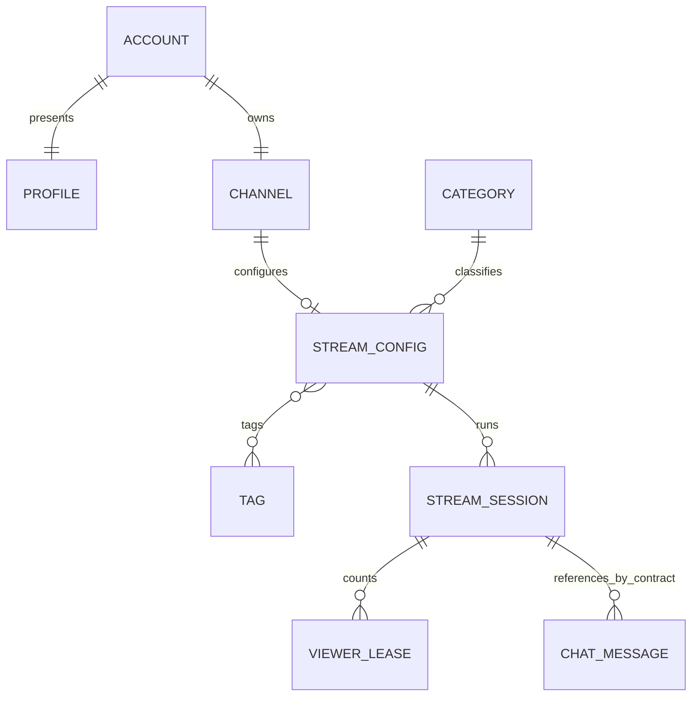

# Contratos y modelo de datos

**Arquitectura:** Core, Chat y Media según ADR-003.
**Regla:** APIs de red solo entre unidades de ejecución. Interfaces locales y FK dentro de Core.

## Propiedad y modelo lógico



ACCOUNT, PROFILE, CHANNEL, CATEGORY, TAG, STREAM_CONFIG, STREAM_SESSION y VIEWER_LEASE están en
PostgreSQL Core: sus referencias internas usan FK y operaciones locales. CHAT_MESSAGE pertenece a
Chat/Redis y es efímero: sessionId y userId allí son referencias opacas por contrato, sin FK entre bases.
Discovery es una consulta/vista, no otra entidad autoritativa ni base de proyecciones distribuida.

| Dueño de escritura | Entidades | Lectores |
| --- | --- | --- |
| Cuentas/Identity dentro de Core | userId, email/handle canónicos, hash, sesión, operaciones idempotentes | Interfaces locales, DTO públicos; nunca email/hash/sesión en respuestas públicas |
| Cuentas/Profile dentro de Core | displayName, bio, avatar y profileVersion | Canal/consultas locales; Chat recibe snapshot autorizado |
| Canales dentro de Core | channelId, ownerUserId, descripción/banner y channelVersion | Consultas públicas locales, módulo Emisiones |
| Catálogo dentro de Core | categorías/tags con IDs, estado y catalogVersion | Emisiones y consultas, mediante FK/lecturas revisadas |
| Emisiones dentro de Core | StreamConfig, secretos ingest, sesiones, cupos, clocks y leases/conteo | Consultas/player, contexto Chat y contratos Media |
| Chat | mensajes efímeros por sesión, secuencia por sala, dedupe y cuota por cuenta | Web, replay/moderación futuros a través del dueño |
| Media | fuente, segmentos/manifiestos y señales técnicas | Core valida disponibilidad; HLS hacia player |

Cada repositorio escribe solo tablas de su módulo. Los casos de uso locales coordinan interfaces de
aplicación con una transacción Core; un read model local puede realizar joins SQL revisados. Ningún
servicio externo importa clases internas o lee tablas de otro. No hay HTTP Core→Core.

## Identificadores, versiones y tiempo

IDs públicos opacos y estables. userId/canal no cambian; handle es inmutable en P1. streamId identifica
configuración persistente y sessionId ejecución. streamGeneration inicia en 0 y aumenta por nueva
sesión; reconexión conserva generación/sesión. sourceGeneration cerca fuentes antiguas.
metadataVersion inicia en 1 y aumenta uno por cambio real; PATCH vacío da 422 EMPTY_PATCH y no-op no
incrementa. profileVersion/channelVersion inician en 0; suben por cambios reales, no por lecturas.
sessionVersion versiona estado/disponibilidad; countVersion es independiente. Mensajes usan sequence
estrictamente creciente por sessionId. No comparar versiones de agregados distintos.

Marcas de tiempo de servidor en UTC con zona explícita; reloj de cliente no es autoridad. El timeline
comienza en cero al primer LIVE reproducible, avanza durante LIVE/gracia, no se reinicia al reconectar
y queda congelado al terminar. `streamOffsetMs` es una coordenada aproximada de sesión; VOD futuro debe
mapearla al medio grabado. P1 no crea grabación ni promete sincronía de replay con archivo inexistente.

## Inventario de interfaces

Las interfaces requieren schema neutro, correlación y presupuesto acotado.

| Interfaz | Proveedor / consumidor | Semántica y fallo |
| --- | --- | --- |
| POST /api/identity/registrations; GET /api/identity/registrations/{id} | Core / Web | Resultado idempotente ACTIVE solo tras commit de cuenta/perfil/canal; no sesión; detalle abajo |
| POST /api/identity/sessions; DELETE /api/identity/sessions/current | Core / Web | Cookie opaca, revocación, CSRF y cuotas preservadas |
| GET /api/identity/public/handles/{handle}; /users/{userId} | Core / Web | Solo cuenta activa y datos públicos mínimos; 404 uniforme |
| GET /api/profile/users/{userId}; GET/PATCH /api/profile/me | Core / Web | Perfil público y edición self; validación local de sesión |
| POST /api/profile/me/avatar-uploads; GET /api/profile/avatars/{key} | Core / Web | Upload de un uso y objeto público inmutable |
| GET /api/channels/by-owner/{userId} | Core / Web | Canal de cuenta activa; sin gate de evento |
| GET /api/channels/by-handle/{handle} | Core / Web | Canal + handle + perfil compuestos localmente; bootstrap incluye stream actual con estado de Emisiones |
| PATCH /api/channels/{channelId}; POST /api/channels/{channelId}/banner-uploads | Core / Web | Propietario; descripción/banner, versión y reglas de imagen |
| GET /api/channels/banners/{key}; GET /api/channels/csrf | Core / Web | Objeto público inmutable; token de la misma seguridad CSRF Core |
| GET /api/taxonomy | Core / Web | IDs/labels activos y versión; validación interna sin API remota |
| POST/GET /api/channels/{channelId}/streams; PATCH /api/streams/{streamId} | Core / Web | Una configuración persistente; valida catálogo/owner localmente |
| POST /api/streams/{streamId}/ingest-keys/rotate | Core / Web | Solo sin sesión activa; secreto una vez |
| GET /api/streams/{streamId}; GET/DELETE /api/streams/sessions/{sessionId} | Core / Web/player | Metadata/estado público y stop owner; no ingest secret |
| POST /api/streams/sessions/{sessionId}/viewer-leases; PUT /api/streams/viewer-leases/{leaseId}/heartbeat; DELETE /api/streams/viewer-leases/{leaseId} | Core / player | Lease anónimo de servidor, heartbeat 10 s, vencimiento 30 s |
| POST /api/discovery/graphql | Core / Web | streams/channels, filtros/ranking/paginación locales; schema conservado abajo |
| GET /api/chat/sessions/{sessionId}/messages; WS /realtime/chat/sessions/{sessionId} | Chat / Web | Historial 1–50, eventos/ACK, anónimo lee, autenticado escribe; chat efímero |
| POST /internal/core/chat/message-context | Core / Chat | Una autorización nueva por mensaje lógico: sesión usuario + autor locales + estado/timeline de Streaming; sin caché de permisos |
| GET /internal/core/chat/sessions/{sessionId} | Core / Chat | Snapshot de existencia/estado/generación y timeline (delegado a Streaming) para abrir/reconciliar sala; sin identidad privada |
| POST /internal/chat/session-events | Chat / Streaming | Notificación durable idempotente de estado de emisión; no autoriza escrituras |
| POST /internal/streaming/ingest/authorize | Core / adaptador Media | streamKey e ingestAttemptId; reserva idempotente de cupo, owner/catálogo locales |
| POST /internal/streaming/sessions/{sessionId}/source-connected; /playback-ready; /source-lost | Core / adaptador Media | ACK durable, generaciones/eventId/path validados; detalle conservado abajo |

`/internal/*` usa TLS privado y token específico por consumidor/ruta; listener público lo bloquea.
Los módulos Core usan interfaces locales; no publican eventos de replicación interna ni requieren
provisión HTTP de canal. Los outboxes se reservan para efectos entre procesos.

## Registro y cuentas: transacción local

POST recibe email, handle, contraseña y Idempotency-Key UUID. Email recorta extremos y compara en
minúsculas, sin plegar puntos/+; handle 4–25 ASCII alfanumérico/underscore, canónico minúsculo, único e
inmutable. Contraseña 12–128 puntos de código Unicode exactos, sin trim/normalización/truncado ni reglas
de composición. Nunca se guarda reversible ni se imprime. Se conserva hash de clave y fingerprint
HMAC del payload; valores normalizados distintos con misma clave dan 409 IDEMPOTENCY_KEY_REUSED.

Una transacción SQL confirma cuenta, perfil inicial (displayName=handle, bio vacía, avatar nulo,
profileVersion=0), canal inicial (channelVersion=0) y operación idempotente. POST devuelve 201
{registrationId,status:"ACTIVE",userId,channelId}; no cookie de sesión. Misma clave/payload conserva IDs
sin otro efecto. Email/handle ocupados devuelven 409 REGISTRATION_UNAVAILABLE uniforme, sin fieldErrors
que revelen cuál existe. Un fallo hace rollback total; timeout/respuesta perdida se recupera repitiendo
la misma clave. El registro se confirma en una operación transaccional, sin estado público parcial.

GET por registrationId requiere la misma clave y devuelve 200 ACTIVE; desconocido/clave incorrecta
404 uniforme. Retener resultado treinta días desde commit; después GET da 404 y operación nueva usa
UUID nuevo. El shell recibe el resultado confirmado sin polling de estados parciales.

## Login, sesión y datos públicos

POST sessions recibe login (email o handle canónico, case-insensitive) y password exacta. Responde
200 {userId,expiresAtUtc}, cookie host-only stream_session Path=/, HttpOnly, SameSite=Lax, Secure en
HTTPS, Max-Age tiempo restante. Credencial opaca >=256 bits, solo hash en servidor; vida fija 24 h,
sin extensión. Login incorrecto 401 uniforme. Logout 204 idempotente, revoca inmediatamente; toda
validación posterior rechaza. Validaciones locales Core consultan interfaz de Cuentas, sin HTTP.
Mutaciones web/login/registro usan CSRF; GET /api/identity/csrf entrega el token de Spring Security.

Login: máximo cinco fallos por identificador normalizado y cincuenta por IP en ventana móvil de 15 min;
éxito reinicia contador del identificador. Registro: diez claves nuevas/IP/hora, retry de clave no
consume otra operación. Exceso 429 RATE_LIMITED + Retry-After; no bloqueo permanente. Concurrencia de
cuotas se resuelve en el dueño, no en un contador independiente por réplica.

Lookup público devuelve userId/handle sin email/hash/credenciales. Cuentas inexistentes/no activas dan
404 uniforme. Los perfiles y canales del nuevo registro están visibles después del mismo commit; no
reintentos de “canal activándose” ni gates de evento. Perfil sin personalización devuelve defaults;
un perfil perdido es una inconsistencia a reparar localmente, no justificación para consultar Identity
por red. Una caída SQL/Core devuelve 503, nunca un falso 404.

## Perfil y composición de canal

GET perfil público devuelve {userId,displayName,bio,avatarUri,updatedAtUtc,profileVersion}. GET/PATCH me
obtiene objetivo del principal, no userId cliente. PATCH permite displayName de 1–50 caracteres, bio
hasta 300 y avatarUploadId. Omitir conserva; displayName:null inválido, bio:null limpia; avatar null
retira, uploadId sustituye. Requiere campo editable; no-op conserva versión, error conserva estado.
Upload multipart file: JPEG/PNG/GIF decodificado real, <=10 MB, ancho y alto >=200 px obligatorios.
Respuesta 201 {uploadId,expiresAtUtc}, ligado al usuario, un uso, vence 15 min. URI de objeto opaca e
inmutable, no ruta física/nombre original. Reemplazo publica objeto nuevo antes de commit; fallo conserva
anterior; borrar antiguo/temporales después de commit y reconciliar huérfanos periódicamente.

`GET /api/channels/by-handle/{handle}` devuelve 200 con un DTO de composición local:

```json
{"channel":{"channelId":"chn_…","ownerUserId":"usr_…","description":"","bannerUri":null,"channelVersion":0},"handle":"caster_01","profile":{"userId":"usr_…","displayName":"caster_01","bio":"","avatarUri":null,"updatedAtUtc":"2026-10-01T20:00:00Z","profileVersion":0},"stream":null}
```

channel contiene exactamente los campos del ejemplo; description inicial vacía y bannerUri nulo.
profile tiene el mismo contrato que GET perfil público. stream es null si no hay configuración;
si existe, contiene el snapshot público de `GET /api/streams/{streamId}` y un campo session con
el snapshot de `GET /api/streams/sessions/{sessionId}` (null antes de la primera emisión).
Session ENDED conserva su identidad y availability=OFFLINE; playbackUrl es null fuera de PLAYABLE.
Core obtiene todos los campos localmente, sin solicitudes HTTP por módulo ni datos de ingestión.
Handle se busca sin distinguir mayúsculas; inexistente/no activo da 404 uniforme, fallo Core/SQL 503.
Web usa el handle devuelto para redirigir casing a URL canónica con 308 y monta player/Chat desde
stream/sessionId. No entregar entidades de cuenta/ORM ni ejecutar un join entre servicios en el shell.

PATCH canal permite solo description (hasta 500 puntos de código; null limpia a cadena vacía) y
bannerUploadId (null retira). Campos omitidos se conservan; cuerpo vacío o campo ajeno da 400
VALIDATION_ERROR. Valida sesión local y propietario, bloquea la fila y aumenta channelVersion una
vez por cambio real; no-op/error conserva datos y versión. Responde los campos de channel del
bootstrap. Upload multipart file devuelve 201 {uploadId,expiresAtUtc}, ligado a owner/channel,
un uso y 15 min; JPEG/PNG/GIF reales <=10 MB. 1200×480 es una recomendación, sin mínimo obligatorio;
límite defensivo de 40 MP. Publicar antes de commit, conservar archivo anterior ante rollback y
reconciliar objetos sin referencias después de una gracia de un día. Las portadas se sirven en
/api/channels/banners/{key}. Cuenta/canal desconocidos dan 404; otro usuario 403, sin sesión 401,
CSRF inválido 403, carga inválida 400 INVALID_BANNER (413 si excede el límite HTTP).

## Semántica de emisión y reloj

Core controla PREPARING, LIVE, RECONNECT_GRACE, ENDED; disponibilidad PLAYABLE, RECONNECTING, OFFLINE.
LIVE requiere HLS confirmado; PREPARING máximo 30 s. Cupo global cinco y uno por canal cuenta
PREPARING/LIVE/gracia, se reserva atómicamente en SQL; sexto rechazo controlado. P1 una réplica de
Core no requiere consenso distribuido, pero timers/callbacks concurren: serializar transiciones con
estado/generaciones y bloqueo/CAS SQL. Una pérdida abre una única gracia de 30 s; reconexión gana solo
con HLS validado antes de 30 s. UTC deadline es informativo; propietario vigente usa monotónico.
Reinicio no da nueva gracia: recuperar restante mediante estrategia durable probada o terminar sesión.
Failover multi-réplica exige fencing/transferencia explicitados en ADR antes de habilitarlo.

## Callbacks Media y contratos de producto

**Callbacks del media adapter.** Las tres rutas internas de la tabla reciben JSON con campos comunes
`eventId` (UUID estable a través de reintentos), `streamId`, `sessionId`, `streamGeneration` y
`sourceGeneration`; solo `playback-ready` añade `playbackPath`. No reciben `occurredAtUtc`: Streaming
asigna `receivedAtUtc` con su reloj. Primer evento válido responde `202` solo después de guardar la
aceptación de forma durable y devuelve `{"accepted":true,"duplicate":false,"eventId":"…"}`; un
reintento con mismo eventId/payload responde `200` con el mismo resultado y `duplicate=true`. Si la
generación es vieja, devuelve `200 {"accepted":true,"ignored":true,"reason":"STALE_GENERATION"}`.
Reutilizar eventId con payload distinto da `409 EVENT_ID_CONFLICT`; sesión/stream no coincidentes dan
`409 SESSION_MISMATCH`; sesión finalizada da `410 SESSION_ENDED`; playbackPath inválido da
`422 INVALID_PLAYBACK_PATH`. El adapter limita cada intento HTTP a 2 s y, ante timeout de red, HTTP
408/429 o 5xx, reintenta con el mismo eventId tras 100, 250, 500, 1000 y 2000 ms; luego continúa cada
2000 ms por un máximo de 15 min desde el primer intento, también si la sesión termina. Cualquier 2xx
confirma el ACK y detiene reintentos; un 410 `SESSION_ENDED` cierra el callback como obsoleto y registra
esa resolución. Si no llega respuesta terminal durante 30 s, se genera una alerta deduplicada por
sessionId/sourceGeneration y se continúa intentando hasta el límite de 15 min; se exponen edad e
intentos como métricas. Al agotar ese plazo, o recibir un 409/422 u otro 4xx permanente, se guarda el
payload y eventId en una dead-letter durable y se detienen los reintentos automáticos. Un operador puede
redrivear el mismo payload y eventId tras corregir/recuperar el receptor (inicia una nueva ventana de
15 min) o cerrar el registro tras confirmar que es irrecuperable/obsoleto. No hay expiración automática
de la dead-letter; retención y umbral de capacidad se fijan en ADR operativo. El endpoint confirma
recepción durable, no disponibilidad de playback; solo la verificación de HLS permite pasar a PLAYABLE.

Los siguientes ejemplos son contratos semánticos, no una imposición de OpenAPI, lenguaje ni librería.
Todas las horas son UTC con `Z`, los IDs son opacos y los errores usan `{code, message, fieldErrors?,
requestId}`.

**Taxonomy.** `GET /api/taxonomy` devuelve IDs estables activos y versión del conjunto; el cliente no crea IDs:

```json
{"catalogVersion":12,"categories":[{"id":"cat_…","name":"Conversación","active":true}],"tags":[{"id":"tag_…","name":"Español","active":true}]}
```

Las categorías/etiquetas nuevas que ingrese el responsable en el catálogo aparecen en esta respuesta
sin reconstruir el cliente web. El orden es estable por nombre normalizado y luego ID. `catalogVersion`
empieza en 1 y aumenta exactamente uno al crear un valor o cambiar su etiqueta/estado. La baja es lógica:
ID y último nombre se conservan como tombstone mientras alguna StreamConfig los referencie; no se
borran físicamente. La lista pública incluye solo valores activos; el lookup interno por ID devuelve
también tombstones para mostrar metadata existente. Un valor inactivo no se puede seleccionar en una
configuración nueva ni en un campo explícito de un PATCH.

**Canal.** `POST /api/channels/{channelId}/banner-uploads` recibe multipart `file`; solo el owner
autenticado puede subir. Valida JPEG/PNG/GIF real, máximo 10 MB y tamaño recomendado 1200×480 px;
devuelve `201 {"uploadId":"upl_…","expiresAtUtc":"…"}`. El uploadId dura 15 minutos, queda ligado
al owner y channelId y se consume una sola vez. `PATCH /api/channels/{channelId}` edita
`description` y `bannerUploadId`; description es opcional y de hasta 500 caracteres. `channelVersion`
inicia en 0 al crear el canal y aumenta en uno solo cuando un PATCH cambia realmente description o
bannerUri; una repetición sin cambios conserva versión. El PATCH aplica de forma atómica solo los campos presentes al estado persistido más reciente; actualizaciones concurrentes se serializan, cambios aceptados en campos distintos se conservan y, si compiten sobre el mismo campo, prevalece el último commit. Omitir un campo
conserva su valor; `description:null` lo limpia; omitir bannerUploadId conserva el banner, `null` lo
elimina y un uploadId lo sustituye. Requiere al menos un campo. La respuesta `200`
contiene `{channelId, ownerUserId, description, bannerUri, channelVersion}`. No se reemplaza el recurso
anterior si validación o persistencia fallan.

**Configuración e inicio de emisión.** Cada canal tiene cero o una configuración persistente de
stream; esta se crea con `POST /api/channels/{channelId}/streams` y
`{"title":"En vivo","categoryId":"cat_…","tagIds":["tag_…"]}`. `title` requerido (1–100 caracteres),
`categoryId` obligatorio y activo, `tagIds` 0–5 IDs únicos activos. La creación inicia
`metadataVersion=1`. La solicitud requiere
`Idempotency-Key`; si ya existe para ese canal se devuelve `200` con la configuración existente y sin
secreto, en vez de crear otra. La primera respuesta `201` contiene `streamId`, campos guardados,
`metadataVersion`, `rtmpUrl` y `streamKey` secreta. Solo se muestra esa vez. Si se pierde, owner puede rotarla
OFFLINE con `POST /api/streams/{streamId}/ingest-keys/rotate`, que invalida la anterior y la muestra
una vez. Al encoder se le configura rtmpUrl y streamKey como password RTMP; el secreto nunca se
incluye en URL, respuesta pública, evento ni log.

El media adapter llama por HTTPS/TLS en red privada a `POST /internal/streaming/ingest/authorize` en
cada intento RTMP válido. Una
clave válida reserva un cupo y crea (o reanuda dentro de RECONNECT_GRACE) un sessionId en PREPARING;
Streaming asigna sourceGeneration monotónica por streamId y solo acepta eventos de la generación
vigente. Clave inválida da `401 INVALID_STREAM_KEY`; otra fuente concurrente para el canal da `409
CHANNEL_ALREADY_ACTIVE`; al alcanzar cinco sesiones reservadas da `409 LIVE_SESSION_LIMIT`. El body
usa transporte interno autenticado y nunca se guarda en logs. Cada slot cuenta desde PREPARING hasta
ENDED, incluyendo LIVE y RECONNECT_GRACE; al acabar PREPARING sin HLS en 30 s, Streaming finaliza la
sesión y libera el cupo. Esto evita sesiones atascadas. `MediaSourceConnected` confirma conexión real
RTMP. Cuando `MediaPlaybackReady` se valida con playlist HLS y al menos un segmento reproducible,
Streaming pasa a LIVE/PLAYABLE y empieza el timeline; inicio y HLS deben completar dentro de 30 s
desde autorización. Disconnect de una sesión LIVE genera `MediaSourceLost` y la gracia de 30 s; una
reconexión válida mantiene el mismo sessionId. Stop voluntario usa
`DELETE /api/streams/sessions/{sessionId}`. Tras ENDED/OFFLINE, el mismo streamId y metadata pueden
servir para la siguiente emisión, que obtiene otro sessionId.

`GET /api/channels/{channelId}/streams` permite al owner volver a cargar la configuración sin mostrar
el secreto. `PATCH /api/streams/{streamId}` acepta uno o más campos de metadata, valida el objeto
completo y actualiza atómicamente antes de RTMP o durante LIVE; éxito devuelve metadataVersion nueva.
Omitir un campo conserva su valor aunque su asociación vigente haya sido desactivada; si el cliente
envía `categoryId` o `tagIds`, todos los IDs enviados deben seguir activos. `tagIds:[]` elimina todas
las etiquetas; categoryId no se puede limpiar. Un patch vacío da 422 `EMPTY_PATCH`. Cambiar título/categoría/tags no
cambia sessionId ni reloj del timeline; al guardar, Core confirma metadataVersion nuevo; las siguientes lecturas locales de canal y
Discovery consultan el commit y lo reflejan dentro del máximo de 5 s, sin evento de replicación.

**Error común.** Ejemplo de error de campo sin filtrar datos privados:

```json
{"code":"INVALID_FILTER","message":"Uno o más filtros no están disponibles.","fieldErrors":{"categoryId":"UNKNOWN_OR_INACTIVE"},"requestId":"req_…"}
```

**Lectura del player.** `GET /api/streams/{streamId}` entrega el estado vigente de configuración/sesión
y `statusFresh`. `streamGeneration` vale 0 antes de la primera emisión y conserva la última generación
después de ENDED; `sessionId` y `sessionVersion` son `null` solo si aún no hubo sesión. Ejemplo LIVE:

```json
{"streamId":"str_…","channelId":"chn_…","sessionId":"ses_…","streamGeneration":3,"title":"Título","category":{"id":"cat_…","name":"Conversación"},"tags":[],"status":"LIVE","availability":"PLAYABLE","statusFresh":true,"viewerCount":3,"countVersion":12,"viewerCountObservedAtUtc":"2026-09-26T20:00:05Z","metadataVersion":7,"sessionVersion":4}
```

Ejemplo de configuración aún no emitida: `{"streamId":"str_…","channelId":"chn_…","sessionId":null,"streamGeneration":0,"status":"OFFLINE","availability":"OFFLINE","statusFresh":true,"metadataVersion":1,"sessionVersion":null}`.

`GET /api/streams/sessions/{sessionId}` entrega disponibilidad, `playbackUrl` solo si es PLAYABLE,
`timelinePositionMs`, `timelineSampledAtUtc`, `metadataVersion`, `sessionVersion`, `viewerCount`,
`countVersion` y `viewerCountObservedAtUtc`. En PREPARING, RECONNECTING o ENDED no debe
retornar un URL como si el medio fuera reproducible.

**Playback lease.** Crear lease solo después del primer frame reproducible y mandar un `Idempotency-Key`
aleatorio en header para que una respuesta perdida no duplique el lease. Ejemplo de response:

```json
{"leaseId":"lease_…","leaseToken":"opaque-secret","sessionId":"ses_…","heartbeatEverySeconds":10,"expiresAfterSeconds":30}
```

El token se manda únicamente en `Authorization: ViewerLease <leaseToken>` al heartbeat/cierre; no se
expone en URL, logs, Discovery ni Chat. El navegador puede renovar o cerrar solo el lease que posee;
una sesión finalizada hace expirar todos sus leases. Una respuesta exitosa al heartbeat devuelve
`{"leaseId":"lease_…","sessionId":"ses_…","expiresAtUtc":"…"}`; token inválido/expirado da
`401`, lease inexistente o sesión finalizada da `404`/`410` según el recurso siga disponible, nunca
renueva el conteo.

`viewerCount` es una estimación operativa de instancias con lease vigente y puede inflarse con tráfico
automatizado: P1 no demuestra criptográficamente que una persona vio el primer frame. Solo se usa para
ordenar Discovery y mostrar audiencia aproximada; no controla autorización, pagos ni beneficios. La
mitigación antiabuso más fuerte (por ejemplo, telemetría de entrega HLS firmada y rate limits en edge)
queda fuera de P1 y debe acordarse antes de usar la métrica para decisiones económicas o de seguridad.

Core calcula el conteo desde leases no vencidos y conserva `countVersion`/`observedAtUtc` en su
módulo de emisiones. Una lectura SQL de Discovery usa ese valor, no espera `ViewerCountChanged`.
Actualizar/agrupar el snapshot como máximo cada segundo y observarlo al menos cada 5 s conserva la
frescura de RNF; `viewerCountFresh=false` si la observación supera 5 s. ENDED invalida leases y excluye
el stream en la misma autoridad. No se necesita reconstruir un índice Discovery ni comparar conteos
contra eventos de ciclo de vida de otra base.

## Chat REST, WebSocket y contexto autorizado

GET messages acepta limit entero 1–50 (default 50) y responde
{sessionId,roomStatus,snapshotSequence,items:[message]} con los últimos N de la sesión en sequence
ascendente; snapshotSequence es el último sequence asignado en la misma lectura atómica. Anónimo puede
leer. Abrir WS y esperar chat.ready antes del historial; fusionar por (sessionId,sequence), sin
huecos/duplicado visible. PREPARING devuelve 409 CHAT_NOT_OPEN; LIVE/gracia sala OPEN; ENDED
READ_ONLY. Desconexión de Chat no interrumpe HLS. Origin WS debe ser exactamente un origen web
configurado, también para anónimos; cookie no es suficiente para aceptar un Origin no permitido.

Frames servidor: {type:"chat.ready",sessionId,roomStatus,lastSequence} tras registrar la conexión;
{type:"message.created",message}; {type:"message.accepted",clientMessageId,messageId,sessionId,
sequence,serverCreatedAtUtc} solo al emisor; {type:"chat.status",sessionId,roomStatus} cuando la
sala cambia (p. ej. READ_ONLY). message = {messageId,sessionId,sequence,author:{userId,handle,
displayName,avatarUri},text,serverCreatedAtUtc,streamOffsetMs,streamGeneration}.

Cliente envía {type:"message.send",clientMessageId:UUID,text}. Normalizar NFC, recortar whitespace
Unicode, 1–500 puntos de código; nunca HTML ejecutable. No aceptar userId/autor/hora/offset/sequence
de cliente. Cuota global por cuenta: un mensaje aceptado en toda ventana móvil 1000 ms, sin burst.
Dedupe (sessionId,userId,clientMessageId) mientras se retenga la sala; repetido devuelve mismo ACK.
Verificar sesión vigente antes de recuperar un ACK para no revelar datos a credencial revocada.

Para cada mensaje nuevo validado, Chat llama una sola vez a POST /internal/core/chat/message-context
con {sessionId,clientMessageId} y X-Session-Credential (cookie opaca), X-Service-Name:chat y token privado.
Core valida sesión de usuario vigente y autor localmente y obtiene estado/timeline actual de Streaming.
Solo LIVE/gracia habilita writeAllowed=true; ENDED devuelve contexto autenticado con
writeAllowed=false y denialCode=CHAT_READ_ONLY, PREPARING con CHAT_NOT_OPEN. Esto permite recuperar
un ACK previo sin autorizar una escritura nueva después del fin. Devuelve {userId,handle,displayName,avatarUri,profileVersion,sessionId,streamGeneration,
sessionVersion,availability,authorizedAtUtc,timelinePositionMs,timelineSampleVersion,writeAllowed,denialCode}. Esta última
versión equivale al sessionVersion del snapshot. Sin perfil personalizado, displayName=handle/avatar=null;
no existe una dependencia Profile HTTP cuyo timeout deba tolerarse. Errores de Core usan el envelope
REST: Chat conserva los códigos STREAMING_UNAVAILABLE, TIMELINE_UNAVAILABLE y AUTH_REQUIRED; 401 es
AUTH_REQUIRED, 404 SESSION_NOT_FOUND y cualquier otro fallo o timeout CORE_UNAVAILABLE.

No cachear contexto para nuevos envíos. Cuota y almacenamiento pertenecen a Chat, no al endpoint Core.
Chat, con el userId confiable, busca primero un resultado de dedupe existente: lo retorna aunque
writeAllowed=false; si no hay resultado, verifica writeAllowed antes de cuota/commit. El mismo
clientMessageId con texto canónico distinto produce MESSAGE_ID_CONFLICT, no otro mensaje.
El contexto no es token reusable por el navegador ni permiso para otros mensajes/sesiones. Presupuestos
objetivo a validar con carga: connect <=100 ms, total <=400 ms (hop Core→Streaming <=200 ms); sin retry
automático del comando de envío. Si Core no responde, frame CORE_UNAVAILABLE y cero persistencia;
Streaming inaccesible STREAMING_UNAVAILABLE; sesión inválida AUTH_REQUIRED; envío nuevo ENDED
CHAT_READ_ONLY; PREPARING CHAT_NOT_OPEN; timeline inválido o ausente TIMELINE_UNAVAILABLE.
El timeout elegido debe revisarse con evidencia, manteniendo p95 de entrega Chat <1 s ni ocultar errores.

Chat asigna hora de servidor y conserva el offset del contexto autorizado (no inventa un reloj del
cliente). Rechaza contexto si el round-trip más tiempo hasta intentar guardar supera 500 ms, usando
monotónico local; devuelve TIMELINE_UNAVAILABLE y permite reintento con mismo clientMessageId. No
extrapola permisos. Una escritura ya autorizada antes de logout/ENDED puede confirmar dentro de ese
presupuesto si Chat aún no observó ENDED; toda autorización posterior observa revocación/fin. Esta
carrera de operación en vuelo es explícita: no se promete transacción distribuida Core–Chat ni
revocación retroactiva de commits.

Chat guarda mensaje, dedupe, secuencia y efecto de cuota atómicamente antes del ACK mediante un script
Redis ([ADR-006](adr/ADR-006-chat-go-redis-efimero.md)), con AOF y fsync por escritura. Unicidad:
(sessionId,sequence) por el ID del Stream y (sessionId,userId,clientMessageId) por el hash de dedupe.
No persistir credencial de usuario. El chat es efímero: al conocer ENDED, la sala queda READ_ONLY y
todas sus claves expiran a los 5 minutos; después el historial está vacío. Cada sala retiene como
máximo los últimos 1000 mensajes.

message.created publica snapshot del autor/texto/offset a conectados. Dedupe también en cliente.
El Redis Stream de la sala es el outbox: cada réplica con conectados lo lee, así que una falla después
de commit antes de broadcast no pierde la entrega. Nunca ACK de mensaje que se puede perder
silenciosamente. Entrega de red puede repetirse y no es exactly-once. Cuota, orden y dedupe se
comparten en Redis entre réplicas; no hay contadores en memoria.

Errores tras Upgrade son frame {type:"error",clientMessageId,code,message,retryAfterMs?}; antes del
Upgrade son HTTP con envelope REST: Origin no permitido 403 ORIGIN_NOT_ALLOWED, sesión inexistente
404 SESSION_NOT_FOUND, PREPARING 409 CHAT_NOT_OPEN, Core/Streaming/Redis caídos 503. Códigos de
frame: AUTH_REQUIRED, CHAT_READ_ONLY, CHAT_NOT_OPEN, CORE_UNAVAILABLE, STREAMING_UNAVAILABLE,
TIMELINE_UNAVAILABLE, RATE_LIMITED (con retryAfterMs), MESSAGE_ID_CONFLICT, MESSAGE_EMPTY,
MESSAGE_TOO_LONG, VALIDATION_ERROR y CHAT_UNAVAILABLE (almacén Chat caído, sin ACK). No convertir error
de Core en anonimato aceptado ni en 404.

GET snapshot privado /internal/core/chat/sessions/{sessionId} al abrir/reconciliar responde
{sessionId,streamId,streamGeneration,sessionVersion,status,availability,timelinePositionMs}, sin
identidad privada; sesión inexistente 404. Historia de sala ya conocida ENDED puede leerse sin Core
mientras Chat conserva su estado; apertura de sesión desconocida con Core caído falla 503, no "sala vacía".

## Único flujo de eventos de negocio entre procesos P1

Streaming guarda cambios de sesión destinados a Chat en un outbox durable dentro del commit.
Dispatcher llama POST /internal/chat/session-events con X-Service-Name:streaming, X-Service-Token y
{eventId,eventType,schemaVersion,aggregateId,sequence,occurredAtUtc,producer:"streaming",
payload:{streamId,sessionId,streamGeneration,sessionVersion,status,availability}}.
aggregateId=session:{sessionId}, sequence=sessionVersion. Chat registra la inbox y aplica el estado en
la misma operación atómica antes del ACK: primer evento 202 {accepted:true,duplicate:false,eventId};
reintento idéntico 200 con duplicate=true; versión o generación vieja 202 con ignored=true y
reason STALE_VERSION; reutilizar ID con payload distinto 409 EVENT_ID_CONFLICT; credencial inválida
401; payload inválido 400. Aplica generación mayor y versión mayor dentro de esa sesión; READ_ONLY es
terminal. Duplicado no reabre ni duplica sala. Estado de escritura siempre se consulta a Core por
contexto, así que un evento tardío no concede permiso. Chat retiene eventIds 24 h.

Timeout por intento 1 s; retry de red/408/429/5xx con backoff 1/2/5/10 s, luego 10 s, hasta 15 min;
respetar Retry-After, alerta deduplicada al atraso >5 s. Al agotar/permanente, retener en dead-letter
durable para redrive con mismo ID; no TTL automático ni pérdida silenciosa. GET snapshot repara
estado de sala conocida al reconectar. Como el chat es efímero, una pérdida total del almacén Chat
vacía las salas activas; su estado se recupera por snapshot al reconectar los clientes.
Un broker futuro requiere ADR y un problema medido; no bus universal inicial.

## Errores, compatibilidad y fronteras

Envelope REST {code,message,fieldErrors?,requestId}; no stack, SQL, secretos, cookie ni email privado.
401 autenticación, 403 propiedad/permiso, 404 inexistente, 409 conflicto, 400/422 validación, 429 cuota,
503/504 indisponible/timeout. GraphQL mantiene extensions code/httpStatus/requestId; WS frames de error.
Mutaciones con idempotencia guardan payload fingerprint y resultado; no reintentar efectos externos
sin ID estable. Schemas versionados/aditivos, eliminación incompatible exige transición y evidencia
de retiro. Clases de aplicación locales no se publican como contrato entre lenguajes.

## Chat Replay futuro

P1 no conserva el chat después de la retención de 5 minutos posterior al fin
([ADR-006](adr/ADR-006-chat-go-redis-efimero.md)). Una fase de Replay deberá definir, en un ADR del
dueño Chat, dónde persistir mensaje/sesión/autor snapshot/texto/timestamp/sequence/offset y
supresiones futuras. Core conserva vínculo VOD–sesión y política de acceso; Media/Core publican
mapping temporal al VOD. Chat servirá ventanas/cursor por contrato, sin copia de tablas ni un
servicio Replay separado de moderación.

## Contratos de consulta y reglas de filtros

Discovery expone una única entrada `POST /api/discovery/graphql` con Content-Type
`application/json`; el body contiene `query`, `operationName` y `variables`. El shell usa consultas
GraphQL versionadas por el módulo; P1 requiere las operaciones `streams` y `channels` con la semántica
de abajo. GraphQL es la interfaz pública conservada; los resolvers son consultas locales dentro de Core.
No se mantiene un runtime Kotlin separado ni llamadas HTTP por fila. La librería concreta requiere ADR.

```graphql
type Query {
  streams(q: String, categoryId: ID, tagId: ID, limit: Int = 20, cursor: String): StreamConnection
  channels(q: String, limit: Int = 20, cursor: String): ChannelConnection
}

type StreamConnection {
  items: [LiveStream!]!
  nextCursor: String
  generatedAtUtc: DateTime!
  statusFresh: Boolean!
}

type LiveStream {
  streamId: ID!
  sessionId: ID!
  channel: PublicChannel!
  title: String!
  category: TaxonomyValue!
  tags: [TaxonomyValue!]!
  status: String!
  availability: String!
  viewerCount: Int!
  viewerCountFresh: Boolean!
  viewerCountObservedAtUtc: DateTime!
  startedAtUtc: DateTime!
  metadataVersion: Int!
  sessionVersion: Int!
  statusFresh: Boolean!
}

type ChannelConnection {
  items: [PublicChannelResult!]!
  nextCursor: String
  generatedAtUtc: DateTime!
  statusFresh: Boolean!
}

type PublicChannelResult {
  channelId: ID!
  userId: ID!
  handle: String!
  displayName: String!
  avatarUri: String
  status: String!
  availability: String!
  title: String
  channelVersion: Int!
  metadataVersion: Int
  sessionVersion: Int
  statusFresh: Boolean!
}

type PublicChannel { channelId: ID!, handle: String!, displayName: String!, avatarUri: String }
type TaxonomyValue { id: ID!, name: String! }
scalar DateTime
```

El shell solicita transmisiones así:

```json
{"operationName":"LiveStreams","query":"query LiveStreams($q:String,$categoryId:ID,$tagId:ID,$limit:Int,$cursor:String){streams(q:$q,categoryId:$categoryId,tagId:$tagId,limit:$limit,cursor:$cursor){items{streamId sessionId channel{channelId handle displayName avatarUri} title category{id name} tags{id name} status availability viewerCount viewerCountFresh viewerCountObservedAtUtc startedAtUtc metadataVersion sessionVersion statusFresh} nextCursor generatedAtUtc statusFresh}}","variables":{"q":"conversación","categoryId":"cat_…","tagId":"tag_…","limit":20,"cursor":null}}
```

Las búsquedas recortan `q`, normalizan a Unicode NFKC y comparan sin distinguir mayúsculas, conservando
las diferencias entre letras con/sin acento; la subcadena puede aparecer en cualquier posición y no
se tokeniza ni translitera. La consulta `streams` acepta
un categoryId y un tagId como máximo, y combina los dos filtros con AND. Los IDs deben existir y estar
activos en Taxonomy; un ID desconocido/inactivo produce error GraphQL de campo con
`extensions.code=INVALID_FILTER`, `extensions.httpStatus=422` y `extensions.requestId`; el error no se
interpreta como texto libre. Seleccionar varios tagIds queda fuera de P1. `limit` predeterminado 20,
máximo 50; valor inválido produce error `INVALID_LIMIT`/422. Solo incluye availability=PLAYABLE y
ordena `viewerCount DESC, startedAtUtc DESC, streamId ASC`. El cursor es opaco, enlazado al filtro y a
un snapshot/version de ranking; cursor inválido o de otros filtros produce `INVALID_CURSOR`/422.

La consulta `channels` busca subcadena normalizada en handle/displayName e incluye OFFLINE y LIVE,
incluido LIVE/RECONNECTING; los campos del perfil público pueden estar en fallback. El orden prioriza:
match exacto, prefijo y luego subcadena; dentro de cada clase, match de handle precede a displayName,
y el desempate es handle y userId ascendente. `streams` mantiene el orden de popularidad incluso con
`q`. Cada fila tiene `statusFresh`; en la conexión, `statusFresh=true` solo si todas las filas son
frescas (para cero filas es `true`). Un stream solo aparece si su estado PLAYABLE está confirmado; si no,
se excluye. Una fila de canal con estado no confirmado muestra availability=UNKNOWN y
`statusFresh=false`, sin inventar OFFLINE. Errores de autenticación no aplican porque ambas consultas son
públicas. El envelope GraphQL de error conserva `message` seguro, `path` y `extensions` con code,
requestId e httpStatus equivalente. Errores de sintaxis o variables faltantes son HTTP 400 con
`BAD_REQUEST`; fallos del servicio son HTTP 503/504 con requestId. Un error en un campo no descarta
datos de otros campos independientes de la misma consulta.

**Límites de consulta pública:** body JSON máximo 16 KiB; solo `streams` y `channels` pueden ser root
fields, cada uno una vez; no se permiten aliases, fragments ni introspection; `limit` máximo 50 por
conexión y suma de `limit` por request ≤100. Una petición que exceda forma/costo devuelve HTTP 422
`QUERY_LIMIT_EXCEEDED` antes de consultar SQL. El endpoint acepta como máximo 600 requests por
IP confiable en una ventana móvil de 60 s, con burst de 20; excederlo devuelve HTTP 429
`RATE_LIMITED` y `Retry-After`. SPEC-12 debe eliminar `X-Forwarded-For` aportado por el cliente y
establecer la IP confiable para que este límite no sea evadible mediante headers falsos.

```json
{"data":{"streams":{"items":[{"streamId":"str_…","sessionId":"ses_…","channel":{"channelId":"chn_…","handle":"caster_01","displayName":"Caster","avatarUri":null},"title":"Conversación en directo","category":{"id":"cat_…","name":"Conversación"},"tags":[{"id":"tag_…","name":"Español"}],"status":"LIVE","availability":"PLAYABLE","viewerCount":8,"viewerCountFresh":true,"viewerCountObservedAtUtc":"2026-09-26T20:00:00Z","startedAtUtc":"2026-09-26T19:00:00Z","metadataVersion":10,"sessionVersion":11,"statusFresh":true}],"nextCursor":null,"generatedAtUtc":"2026-09-26T20:00:00Z","statusFresh":true}}}
```

Sin coincidencias devuelve una conexión válida con `items: []` y `nextCursor: null`. Las lecturas de Discovery identifican la freshness de estado y conteo por fila; `statusFresh` y `viewerCountFresh` son señales independientes. Si no se puede confirmar el estado actual, no afirman PLAYABLE ni inventan OFFLINE: canales pueden tener availability=UNKNOWN con `statusFresh=false`; streams no confirmados se excluyen de resultados reproducibles. Si un proveedor falla, devolver error 503/504 con requestId; los root fields GraphQL independientes conservan los datos que sí se pudieron obtener.


Las lecturas SQL entre módulos Core usan vistas/proyecciones de lectura publicadas por el dueño,
columnas explícitas y permisos de solo lectura; no acceso irrestricto a tablas privadas. Son contrato
local versionado/revisado según RNF-041/042 y excluyen credenciales/secretos.
