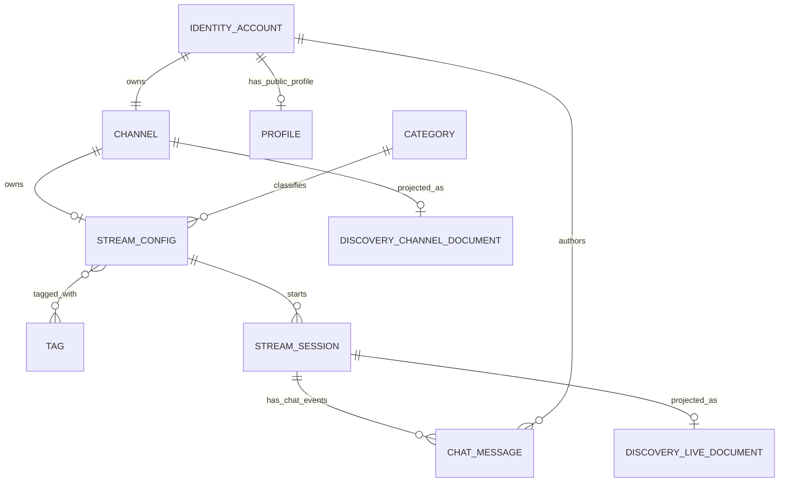

# Contratos y modelo de datos — STREAMING

**Estado:** contratos lógicos acordados; esquemas y tecnologías concretos se cierran con ADR por dominio.
**Regla principal:** un consumidor usa la API/evento publicado por el dueño, no las tablas privadas.

## Propiedad de datos y ERD lógico



`IDENTITY_ACCOUNT`, `CHANNEL`, `PROFILE`, `STREAM_CONFIG`, `STREAM_SESSION`, `CATEGORY`, `TAG` y demás relaciones son
entidades lógicas. Como los dominios pueden persistir en almacenes distintos, los IDs externos no son
foreign keys entre bases: cada consumidor valida referencias mediante contrato y maneja referencias
eventualmente ausentes. El ERD físico debe quedar en el módulo dueño.

Título, categoría y tags son propiedad de `STREAM_CONFIG`/`streamId`, por lo que existen aunque el
canal esté OFFLINE y no haya una sesión previa. Cada `STREAM_SESSION` refiere a esa configuración y
puede conservar el snapshot/version necesario para reproducir sus eventos. Discovery mantiene por
separado un `DISCOVERY_CHANNEL_DOCUMENT` por canal ACTIVE (incluidos canales OFFLINE) y un
`DISCOVERY_LIVE_DOCUMENT` por sesión que confirma PLAYABLE; una sesión sin reproducción no se anuncia
como live.

| Dominio dueño | Entidades y datos propios | Identificadores compartidos permitidos |
| --- | --- | --- |
| Identity | cuenta, email normalizado, handle, hash, estado y sesión | `userId`, `handle` público; nunca hash/email en consultas públicas. Identity es la única autoridad del handle. |
| Profile | `displayName`, `bio`, `avatarUri` | `userId` como clave externa |
| Channels | `channelId`, `ownerUserId`, `description`, `bannerUri` | `channelId`, `ownerUserId` y estado/stream proyectado de Streaming. No guarda ni decide el handle; la URL lo resuelve Identity. |
| Streaming | `streamId` estable por canal, metadata vigente, secreto de ingestión; `sessionId` nuevo por emisión, estado, tiempos, leases y conteo | `streamId`, `sessionId`, `channelId`, IDs de catálogo; fuente de verdad de LIVE y metadata de stream |
| Chat | `messageId`, `sessionId`, `userId`, snapshot del nombre visible, contenido, `serverCreatedAt`, `streamOffsetMs`, `sequence` | `sessionId`, `userId`; no requiere consultar perfil para reproducir un mensaje histórico |
| Taxonomy | `categoryId`, nombres/locales si aplica, `tagId`, estado | IDs estables que Streaming persiste |
| Discovery | documento derivado consultable, campos de búsqueda y tiempo de actualización | referencias públicas y cursor/versiones; reconstruible desde fuentes/eventos |

## Identificadores, tiempo y compatibilidad

- IDs públicos son opacos, estables e independientes del ID secuencial de una base concreta.
- Todas las marcas de tiempo de servidor se expresan en UTC con zona explícita. `sequence` crece dentro
  de un agregado namespaced; nunca se compara entre aggregateIds distintos. Los IDs canónicos son
  `identity:{userId}`, `profile:{userId}`, `channel:{channelId}`, `stream:{streamId}`,
  `session:{sessionId}`, `viewer-count:{sessionId}` y `chat-session:{sessionId}`. En P1, sequence
  corresponde respectivamente a la versión pública de Identity (1 en activación), profileVersion,
  channelVersion, metadataVersion, sessionVersion, countVersion y la sequence de mensajes de Chat.
  IdentityPublicChanged es la única publicación de Identity P1 por cuenta; una extensión futura que
  publique más cambios debe incrementar esa versión. Relojes de cliente no son autoridad.
- `streamId` identifica la configuración persistente y su `metadataVersion`, monotónica por streamId.
  Una configuración nueva inicia `metadataVersion=1`; un PATCH con cambio real incrementa exactamente
  uno, mientras un no-op no incrementa (PATCH sin campos devuelve 422 `EMPTY_PATCH`).
- `streamGeneration` inicia en 0 al crear StreamConfig, antes de emitir. Cada sessionId nuevo recibe la
  siguiente generación entera; reconexión conserva sessionId/generación. Tras ENDED se conserva la
  última generación; una configuración nunca emitida tiene `sessionId=null` y `sessionVersion=null`.
- Cada emisión nueva incrementa `streamGeneration` monotónica por streamId; una reconexión dentro de
  gracia conserva la misma generación y sessionId. Cada `sessionId` nuevo lleva una generación superior
  y tiene su propio `sessionVersion`, monotónico para estado, disponibilidad y timeline. Eventos de
  metadata usan `aggregateId=stream:{streamId}`; los de ciclo de vida, disponibilidad y timeline usan
  `aggregateId=session:{sessionId}`; viewer snapshots usan `aggregateId=viewer-count:{sessionId}` y Chat
  usa `aggregateId=chat-session:{sessionId}`. Cada uno lleva su versión/sequence propia e incluye
  streamGeneration donde corresponde. Una proyección selecciona la streamGeneration mayor y luego
  compara sessionVersion solo dentro de esa sesión; nunca compara versiones de agregados distintos.
  Discovery retiene las versiones pertinentes por separado.
- `streamOffsetMs` representa el tiempo relativo al origen reproducible de la sesión; Streaming publica la regla y Chat guarda el valor recibido. No convertir hora de pared a offset sin sincronización definida.
- Schemas publicados tienen versión explícita o política de compatibilidad. Cambios aditivos no deben
  romper consumidores; retirar/renombrar campos requiere transición acordada y evidencia de adopción.
- La entrega de eventos puede repetirse o llegar tarde. Cada consumidor deduplica por ID de evento,
  vuelve a procesar de forma segura y ejecuta reconciliación donde requiera una proyección completa.

## Contratos entre dominios P1

Los paths y nombres de evento de esta sección son los contratos normativos de P1; todavía no afirman
que las APIs estén desplegadas. Host, puerto, framework y mecanismo interno de persistencia pueden
elegirse por ADR. Cambiar un path o la semántica requiere actualizar este inventario, los consumidores
y los SPEC afectados antes de implementar el cambio.

| Contrato | Productor → consumidor | Datos mínimos | Auth / errores / resiliencia |
| --- | --- | --- | --- |
| `POST /api/identity/registrations` | Identity ← shell | email, handle, contraseña y `Idempotency-Key`; respuesta `registrationId` + `PENDING`/`ACTIVE`; ACTIVE entrega userId/channelId, nunca sesión | duplicado de email/handle usa el mismo `409 REGISTRATION_UNAVAILABLE` sin revelar cuál existe; PENDING vence a las 24 h; POST repetido de operación EXPIRED devuelve `410` y `code=REGISTRATION_EXPIRED`; password y clave nunca se devuelven; reenvío dentro de retención devuelve el mismo resultado |
| `GET /api/identity/registrations/{registrationId}` | Identity ← shell | estado recuperable `PENDING`/`ACTIVE`/`EXPIRED` y, al completar, userId/channelId; nunca emite credencial ni sesión | requiere el mismo `Idempotency-Key`; clave de recuperación por HTTPS, nunca logs; `202` PENDING, `200` ACTIVE, `410` con `code=REGISTRATION_EXPIRED` y estado EXPIRED; después de ACTIVE el usuario hace login normal |
| `GET /api/identity/public/handles/{handle}` | Identity → shell/Channels/Discovery | userId y handle canónico, nunca email/credenciales | solo cuentas ACTIVE; lookup case-insensitive sobre handle canónico minúsculo; `404` indistinguible para PENDING, EXPIRED o inexistente |
| `GET /api/identity/public/users/{userId}` | Identity → Profile/Channels/Discovery/Chat | userId y handle canónico, nunca email/credenciales | solo cuentas ACTIVE; `404` indistinguible para PENDING, EXPIRED o inexistente; permite poblar/reconstruir proyecciones desde userId y fallback de Profile |
| `POST /api/identity/sessions` | Identity ← shell | credenciales; principal/sesión y expiración | 401 uniforme; límite de intentos; secretos nunca en logs |
| `DELETE /api/identity/sessions/current` | Identity ← shell | sesión autenticada | revocación idempotente; 401/204 definidos |
| `POST /internal/identity/sessions/introspect` | Identity ← servicios de dominio | credencial opaca de sesión recibida en cookie por el servicio; devuelve `active`, userId, handle canónico y expiración | HTTPS/TLS también dentro de red privada + autenticación de servicio; no cachear en P1 para observar logout inmediatamente; `200 active=false` si inválida, `503` si Identity no disponible; no registrar ni persistir credencial |
| `GET /api/profile/users/{userId}` | Profile → shell/Channels/Chat/Discovery | displayName, bio, avatarUri y profileVersion; nunca email | identidad PENDING/EXPIRED/inexistente devuelve el mismo `404`; para ACTIVE sin proyección Profile consulta Identity y devuelve fallback seguro documentado abajo; Identity no disponible produce `503`, no `404` |
| `GET/PATCH /api/profile/me` | Profile ↔ shell | lectura y edición parcial del perfil del principal | autenticado; PATCH solo self; upload de avatar ligado al principal; 401 vs 403 |
| `POST /api/profile/me/avatar-uploads` | Profile ← shell | multipart con un archivo JPEG/PNG/GIF de avatar | autenticado; máximo 10 MB; validar tipo real/dimensiones y emitir uploadId temporal ligado al userId |
| `GET /api/channels/by-owner/{userId}` | Channels → shell/BFF | channelId, descripción/banner, `channelVersion` y proyección pública de stream | lectura pública solo desde proyección activa creada por `IdentityPublicChanged`; `404` indistinguible para PENDING, EXPIRED o no proyectado; Channels nunca valida ni redefine el handle |
| `PATCH /api/channels/{channelId}` | Channels ← shell | edición parcial de descripción/banner; channelId y principal autenticado | owner only; omisión conserva, null limpia campos opcionales; validación del archivo en servidor |
| `POST /api/channels/{channelId}/banner-uploads` | Channels ← shell | multipart con imagen de portada | autenticado como owner; JPEG/PNG/GIF hasta 10 MB; validar tipo real/dimensiones y emitir uploadId ligado al userId/channelId |
| URL web `/channels/{handle}` | shell → Identity → Channels/Profile/Streaming | shell resuelve handle canónico a userId con Identity y después compone el canal | handle es propiedad de Identity; en P1 es inmutable. Si Identity confirma ACTIVE y Channel responde 404 por retraso de proyección, shell reintenta por un máximo acumulado de 2 s y luego muestra estado transitorio explícito con acción de reintento, no una página 404. Profile usa fallback desde Identity si su proyección no está lista. Un futuro cambio de handle requiere actualizar proyecciones/alias y política de URL en ADR |
| `GET /api/taxonomy` | Taxonomy → shell/Streaming/Discovery | categorías y tags con IDs/labels | lectura pública; estado activo y catalogVersion |
| `GET /internal/taxonomy/values/{valueId}` | Taxonomy → Streaming/Discovery | ID, etiqueta estable y estado activo/inactivo | HTTPS/TLS en red privada + autenticación de servicio; conserva lectura de tombstones usados por configuraciones existentes |
| `POST /api/channels/{channelId}/streams` | Streaming ← shell | crear la configuración persistente única del canal: metadata, streamId, rtmpUrl y streamKey de emisión | owner autenticado; idempotente por channelId; clave visible solo en la primera respuesta/rotación; retry devuelve configuración sin secreto; no crea sesión LIVE |
| `GET /api/channels/{channelId}/streams` | Streaming → shell del owner | configuración persistente, streamId, metadata y estado actual; sin revelar streamKey | owner autenticado; 404 si aún no se configuró; no expone stream key |
| `PATCH /api/streams/{streamId}` | Streaming ← shell | reemplazar parcialmente title, categoryId y tagIds de la configuración del canal | principal propietario; validar activos solo los IDs enviados explícitamente; campos omitidos preservan incluso una asociación que luego quedó inactiva; permitido OFFLINE y durante LIVE |
| `POST /api/streams/{streamId}/ingest-keys/rotate` | Streaming ← shell | invalidar clave anterior y emitir una nueva | owner autenticado; solo OFFLINE; clave nueva se muestra una vez; 409 si hay sesión activa |
| `GET /api/streams/{streamId}` | Streaming → shell/player | metadata pública, metadataVersion, channelId, streamGeneration y sesión/disponibilidad actual si existe | lectura anónima; no devuelve ingest secret; estado y freshness explícitos |
| `GET /api/streams/sessions/{sessionId}` | Streaming → player/Chat/Channels/Discovery | estado interno y público, streamGeneration, sessionVersion, manifest HLS solo cuando reproducible, timeline sample, metadataVersion y snapshot `viewerCount`/`countVersion`/`viewerCountObservedAtUtc` | lectura pública salvo datos privados; `404` sesión inexistente; media unavailable no se representa como un LIVE reproducible |
| `DELETE /api/streams/sessions/{sessionId}` | Streaming ← shell | termina inmediatamente la sesión activa del canal propio | owner autenticado; idempotente para la misma sesión; el evento ENDED se emite una sola vez |
| `POST /internal/streaming/ingest/authorize` | media adapter → Streaming | valida streamKey en body y `ingestAttemptId` estable por intento; reserva cupo, devuelve streamId, sessionId, streamGeneration y sourceGeneration | HTTPS/TLS en red privada + media adapter autenticado; retry con mismo ingestAttemptId devuelve mismo resultado; intento concurrente distinto da `409 CHANNEL_ALREADY_ACTIVE`/`LIVE_SESSION_LIMIT`; nunca registra body/secreto |
| `POST /api/streams/sessions/{sessionId}/viewer-leases` | player → Streaming | crea lease por instancia de reproducción tras primer frame; cliente aporta `Idempotency-Key`, no el conteo | anónimo permitido; servidor emite ID/token opacos atados a sessionId; no se acepta `viewerCount` del cliente |
| `PUT /api/streams/viewer-leases/{leaseId}/heartbeat` | player → Streaming | renueva lease con su token opaco | header `Authorization: ViewerLease <leaseToken>`; heartbeat esperado cada 10 s; expira 30 s tras último heartbeat válido; sesión ENDED invalida lease inmediatamente |
| `DELETE /api/streams/viewer-leases/{leaseId}` | player → Streaming | cierre explícito de lease | requiere token en header; idempotente; lease queda fuera del conteo inmediatamente |
| `POST /api/discovery/graphql` (GraphQL sobre HTTP/JSON) | Discovery ← shell | campos `streams` y `channels`, parámetros paginados y freshness | anónimo; `streams` solo PLAYABLE; errores de campo GraphQL llevan código estable/requestId; límites abajo |
| `GET /api/chat/sessions/{sessionId}/messages?limit=50` | Chat → shell | historial reciente de una sesión, `limit` entre 1 y 50 (default 50), ascendente por `sequence`; incluye `snapshotSequence` | lectura anónima; `404 SESSION_NOT_FOUND`; sesión ENDED conserva lectura |
| `WS /realtime/chat/sessions/{sessionId}` | Chat ↔ shell | el servidor envía `chat.ready` tras Upgrade y luego `message.created`; cliente envía `message.send`; servidor confirma con `message.accepted` o `error`; ping/pong de protocolo | WebSocket es el único transporte P1; lectura anónima y envío autenticado; Origin debe ser el origen web configurado; Chat obtiene el principal mediante introspección privada en Identity por cada envío y nunca confía en campos del cliente |
| `POST /internal/channels/provision` | Identity → Channels | ownerUserId, registrationId, pendingUntilUtc y requestId/Idempotency-Key; resultado único channelId | HTTPS/TLS en red privada + exclusiva para servicio Identity autenticado; el reverse proxy público no enruta `/internal/*`; canal no se publica hasta IdentityPublicChanged ACTIVE |
| `GET /internal/channels/provisions/{registrationId}` | Identity → Channels | estado `PENDING`, `PROVISIONED` o `ABSENT`, con ownerUserId/channelId cuando está provisionado | HTTPS/TLS en red privada + autenticación de servicio; registrationId es único e inmutable; después del deadline devuelve estado terminal y garantiza que no queda una creación en vuelo que pueda confirmarse después |
| `DELETE /internal/channels/provisions/{registrationId}` | Identity → Channels | elimina solo la provisión vinculada al registrationId | HTTPS/TLS en red privada + autenticación de servicio; idempotente; 204 si elimina o ya no existe; no requiere channelId que Identity quizá no recibió |
| Evento `IdentityPublicChanged` | Identity → Channels/Profile/Discovery | userId, handle canónico e identityVersion; solo identidad pública, nunca email | se emite solo al pasar ACTIVE y activa proyecciones públicas; PENDING/EXPIRED nunca emiten; Discovery solicita channel/profile para ese userId después del evento; versión por userId |
| Evento interno `ChannelProvisioned` | Channels → Identity | ownerUserId, registrationId, channelId, channelVersion=0 y requestId | outbox o mecanismo durable equivalente ligado a la transacción de creación; no publica cuenta ni canal y no se envía a Discovery |
| Evento `ChannelChanged` | Channels → Discovery | channelId/ownerUserId, descripción/banner, channelVersion | solo tras IdentityPublicChanged ACTIVE; Discovery obtiene la base del canal después de la activación y aplica versiones mayores |
| `POST /internal/streaming/sessions/{sessionId}/source-connected` | media adapter → Streaming | eventId, streamId, sessionId, streamGeneration y sourceGeneration | HTTPS/TLS privado + autenticación de servicio; `202` tras aceptación durable, `200` para duplicado o generación obsoleta; transición queda PREPARING, no publica LIVE |
| `POST /internal/streaming/sessions/{sessionId}/playback-ready` | media adapter → Streaming | campos comunes de señal y playbackPath relativo | misma auth y ACK durable; `playbackPath` debe ser manifiesto HLS bajo `/hls/{sessionId}/`, sin host/esquema externo, traversal ni otro sessionId; Streaming verifica playlist y segmento antes de LIVE/PLAYABLE |
| `POST /internal/streaming/sessions/{sessionId}/source-lost` | media adapter → Streaming | campos comunes de señal | misma auth y ACK durable; Streaming sella `receivedAtUtc` con su reloj y abre gracia de 30 s; no confía en timestamps enviados por media adapter |
| Evento `ViewerCountChanged` | Streaming → Discovery | eventId, streamId, sessionId, streamGeneration, countVersion, viewerCount y `observedAtUtc` | snapshot durable al pasar a PLAYABLE (countVersion inicia en 1), en cada cambio efectivo (coalescido a máximo 1/s) y heartbeat cada 5 s; countVersion aumenta en uno por snapshot; entrega al menos una vez y consumidor deduplica/aplica la versión mayor |
| Eventos `StreamSession*` | Streaming → Chat/Channels/Discovery | sessionId, streamId, streamGeneration, channelId, estado, eventId, sequence/sessionVersion y metadataVersion; Chat además necesita offset | idempotencia, retry/backoff; proyección elige la mayor streamGeneration y luego sessionVersion por sesión; `StreamSessionEnded` retira el stream de resultados PLAYABLE |
| Evento `ProfilePublicChanged` | Profile → proyecciones de canal/búsqueda/chat | userId, displayName/avatar, profileVersion | solo campos públicos; consumidor guarda snapshot cuando aplique |

## Sobre de errores

Todos los contratos deben acordar un envelope con `code`, `message` para humanos, `fieldErrors`
cuando hay validación, `requestId`/correlation y detalle seguro. No incluir tracebacks, credenciales,
tokens, SQL ni datos privados. Distinguir no autenticado (401), no autorizado (403), recurso inexistente
(404), conflicto de estado/idempotencia (409), validación (400/422), límite (429) y dependencia no
disponible/timeout (503/504) según convención confirmada en los schemas.

## Eventos, retries y consistencia

- Evento con `eventId`, `eventType`, `schemaVersion`, `occurredAtUtc`, productor y payload; publicar un
  ID de agregación/session cuando el orden importa.
- Timeout/retry deben ser acotados con backoff y jitter. Para comandos no repetir efecto: usar key de
  idempotencia o ID único cuando sea apropiado.
- Confirmar si las llamadas entre dominios son síncronas o si hay proyección/eventos; una proyección
  documenta frescura objetivo y política de backfill/reconciliación.
- Fallo de Discovery no detiene emisión; fallo de Chat no detiene playback; fallo de Taxonomy no hace
  inválidas asociaciones ya aceptadas; Identity inaccesible no debe confiar en credenciales expiradas.

## Semántica de sesión, viewers y timeline

La sesión Streaming tiene estados internos `PREPARING`, `LIVE`, `RECONNECT_GRACE` y `ENDED`. Durante
`RECONNECT_GRACE`, la misma sesión continúa hasta cumplir 30 segundos desde la detección de pérdida:
el estado de ciclo sigue activo, la disponibilidad es `RECONNECTING`, el reproductor informa esa
condición, Channels puede mostrar “En vivo · reconectando”, Discovery no presenta el stream en las
listas que prometen reproducción disponible y Chat conserva lectura/escritura. Al expirar la gracia o
recibir stop voluntario, la disponibilidad es `OFFLINE`, la sesión queda `ENDED` y Chat solo lectura.
La misma regla se usa en eventos y lecturas. Al detectar la pérdida, Streaming fija una sola vez
`graceDeadlineAtUtc = lossDetectedAtUtc + 30 s`; publicarlo permite observar el límite, pero el campo
UTC por sí solo no arbitra una carrera ni es reloj de cliente. El dueño vigente de la sesión mide el
tiempo con reloj monotónico del servidor: acepta reconexión solo si `elapsedSinceLoss < 30 s`; en
`elapsedSinceLoss >= 30 s` timer y callback se serializan en una transición atómica condicionada al
estado, `sessionId`, `streamGeneration` y fencing token vigentes, y gana ENDED. Una transferencia de
dueño no reinicia ni extiende la gracia: debe transferir el tiempo restante y cercar al dueño anterior;
si no puede demostrar el tiempo restante, termina la sesión en lugar de conceder otra gracia. Estos
detalles de reloj distribuido/fencing se cierran en ADR. Callbacks tardíos de esa sesión no la reabren.
Un nuevo intento posterior crea otro sessionId y mayor `streamGeneration`. Callbacks de una fuente vieja
dentro de la sesión vigente se ignoran por `sourceGeneration`. Las proyecciones eligen primero la mayor `streamGeneration` por
streamId y luego comparan `sessionVersion` solo dentro de ese sessionId; nunca ordenan sesiones
distintas solo por sessionVersion. Los cambios de metadata se deduplican/ordenan por `metadataVersion`
del streamId.

Un playback lease cuenta una instancia de reproductor, no una cuenta ni una conexión de Chat. Solo se
crea tras un primer frame reproducible. Se renueva cada 10 s, vence a los 30 s desde el último heartbeat
validado y termina inmediatamente al cerrar o finalizar la sesión. `viewerCount` es un valor calculado
por Streaming; rechaza identificadores, tokens y conteos elegidos por el cliente.

El timeline de P1 comienza en cero al primer estado LIVE reproducible y avanza como reloj monotónico de
la sesión durante LIVE y la gracia; no se reinicia en reconexión y termina con la sesión. `timelineSample`
lleva `sessionId`, `sampledAtUtc`, `timelinePositionMs`, `availability` y `sessionVersion`. Streaming publica
la muestra al iniciar, al cambiar disponibilidad/terminar y al menos una vez por segundo mientras está
LIVE **y durante toda la ventana RECONNECT_GRACE**. En gracia, `timelinePositionMs` sigue avanzando y
`availability=RECONNECTING`; el último sample marca ENDED al terminar. Chat extrapola desde la última
muestra usando su reloj monotónico local hasta recibir otra. Cada
mensaje aceptado almacena `serverCreatedAtUtc`, `streamOffsetMs` y `timelineSampleVersion`; los relojes
de cliente no intervienen. El timeline sirve como coordenada de Chat Replay futuro; P1 no garantiza
sincronización con un archivo VOD que aún no existe, y la fase VOD deberá preservar o mapear esta
coordenada.

## Esquemas neutrales de interacción P1

**Callbacks del media adapter.** Las tres rutas internas de la tabla reciben JSON con campos comunes
`eventId` (UUID estable a través de reintentos), `streamId`, `sessionId`, `streamGeneration` y
`sourceGeneration`; solo `playback-ready` añade `playbackPath`. No reciben `occurredAtUtc`: Streaming
asigna `receivedAtUtc` con su reloj. Primer evento válido responde `202` solo después de guardar la
aceptación de forma durable y devuelve `{"accepted":true,"duplicate":false,"eventId":"…"}`; un
reintento con mismo eventId/payload responde `200` con el mismo resultado y `duplicate=true`. Si la
generación es vieja, devuelve `200 {"accepted":true,"ignored":true,"reason":"STALE_GENERATION"}`.
Reutilizar eventId con payload distinto da `409 EVENT_ID_CONFLICT`; sesión/stream no coincidentes dan
`409 SESSION_MISMATCH`; sesión finalizada da `410 SESSION_ENDED`; playbackPath inválido da
`422 INVALID_PLAYBACK_PATH`. El adapter limita cada intento HTTP a 2 s y, ante timeout de red, HTTP
408/429 o 5xx, reintenta con el mismo eventId tras 100, 250, 500, 1000 y 2000 ms; luego continúa cada
2000 ms por un máximo de 15 min desde el primer intento, también si la sesión termina. Cualquier 2xx
confirma el ACK y detiene reintentos; un 410 `SESSION_ENDED` cierra el callback como obsoleto y registra
esa resolución. Si no llega respuesta terminal durante 30 s, se genera una alerta deduplicada por
sessionId/sourceGeneration y se continúa intentando hasta el límite de 15 min; se exponen edad e
intentos como métricas. Al agotar ese plazo, o recibir un 409/422 u otro 4xx permanente, se guarda el
payload y eventId en una dead-letter durable y se detienen los reintentos automáticos. Un operador puede
redrivear el mismo payload y eventId tras corregir/recuperar el receptor (inicia una nueva ventana de
15 min) o cerrar el registro tras confirmar que es irrecuperable/obsoleto. No hay expiración automática
de la dead-letter; retención y umbral de capacidad se fijan en ADR operativo. El endpoint confirma
recepción durable, no disponibilidad de playback; solo la verificación de HLS permite pasar a PLAYABLE.

Los siguientes ejemplos son contratos semánticos, no una imposición de OpenAPI, lenguaje ni librería.
Todas las horas son UTC con `Z`, los IDs son opacos y los errores usan `{code, message, fieldErrors?,
requestId}`.

**Registro recuperable.** Request de `POST /api/identity/registrations`:

```json
{"email":"person@example.test","handle":"caster_01","password":"demo-secret"}
```

El email se recorta en los extremos y se compara en minúsculas; no se pliegan alias con `+` ni puntos.
Handle P1 acepta 4–25 caracteres ASCII alfanuméricos o `_`, sin espacios ni transliteración; su forma
canónica es minúscula y la unicidad no distingue mayúsculas. La contraseña P1 acepta 12–128 puntos de
código Unicode, incluidos espacios; se valida y compara exactamente como se ingresó, sin recortarla ni
normalizarla, y no se trunca. No se exige mezcla de clases de caracteres ni caducidad periódica.
El `Idempotency-Key` viaja en header y es un UUID aleatorio por intento lógico, reutilizado exactamente
en todos los reintentos. Identity conserva el hash de la clave y un fingerprint del request junto a la
operación y nunca registra su valor. La misma clave con payload normalizado distinto devuelve `409
IDEMPOTENCY_KEY_REUSED`. Email/handle duplicado responde igual con `409 REGISTRATION_UNAVAILABLE`, sin indicar cuál
está ocupado ni adjuntar `fieldErrors`. En éxito completo: `201` con
`{"registrationId":"reg_…","status":"ACTIVE","userId":"usr_…","channelId":"chn_…"}`.
El registro nunca inicia sesión ni emite cookie. Mientras el canal no esté provisionado: `202` con
`{"registrationId":"reg_…","status":"PENDING","retryAfterSeconds":2}`; la cuenta pendiente no
puede iniciar sesión ni aparecer en interfaces públicas. Un worker reintenta Channels con backoff
exponencial de 1 s a máximo 5 min; el GET también dispara un reintento inmediato. Si sigue PENDING
24 h desde el instante persistido `pendingSinceUtc` en que se crea PENDING, la operación pasa a EXPIRED, libera las reservas de email/handle y devuelve
`410 REGISTRATION_EXPIRED`; el usuario puede comenzar otra vez con una clave UUID nueva. Repetir `POST` con la misma clave mientras se retiene el registro devuelve el
mismo resultado, incluido `410` si expiró, sin duplicar ni emitir una sesión; `GET /api/identity/registrations/{registrationId}`
usa esa misma clave y devuelve `202 PENDING`, `200 ACTIVE` con userId/channelId o `410 EXPIRED`. El
registro conserva su clave idempotente 30 días desde ACTIVE/EXPIRED; pasado ese período el ID devuelve
404 y una operación nueva debe usar una clave UUID nueva. La recuperación en servidor reintenta la provisión aunque el navegador cierre o no vuelva a consultar. Cuando el estado
es ACTIVE, el shell navega al login o envía explícitamente un login normal con la credencial que el
usuario escribió. Channels crea un canal idempotente por ownerUserId; al completar ambos pasos
Identity cambia a ACTIVE. Una clave diferente no puede adoptar una operación pendiente por email.

**Login y logout.** Login usa `POST /api/identity/sessions` con
`{"login":"caster_01","password":"demo-secret"}`; `login` acepta el email o handle canónico
normalizado. Handles se buscan sin distinguir mayúsculas; el resolver devuelve siempre el canónico en
minúsculas. La contraseña se compara exactamente con el valor original (sin trim ni normalización).
La ruta web acepta cualquier casing y el shell responde `308` al URL canónico. Respuesta
`200` con `{"userId":"usr_…","expiresAtUtc":"…"}` y una credencial de
sesión opaca en cookie `HttpOnly; SameSite=Lax; Secure`. `Secure` se omite solo en un entorno local
por HTTP sin TLS; todo entorno HTTPS la exige. La credencial no se devuelve en JSON ni se expone a
JavaScript. Las solicitudes mutables desde
el origen web usan protección CSRF además de la cookie. Credenciales inválidas y cuentas PENDING
responden con `401` genérico. `DELETE /api/identity/sessions/current` revoca la sesión actual y
responde `204`; repetir logout sin cookie también puede responder `204`. La sesión dura 24 h desde
login, sin extensión deslizante en P1; el servidor genera una credencial opaca aleatoria de al menos
256 bits y almacena solo un hash. Cookie host-only, Path `/`, Max-Age igual al tiempo restante, sin
Domain. La revocación de logout invalida inmediatamente toda introspección posterior.

Los servicios reciben la cookie opaca en el request del mismo origen y, antes de toda operación
protegida (incluido cada `message.send` WebSocket), llaman por HTTPS/TLS en red privada a
`POST /internal/identity/sessions/introspect`, con autenticación de servicio y la credencial en
`X-Session-Credential`. Identity responde `200 {"active":true,"userId":"usr_…","handle":"caster_01","expiresAtUtc":"…"}`;
para credencial inválida/revocada devuelve `200 {"active":false}`. Los servicios no cachean la
introspección en P1, no registran el header y nunca comparten la credencial entre dominios. Si Identity
no está disponible, la acción protegida falla cerrada con `503 IDENTITY_UNAVAILABLE`. La ruta interna
no se publica en reverse proxy; autenticación de servicios usa mecanismo privado definido por ADR.

Rate limits P1 de Identity: `POST /registrations` permite 10 claves de operación distintas por IP en
cualquier ventana móvil de una hora; repetir una clave existente no consume cuota. Para login se
cuentan solo intentos fallidos: máximo 5 por identificador normalizado (email o handle) y 50 por IP en
cualquier ventana móvil de 15 min. El éxito reinicia el contador de ese identificador; nunca se bloquea
permanentemente una cuenta. Al exceder cualquiera de los límites se responde `429 RATE_LIMITED` con
`Retry-After` en segundos, sin indicar si el identificador existe. Login inválido siempre es `401` con
el mismo cuerpo para email inexistente, handle inexistente, contraseña inválida o cuenta PENDING.
Estos límites no cuentan autenticaciones correctas y por ello no limitan la prueba de carga de login.

`GET /api/identity/public/users/{userId}` resuelve solo cuentas ACTIVE a handle canónico sin email ni
credenciales; `GET /api/identity/public/handles/{handle}` tiene la misma regla. Para PENDING, EXPIRED
e inexistente ambos endpoints dan el mismo `404`, de modo que reservar handle no revela existencia ni
userId. Juntos soportan navegación, lookup inverso y reconstrucción de índices públicos.

**Perfil.** `GET /api/profile/users/{userId}` es lectura pública del perfil visible. Para todo userId
ACTIVE devuelve `200`; si el usuario no ha personalizado su perfil, `displayName` usa el handle de
Identity, `bio` es cadena vacía, `avatarUri` es `null` y `profileVersion` es 0. Devuelve el mismo `404`
para userId inexistente, PENDING o EXPIRED; una reserva de handle pendiente nunca revela existencia ni
userId. `GET /api/profile/me` devuelve esos mismos campos del
principal autenticado; si la cuenta no está ACTIVE devuelve `401` genérico. Ejemplo:

```json
{"userId":"usr_…","displayName":"Caster","bio":"Hola","avatarUri":"https://media.example.test/avatars/usr_….png","updatedAtUtc":"2026-09-26T20:00:00Z","profileVersion":4}
```

`POST /api/profile/me/avatar-uploads` recibe multipart `file`; valida JPEG/PNG/GIF real, máximo
10 MB y mínimo recomendado 200×200 px, y responde `201 {"uploadId":"upl_…","expiresAtUtc":"…"}`.
El uploadId dura 15 minutos, pertenece al principal y se consume una sola vez. `PATCH /api/profile/me`
acepta uno o más campos en `{"displayName":"Caster","bio":"Hola","avatarUploadId":"upl_…"}`.
`displayName` si se envía tiene 1–50 caracteres; `bio` hasta 300. Omitir un campo conserva su valor;
`displayName:null` no es válido, `bio:null` lo limpia; avatar omitido lo conserva, `null` elimina el
personalizado y un uploadId lo sustituye. Requiere al menos un campo. La actualización exitosa devuelve
el objeto leído arriba; error de validación no modifica el perfil previo.

**Taxonomy.** `GET /api/taxonomy` devuelve IDs estables activos y versión del conjunto; el cliente no crea IDs:

```json
{"catalogVersion":12,"categories":[{"id":"cat_…","name":"Conversación","active":true}],"tags":[{"id":"tag_…","name":"Español","active":true}]}
```

Las categorías/etiquetas nuevas que ingrese el responsable en el catálogo aparecen en esta respuesta
sin reconstruir el cliente web. El orden es estable por nombre normalizado y luego ID. `catalogVersion`
empieza en 1 y aumenta exactamente uno al crear un valor o cambiar su etiqueta/estado. La baja es lógica:
ID y último nombre se conservan como tombstone mientras alguna StreamConfig los referencie; no se
borran físicamente. La lista pública incluye solo valores activos; el lookup interno por ID devuelve
también tombstones para mostrar metadata existente. Un valor inactivo no se puede seleccionar en una
configuración nueva ni en un campo explícito de un PATCH.

**Canal.** `POST /api/channels/{channelId}/banner-uploads` recibe multipart `file`; solo el owner
autenticado puede subir. Valida JPEG/PNG/GIF real, máximo 10 MB y tamaño recomendado 1200×480 px;
devuelve `201 {"uploadId":"upl_…","expiresAtUtc":"…"}`. El uploadId dura 15 minutos, queda ligado
al owner y channelId y se consume una sola vez. `PATCH /api/channels/{channelId}` edita
`description` y `bannerUploadId`; description es opcional y de hasta 500 caracteres. `channelVersion`
inicia en 0 al provisionar y aumenta en uno solo cuando un PATCH cambia realmente description o
bannerUri; una repetición sin cambios conserva versión. El PATCH aplica de forma atómica solo los campos presentes al estado persistido más reciente; actualizaciones concurrentes se serializan, cambios aceptados en campos distintos se conservan y, si compiten sobre el mismo campo, prevalece el último commit. Omitir un campo
conserva su valor; `description:null` lo limpia; omitir bannerUploadId conserva el banner, `null` lo
elimina y un uploadId lo sustituye. Requiere al menos un campo. La respuesta `200`
contiene `{channelId, ownerUserId, description, bannerUri, channelVersion}`. No se reemplaza el recurso
anterior si validación o persistencia fallan.

**Configuración e inicio de emisión.** Cada canal tiene cero o una configuración persistente de
stream; esta se crea con `POST /api/channels/{channelId}/streams` y
`{"title":"En vivo","categoryId":"cat_…","tagIds":["tag_…"]}`. `title` requerido (1–100 caracteres),
`categoryId` obligatorio y activo, `tagIds` 0–5 IDs únicos activos. La creación inicia
`metadataVersion=1`. La solicitud requiere
`Idempotency-Key`; si ya existe para ese canal se devuelve `200` con la configuración existente y sin
secreto, en vez de crear otra. La primera respuesta `201` contiene `streamId`, campos guardados,
`metadataVersion`, `rtmpUrl` y `streamKey` secreta. Solo se muestra esa vez. Si se pierde, owner puede rotarla
OFFLINE con `POST /api/streams/{streamId}/ingest-keys/rotate`, que invalida la anterior y la muestra
una vez. Al encoder se le configura rtmpUrl y streamKey como password RTMP; el secreto nunca se
incluye en URL, respuesta pública, evento ni log.

El media adapter llama por HTTPS/TLS en red privada a `POST /internal/streaming/ingest/authorize` en
cada intento RTMP válido. Una
clave válida reserva un cupo y crea (o reanuda dentro de RECONNECT_GRACE) un sessionId en PREPARING;
Streaming asigna sourceGeneration monotónica por streamId y solo acepta eventos de la generación
vigente. Clave inválida da `401 INVALID_STREAM_KEY`; otra fuente concurrente para el canal da `409
CHANNEL_ALREADY_ACTIVE`; al alcanzar cinco sesiones reservadas da `409 LIVE_SESSION_LIMIT`. El body
usa transporte interno autenticado y nunca se guarda en logs. Cada slot cuenta desde PREPARING hasta
ENDED, incluyendo LIVE y RECONNECT_GRACE; al acabar PREPARING sin HLS en 30 s, Streaming finaliza la
sesión y libera el cupo. Esto evita sesiones atascadas. `MediaSourceConnected` confirma conexión real
RTMP. Cuando `MediaPlaybackReady` se valida con playlist HLS y al menos un segmento reproducible,
Streaming pasa a LIVE/PLAYABLE y empieza el timeline; inicio y HLS deben completar dentro de 30 s
desde autorización. Disconnect de una sesión LIVE genera `MediaSourceLost` y la gracia de 30 s; una
reconexión válida mantiene el mismo sessionId. Stop voluntario usa
`DELETE /api/streams/sessions/{sessionId}`. Tras ENDED/OFFLINE, el mismo streamId y metadata pueden
servir para la siguiente emisión, que obtiene otro sessionId.

`GET /api/channels/{channelId}/streams` permite al owner volver a cargar la configuración sin mostrar
el secreto. `PATCH /api/streams/{streamId}` acepta uno o más campos de metadata, valida el objeto
completo y actualiza atómicamente antes de RTMP o durante LIVE; éxito devuelve metadataVersion nueva.
Omitir un campo conserva su valor aunque su asociación vigente haya sido desactivada; si el cliente
envía `categoryId` o `tagIds`, todos los IDs enviados deben seguir activos. `tagIds:[]` elimina todas
las etiquetas; categoryId no se puede limpiar. Un patch vacío da 422 `EMPTY_PATCH`. Cambiar título/categoría/tags no
cambia sessionId ni reloj del timeline; al guardar se publica StreamMetadataUpdated con
metadataVersion nuevo y se propaga a Channels/Discovery en máximo 5 s bajo operación normal.

**Error común.** Ejemplo de error de campo sin filtrar datos privados:

```json
{"code":"INVALID_FILTER","message":"Uno o más filtros no están disponibles.","fieldErrors":{"categoryId":"UNKNOWN_OR_INACTIVE"},"requestId":"req_…"}
```

**Lectura del player.** `GET /api/streams/{streamId}` entrega el estado vigente de configuración/sesión
y `statusFresh`. `streamGeneration` vale 0 antes de la primera emisión y conserva la última generación
después de ENDED; `sessionId` y `sessionVersion` son `null` solo si aún no hubo sesión. Ejemplo LIVE:

```json
{"streamId":"str_…","channelId":"chn_…","sessionId":"ses_…","streamGeneration":3,"title":"Título","category":{"id":"cat_…","name":"Conversación"},"tags":[],"status":"LIVE","availability":"PLAYABLE","statusFresh":true,"viewerCount":3,"countVersion":12,"viewerCountObservedAtUtc":"2026-09-26T20:00:05Z","metadataVersion":7,"sessionVersion":4}
```

Ejemplo de configuración aún no emitida: `{"streamId":"str_…","channelId":"chn_…","sessionId":null,"streamGeneration":0,"status":"OFFLINE","availability":"OFFLINE","statusFresh":true,"metadataVersion":1,"sessionVersion":null}`.

`GET /api/streams/sessions/{sessionId}` entrega disponibilidad, `playbackUrl` solo si es PLAYABLE,
`timelinePositionMs`, `timelineSampledAtUtc`, `metadataVersion`, `sessionVersion`, `viewerCount`,
`countVersion` y `viewerCountObservedAtUtc`. En PREPARING, RECONNECTING o ENDED no debe
retornar un URL como si el medio fuera reproducible.

**Playback lease.** Crear lease solo después del primer frame reproducible y mandar un `Idempotency-Key`
aleatorio en header para que una respuesta perdida no duplique el lease. Ejemplo de response:

```json
{"leaseId":"lease_…","leaseToken":"opaque-secret","sessionId":"ses_…","heartbeatEverySeconds":10,"expiresAfterSeconds":30}
```

El token se manda únicamente en `Authorization: ViewerLease <leaseToken>` al heartbeat/cierre; no se
expone en URL, logs, Discovery ni Chat. El navegador puede renovar o cerrar solo el lease que posee;
una sesión finalizada hace expirar todos sus leases. Una respuesta exitosa al heartbeat devuelve
`{"leaseId":"lease_…","sessionId":"ses_…","expiresAtUtc":"…"}`; token inválido/expirado da
`401`, lease inexistente o sesión finalizada da `404`/`410` según el recurso siga disponible, nunca
renueva el conteo.

`viewerCount` es una estimación operativa de instancias con lease vigente y puede inflarse con tráfico
automatizado: P1 no demuestra criptográficamente que una persona vio el primer frame. Solo se usa para
ordenar Discovery y mostrar audiencia aproximada; no controla autorización, pagos ni beneficios. La
mitigación antiabuso más fuerte (por ejemplo, telemetría de entrega HLS firmada y rate limits en edge)
queda fuera de P1 y debe acordarse antes de usar la métrica para decisiones económicas o de seguridad.

Streaming emite un snapshot `ViewerCountChanged` al pasar a PLAYABLE, en cada cambio efectivo
coalesciendo cambios a como máximo un evento por segundo y stream, cada 5 s aunque el número no cambie,
y un último cero al terminar la sesión. Cada snapshot
incrementa `countVersion` monotónica dentro de la sesión e incluye `observedAtUtc` del servidor.
Discovery actualiza solo si coinciden sessionId/streamGeneration vigentes y countVersion es mayor;
un evento tardío de sesión ENDED no la resucita. Bajo operación normal, Discovery refleja un cambio
en 5 s. GraphQL conserva el último conteo conocido para ordenar y muestra su antigüedad; si no recibió
snapshot en los últimos 5 s, `viewerCountFresh=false`, sin ocultar ni recalificar como fresco el valor.
La reconstrucción de Discovery obtiene el snapshot actual desde `GET /api/streams/sessions/{sessionId}`.

**Chat REST y WebSocket.** `GET /api/chat/sessions/{sessionId}/messages?limit=50` acepta límite
entero 1–50, default 50, devuelve los últimos N mensajes solo de esa sesión en `sequence` ascendente,
con `snapshotSequence` (el máximo sequence visible al leer). Sesión inexistente devuelve `404
SESSION_NOT_FOUND`; una sesión ENDED conserva historial. El cliente abre primero el WebSocket y espera
`chat.ready`; luego solicita el historial. Así no queda un hueco entre la lectura inicial y el stream
live; combina ambos por `sequence` y descarta duplicados. `chat.ready` incluye sessionId, estado de
sala (`OPEN` o `READ_ONLY`) y `lastSequence`. Una sala PREPARING no acepta conexión (`409
CHAT_NOT_OPEN`); LIVE y RECONNECT_GRACE son `OPEN`, ENDED es `READ_ONLY`.

El cliente envía `{"type":"message.send","clientMessageId":"UUID","text":"Hola"}`. El UUID
se genera una vez por intento lógico y se reutiliza tras timeout/reconexión. La clave de deduplicación
es `(sessionId, userId, clientMessageId)`; mientras se conserve el mensaje se conserva su resultado
idempotente. Un duplicado devuelve el mismo `message.accepted` sin persistir ni distribuir otro mensaje.
El servidor asigna `messageId`, `sequence` estrictamente creciente por sesión, texto canónico, autor,
timestamp y offset; persiste antes de confirmar. Primero responde al emisor
`{"type":"message.accepted","clientMessageId":"…","messageId":"…","sequence":81}` y
después distribuye `message.created` a todos los suscriptores, incluido el emisor. La entrega en red
puede repetirse; el cliente deduplica por `(sessionId, sequence)`.

Antes de validar, Chat normaliza `text` a Unicode NFC y recorta espacios Unicode al inicio/fin;
rechaza vacío o más de 500 puntos de código Unicode después de normalizar. El texto se renderiza
siempre como texto, nunca como HTML. La cuota permite como máximo un mensaje aceptado en cualquier
ventana móvil de 1000 ms por cuenta, compartida entre todas las salas, sin ráfaga acumulada. El límite
usa el reloj monotónico del servidor. `message.accepted` contiene `clientMessageId`, `messageId`,
`sessionId`, `sequence` y `serverCreatedAtUtc`; los errores estables incluyen `AUTH_REQUIRED`,
`CHAT_NOT_OPEN`, `CHAT_READ_ONLY`, `INVALID_MESSAGE`, `RATE_LIMITED` con `retryAfterMs`,
`TIMELINE_UNAVAILABLE`, `IDENTITY_UNAVAILABLE` y `STREAMING_UNAVAILABLE`. Tras completar WebSocket Upgrade, todo rechazo de un
`message.send` se devuelve como frame `{"type":"error","clientMessageId":"…","code":"…"}` y no
con un status HTTP. Identity o Streaming sin disponibilidad y una muestra de timeline ausente/stale
fallan cerrado con su frame correspondiente y no persisten ni distribuyen. Profile tiene fallback y
no es un error del envío: se acepta con handle canónico de Identity y avatar nulo. Antes del Upgrade,
el handshake puede devolver HTTP 503 si una dependencia necesaria no está disponible. El cliente reintenta
`TIMELINE_UNAVAILABLE` con el mismo clientMessageId después de recibir muestras nuevas.

Chat no acepta `userId`, handle, hora, secuencia u offset enviados por cliente. En cada mensaje válido,
Profile proporciona el snapshot confiable de displayName/avatar; si Profile devuelve error o timeout,
Chat acepta el envío con `displayName` igual al handle canónico de Identity y `avatarUri=null`. Una
caída de Profile no detiene Chat ni playback; una edición posterior no reescribe mensajes previos. Para
guardar offset, Chat usa la última muestra de Streaming recibida en los últimos 3 segundos y la
extrapola con reloj monotónico local; si no tiene muestra suficientemente reciente, rechaza el envío
con frame WebSocket `error` de `TIMELINE_UNAVAILABLE` sin persistir ni distribuir. `timelineSampleVersion` es exactamente el
`sessionVersion` de esa muestra, no una versión independiente. El offset almacenado es no negativo y
aproximado para el eje de sesión; P1 no promete sincronización con un VOD futuro. En `RECONNECT_GRACE`
la coordenada sigue avanzando; ENDED rechaza writes y conserva lectura. Anónimos reciben historial y
eventos, pero el envío requiere principal autenticado.

## Registro durable y fallos parciales

El resultado observable es independiente del patrón elegido en ADR: registro solo se reporta completo
cuando Identity está ACTIVE y existe exactamente un canal. Si falla el segundo paso, el cliente ve
PENDING/reintentable y puede consultar o repetir la misma operación; nunca se entrega sesión mientras
está pendiente. La operación pendiente y su idempotency key son datos persistentes, y la recuperación
puede reintentar Channels sin duplicar el canal. Una cuenta PENDING no es un registro parcial visible.

## Contratos de eventos internos

El sobre común es `{eventId,eventType,schemaVersion,aggregateId,sequence,occurredAtUtc,producer,payload}`. `sequence` crece estrictamente dentro de un `aggregateId`; no se comparan secuencias de agregados distintos. Los eventos de metadata usan `aggregateId=stream:{streamId}` y `sequence=metadataVersion`. Los eventos de ciclo de vida y timeline usan `aggregateId=session:{sessionId}` y `sequence=sessionVersion`. `ViewerCountChanged` usa `aggregateId=viewer-count:{sessionId}` y `sequence=countVersion`, monotónica solo para ese conteo. `ChatMessageCreated` usa `aggregateId=chat-session:{sessionId}` y sequence igual a la secuencia de mensaje de Chat. `IdentityPublicChanged` usa `identity:{userId}` (sequence 1 para la única activación publicada en P1), `ProfilePublicChanged` usa `profile:{userId}`/profileVersion y `ChannelProvisioned`/`ChannelChanged` usan `channel:{channelId}`/channelVersion. Consumidores ordenan ciclo de vida por `streamGeneration` y después `sessionVersion` dentro de la sesión; ordenan conteo por generación/sesión vigente y `countVersion`, nunca por la secuencia de ciclo de vida. Todas las horas son UTC. Todo evento de ciclo de vida, incluso `StreamSessionEnded`, incluye `sessionId`, `streamId`, `streamGeneration`, estado/availability y sessionVersion final. Los productores pueden añadir campos compatibles y versionados, pero no cambiar el significado de los campos existentes.

```json
{"eventId":"evt_…","eventType":"StreamSessionAvailabilityChanged","schemaVersion":1,"aggregateId":"session:ses_…","sequence":8,"occurredAtUtc":"2026-09-26T20:00:00Z","producer":"streaming","payload":{"sessionId":"ses_…","streamId":"str_…","streamGeneration":3,"channelId":"chn_…","status":"LIVE","availability":"RECONNECTING","sessionVersion":8,"graceDeadlineAtUtc":"2026-09-26T20:00:30Z"}}
```

```json
{"eventId":"evt_…","eventType":"StreamTimelineSample","schemaVersion":1,"aggregateId":"session:ses_…","sequence":9,"occurredAtUtc":"2026-09-26T20:00:01Z","producer":"streaming","payload":{"sessionId":"ses_…","streamId":"str_…","streamGeneration":3,"sampledAtUtc":"2026-09-26T20:00:01Z","timelinePositionMs":120000,"availability":"RECONNECTING","sessionVersion":9}}
```

```json
{"eventId":"evt_…","eventType":"StreamSessionEnded","schemaVersion":1,"aggregateId":"session:ses_…","sequence":14,"occurredAtUtc":"2026-09-26T20:00:30Z","producer":"streaming","payload":{"sessionId":"ses_…","streamId":"str_…","streamGeneration":3,"channelId":"chn_…","status":"ENDED","availability":"OFFLINE","sessionVersion":14}}
```

```json
{"eventId":"evt_…","eventType":"ViewerCountChanged","schemaVersion":1,"aggregateId":"viewer-count:ses_…","sequence":12,"occurredAtUtc":"2026-09-26T20:00:05Z","producer":"streaming","payload":{"sessionId":"ses_…","streamId":"str_…","streamGeneration":3,"countVersion":12,"viewerCount":8,"observedAtUtc":"2026-09-26T20:00:05Z"}}
```

```json
{"eventId":"evt_…","eventType":"StreamMetadataUpdated","schemaVersion":1,"aggregateId":"stream:str_…","sequence":10,"occurredAtUtc":"2026-09-26T20:00:02Z","producer":"streaming","payload":{"streamId":"str_…","sessionId":"ses_…","channelId":"chn_…","metadataVersion":10,"title":"Título nuevo","categoryId":"cat_…","tagIds":["tag_…"]}}
```

Identity emite `IdentityPublicChanged` solo al activar la cuenta; Channels y Profile usan ese evento para admitir al userId en sus proyecciones públicas, y Discovery obtiene por lookup de Identity el usuario activo antes de pedir Channel/Profile. PENDING/EXPIRED nunca producen este evento. Channels puede emitir `ChannelProvisioned` con ownerUserId/channelId, `registrationId`, `channelVersion=0` y requestId como confirmación interna; no es un evento de publicación ni se envía a Discovery. Tras cambios de canal activo, `ChannelChanged` incluye channelVersion monotónica; Discovery aplica solo una versión mayor y mantiene el documento incluso OFFLINE. Profile emite `ProfilePublicChanged` con userId, displayName/avatarUri y profileVersion; excluye email, credenciales y sesión. Chat crea `ChatMessageCreated` con messageId, sessionId, userId, displayName/avatar snapshot, body, serverCreatedAtUtc, streamOffsetMs, timelineSampleVersion y sequence. Ningún evento público lleva password/hash, cookie/session token, stream key ni datos privados.

## Contratos de consulta y reglas de filtros

Discovery expone una única entrada `POST /api/discovery/graphql` con Content-Type
`application/json`; el body contiene `query`, `operationName` y `variables`. El shell usa consultas
GraphQL versionadas por el módulo; P1 requiere las operaciones `streams` y `channels` con la semántica
de abajo. El módulo ya registra GraphQL como conector y Kotlin/Spring for GraphQL como tecnología; esa
elección es local a Discovery y no impone GraphQL a los demás módulos.

```graphql
type Query {
  streams(q: String, categoryId: ID, tagId: ID, limit: Int = 20, cursor: String): StreamConnection
  channels(q: String, limit: Int = 20, cursor: String): ChannelConnection
}

type StreamConnection {
  items: [LiveStream!]!
  nextCursor: String
  generatedAtUtc: DateTime!
  statusFresh: Boolean!
}

type LiveStream {
  streamId: ID!
  sessionId: ID!
  channel: PublicChannel!
  title: String!
  category: TaxonomyValue!
  tags: [TaxonomyValue!]!
  status: String!
  availability: String!
  viewerCount: Int!
  viewerCountFresh: Boolean!
  viewerCountObservedAtUtc: DateTime!
  startedAtUtc: DateTime!
  metadataVersion: Int!
  sessionVersion: Int!
  statusFresh: Boolean!
}

type ChannelConnection {
  items: [PublicChannelResult!]!
  nextCursor: String
  generatedAtUtc: DateTime!
  statusFresh: Boolean!
}

type PublicChannelResult {
  channelId: ID!
  userId: ID!
  handle: String!
  displayName: String!
  avatarUri: String
  status: String!
  availability: String!
  title: String
  channelVersion: Int!
  metadataVersion: Int
  sessionVersion: Int
  statusFresh: Boolean!
}

type PublicChannel { channelId: ID!, handle: String!, displayName: String!, avatarUri: String }
type TaxonomyValue { id: ID!, name: String! }
scalar DateTime
```

El shell solicita transmisiones así:

```json
{"operationName":"LiveStreams","query":"query LiveStreams($q:String,$categoryId:ID,$tagId:ID,$limit:Int,$cursor:String){streams(q:$q,categoryId:$categoryId,tagId:$tagId,limit:$limit,cursor:$cursor){items{streamId sessionId channel{channelId handle displayName avatarUri} title category{id name} tags{id name} status availability viewerCount viewerCountFresh viewerCountObservedAtUtc startedAtUtc metadataVersion sessionVersion statusFresh} nextCursor generatedAtUtc statusFresh}}","variables":{"q":"conversación","categoryId":"cat_…","tagId":"tag_…","limit":20,"cursor":null}}
```

Las búsquedas recortan `q`, normalizan a Unicode NFKC y comparan sin distinguir mayúsculas, conservando
las diferencias entre letras con/sin acento; la subcadena puede aparecer en cualquier posición y no
se tokeniza ni translitera. La consulta `streams` acepta
un categoryId y un tagId como máximo, y combina los dos filtros con AND. Los IDs deben existir y estar
activos en Taxonomy; un ID desconocido/inactivo produce error GraphQL de campo con
`extensions.code=INVALID_FILTER`, `extensions.httpStatus=422` y `extensions.requestId`; el error no se
interpreta como texto libre. Seleccionar varios tagIds queda fuera de P1. `limit` predeterminado 20,
máximo 50; valor inválido produce error `INVALID_LIMIT`/422. Solo incluye availability=PLAYABLE y
ordena `viewerCount DESC, startedAtUtc DESC, streamId ASC`. El cursor es opaco, enlazado al filtro y a
un snapshot/version de ranking; cursor inválido o de otros filtros produce `INVALID_CURSOR`/422.

La consulta `channels` busca subcadena normalizada en handle/displayName e incluye OFFLINE y LIVE,
incluido LIVE/RECONNECTING; los campos del perfil público pueden estar en fallback. El orden prioriza:
match exacto, prefijo y luego subcadena; dentro de cada clase, match de handle precede a displayName,
y el desempate es handle y userId ascendente. `streams` mantiene el orden de popularidad incluso con
`q`. Cada fila tiene `statusFresh`; en la conexión, `statusFresh=true` solo si todas las filas son
frescas (para cero filas es `true`). Un stream solo aparece si su estado PLAYABLE está confirmado; si no,
se excluye. Una fila de canal con estado no confirmado muestra availability=UNKNOWN y
`statusFresh=false`, sin inventar OFFLINE. Errores de autenticación no aplican porque ambas consultas son
públicas. El envelope GraphQL de error conserva `message` seguro, `path` y `extensions` con code,
requestId e httpStatus equivalente. Errores de sintaxis o variables faltantes son HTTP 400 con
`BAD_REQUEST`; fallos del servicio son HTTP 503/504 con requestId. Un error en un campo no descarta
datos de otros campos independientes de la misma consulta.

**Límites de consulta pública:** body JSON máximo 16 KiB; solo `streams` y `channels` pueden ser root
fields, cada uno una vez; no se permiten aliases, fragments ni introspection; `limit` máximo 50 por
conexión y suma de `limit` por request ≤100. Una petición que exceda forma/costo devuelve HTTP 422
`QUERY_LIMIT_EXCEEDED` antes de consultar proveedores. El endpoint acepta como máximo 600 requests por
IP confiable en una ventana móvil de 60 s, con burst de 20; excederlo devuelve HTTP 429
`RATE_LIMITED` y `Retry-After`. SPEC-12 debe eliminar `X-Forwarded-For` aportado por el cliente y
establecer la IP confiable para que este límite no sea evadible mediante headers falsos.

```json
{"data":{"streams":{"items":[{"streamId":"str_…","sessionId":"ses_…","channel":{"channelId":"chn_…","handle":"caster_01","displayName":"Caster","avatarUri":null},"title":"Conversación en directo","category":{"id":"cat_…","name":"Conversación"},"tags":[{"id":"tag_…","name":"Español"}],"status":"LIVE","availability":"PLAYABLE","viewerCount":8,"viewerCountFresh":true,"viewerCountObservedAtUtc":"2026-09-26T20:00:00Z","startedAtUtc":"2026-09-26T19:00:00Z","metadataVersion":10,"sessionVersion":11,"statusFresh":true}],"nextCursor":null,"generatedAtUtc":"2026-09-26T20:00:00Z","statusFresh":true}}}
```

Sin coincidencias devuelve una conexión válida con `items: []` y `nextCursor: null`. Las proyecciones Discovery identifican la freshness de estado y conteo por fila; `statusFresh` y `viewerCountFresh` son señales independientes. Si no se puede confirmar el estado actual, no afirman PLAYABLE ni inventan OFFLINE: canales pueden tener availability=UNKNOWN con `statusFresh=false`; streams no confirmados se excluyen de resultados reproducibles. Si un proveedor falla, devolver error 503/504 con requestId; los root fields GraphQL independientes conservan los datos que sí se pudieron obtener.

## Provisión de canal y privacidad

`POST /internal/channels/provision` recibe `ownerUserId`, `registrationId`, `pendingUntilUtc` y `Idempotency-Key`/requestId únicamente desde Identity, por HTTPS/TLS en red privada con autenticación de servicio; el reverse proxy público no enruta `/internal/*`. `registrationId` queda guardado como vínculo inmutable del canal y es único. Primera creación responde `201` con `{"channelId":"chn_…","ownerUserId":"usr_…","registrationId":"reg_…","created":true}`; repetición idéntica responde `200` con los mismos IDs y `created:false`. Reutilizar registrationId con otro owner/deadline produce `409 REGISTRATION_MISMATCH`; otro registrationId que pretende un segundo canal para el mismo owner produce `409 CHANNEL_ALREADY_PROVISIONED`. No acepta ni guarda handle. Channels aplica una cerca atómica por registrationId y `pendingUntilUtc`: la creación solo puede confirmarse si el reloj del servidor sigue estrictamente antes del deadline; una petición que alcance o pase `now >= pendingUntilUtc` responde `410 REGISTRATION_EXPIRED` y no crea el canal. La transacción de creación registra también `ChannelProvisioned` en outbox durable (o mecanismo equivalente), sin enviarlo a Discovery.

Identity solo pasa PENDING a ACTIVE mediante compare-and-set antes de `pendingUntilUtc`; al instante `now >= pendingUntilUtc`, EXPIRED es terminal y nunca se publica `IdentityPublicChanged`. Ante timeout/respuesta perdida, Identity conserva registrationId y reconcilia con `GET /internal/channels/provisions/{registrationId}`. Antes del deadline, un alta aún no decidida responde `202 {"state":"PENDING","retryAfterMs":250}`; una clave desconocida responde `404 UNKNOWN_REGISTRATION`. Tras el deadline, ese GET espera/fencea cualquier creación en curso y responde `200 {"state":"PROVISIONED","ownerUserId":"…","channelId":"…"}` o `200 {"state":"ABSENT"}`; por contrato ninguna creación puede aparecer después de ABSENT. Si EXPIRED y el estado es PROVISIONED, Identity reintenta `DELETE /internal/channels/provisions/{registrationId}` hasta confirmar 204; si ABSENT, marca compensación completa. DELETE devuelve 204 tanto si borró como si ya no existía, incluido registrationId no materializado. Así Identity puede borrar una provisión aunque jamás recibiera channelId. Repetir DELETE es seguro y solo afecta el canal vinculado a ese registrationId. `ChannelProvisioned` es confirmación privada hacia Identity y nunca se envía a Discovery.

Sin `IdentityPublicChanged` ACTIVE, las lecturas Channels devuelven 404. Discovery materializa un canal offline solo después de recibir `IdentityPublicChanged` ACTIVE y completar con éxito los lookups públicos de Identity, Channels y Profile; si Channels todavía devuelve 404, Discovery reintenta sin publicar el canal. Profile, si carece de la proyección local, confirma el userId ACTIVE mediante Identity y devuelve el fallback `displayName=handle`, `bio=""`, `avatarUri=null`, `profileVersion=0`; si Identity no está disponible responde 503, no 404. El shell resuelve `/channels/{handle}` con Identity y luego consulta el canal por ownerUserId; tras 404 posterior a Identity ACTIVE aplica reintentos de 100/250/500/1000 ms bajo un deadline total de 2 s y, si no se materializa, muestra un estado transitorio con acción manual de reintento. `GET /api/identity/public/users/{userId}` permite reconciliar/reconstruir el índice activo. En P1 handle es inmutable; futura edición requiere evento/proyección, transición de alias y política explícita de URL antes de habilitarla.

La cuota de chat P1 es un mensaje por cuenta por segundo entre todas las salas. Al excederla Chat responde por WebSocket con `{"type":"error","code":"RATE_LIMITED","retryAfterMs":1000}` y no persiste ni distribuye el mensaje. El principal autenticado proporciona userId; el cliente no puede elegirlo. El handshake acepta únicamente el Origin web configurado y una credencial/sesión vigente; Origin no representa identidad.

## Chat Replay futuro

P1 guarda eventos suficientes para timeline futuro: mensaje, sesión, autor visible snapshot, contenido
seguro, timestamp de servidor, posición relativa y secuencia. P1 no almacena VOD ni reproduce replay.
La fase VOD deberá decidir retención, privacidad/borrado, edición/deleción por moderación y sincronía,
y entonces definir exportación de eventos sin consultar tablas internas de Chat.
