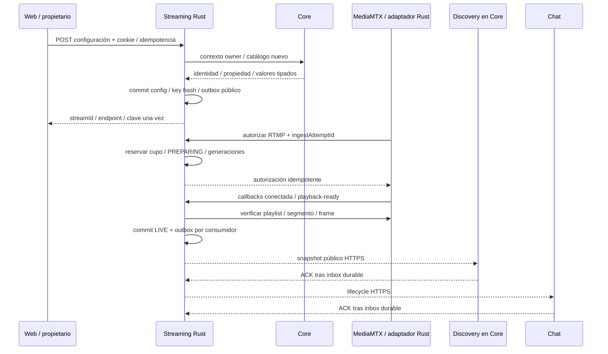
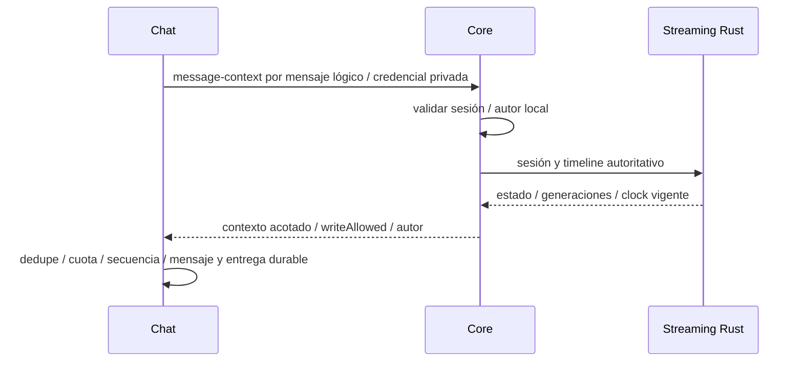

# Flujos de integración — arquitectura P1

**Arquitectura:** ADR-005. Core, Streaming Rust, Chat y Media cruzan contratos privados explícitos. Cuentas/Canales/Catálogo/Discovery permanecen locales en Core. Integración es trabajo de contratos, infraestructura y evidencia; no ejecuta workflows. La fuente semántica es [contratos](contratos_modelo_datos.md).

En P1 el adaptador Media comparte proceso con Streaming según ADR-011. Los contratos técnicos de autorización/callbacks se conservan en HTTP loopback autenticado en desarrollo y HTTPS con CA explícita en el perfil persistente ADR-014; MediaMTX sigue en otro contenedor. Fallo/reinicio del proceso Streaming afecta también autorización Media y HLS.

## A — Registro y canal inicial

Core confirma cuenta ACTIVE, perfil, canal y resultado idempotente en una transacción PostgreSQL. Rollback no publica parcialmente; respuesta perdida y misma clave recuperan IDs. Login es separado. El canal aparece desde commit, independientemente de eventos o disponibilidad Streaming.

## B — Configurar e iniciar emisión

LIVE no espera a Discovery ni Chat. Core no genera/recibe claves; Streaming conserva solo hash y las muestra una vez. Validación Core y commit Streaming no son transacción compartida: contextos nuevos, no cacheados, con presupuesto <=1 s. RTMP valida clave de configuración y cupo; no exige una sesión de navegador activa del encoder.

## C — Pérdida, gracia, retorno y stop

Streaming serializa callback/timer con SQL y clock monotónico owner. Una pérdida inicia una sola gracia de 30 s; sessionId/streamGeneration se conservan y reconexión crea sourceGeneration nueva. Playback probado antes del deadline gana; elapsed>=30 s, pérdida de owner/anchor o stop termina. ENDED invalida leases, congela timeline, libera cupo y guarda lifecycle/snapshot en outbox. El adaptador corta la fuente; callback tardío no reabre. P1 una réplica Streaming; failover requiere fencing/clock probado.

Canal muestra LIVE/reconectando y Discovery excluye lo no reproducible según snapshot/frescura. Chat permite escribir en gracia solo mediante contexto vigente, sin depender del atraso de eventos.

## D — Metadata y proyección Discovery

Streaming solicita contexto Core de identidad/owner y valores explícitos activos/tipados; PATCH confirma metadataVersion y snapshot público. Campos omitidos preservan asociaciones y último label tombstone. GraphQL Core combina la proyección con Cuentas/Canales/Catálogo locales; no accede a SQL Streaming ni hace HTTP por fila. Ranking/cursor/filtros se conservan.

Outbox/inbox idempotentes, projectionVersion y posición de commit evitan regresiones; estado/metadata/conteo deben ser visibles <=5 s en perfil normal. Edad del productor >5 s marca UNKNOWN/excluye PLAYABLE; conteo tiene freshness independiente. Snapshot paginado consistente con watermark y recepción durable concurrente permiten reconciliar/reconstruir. No rejuvenecer fecha al recibir un evento viejo. El player consulta Streaming autoritativo; proyección no es permiso.

## E — Chat y contexto autorizado

Chat conserva una llamada Core por mensaje nuevo; Core consulta Streaming dentro del presupuesto agregado <=400 ms. El intento de persistencia Chat exige <=500 ms desde iniciar el contexto, usando monotónico local; no es un deadline de commit físico Redis. Core caído invalida nuevos contextos; Streaming caído impide autorizar desde datos Discovery. Logout/ENDED rechazan la siguiente autorización; operaciones en vuelo ya autorizadas pueden confirmar dentro del presupuesto. Los eventos lifecycle llegan desde Streaming con producer=streaming y no conceden permiso. Snapshot de sala se delega a Streaming; historia conocida puede permanecer disponible en Chat.

## F — Player, leases y bootstrap canal

Core compone cuenta/perfil/canal localmente y solicita un batch público Streaming para bootstrap; conserva datos del canal con UNKNOWN si falla Streaming. Web obtiene playback/estado/timeline actual desde Streaming y HLS desde Media. Después de primer frame crea lease idempotente; heartbeat 10 s, expiración 30 s y cierre/ENDED inmediato. Conteo best-effort deriva de leases, no de Chat ni valores cliente. Snapshots agrupados se entregan a Discovery; no transportan tokens.

## Fallos y recuperación

| Fallo | Resultado esperado | Recuperación |
| --- | --- | --- |
| Core / PostgreSQL Core | Registro no publica parcial; comandos protegidos Streaming y nuevos contextos Chat fallan cerrados; HLS puede continuar | Readiness/reinicio, resultado idempotente y backup |
| Streaming / PostgreSQL Streaming | Nuevas ingestas/control/leases/contexto Chat no disponibles; Discovery degrada frescura | Persistencia, cierre sin nueva gracia, replay y reconciliación |
| Discovery / delivery de proyección | Búsqueda atrasada/UNKNOWN según edad; HLS/Chat no esperan al consumidor | Inbox/outbox por consumidor, DLQ, snapshot/watermark |
| Chat / su almacén | HLS continúa; sin ACK sin persistencia | Lifecycle/snapshot, dedupe e historial/entrega durable |
| Media | Sin LIVE ficticio; PREPARING/gracia/ENDED | Callbacks durables, retries/DLQ, generaciones y control de fuente |
| Imágenes / proxy | Error visible; referencia anterior conservada ante fallo archivo | Limpieza/compensación local y configuración observable |

No se promete aislamiento entre control Streaming y su adaptador Media, ni entre módulos dentro de Core ni disponibilidad indefinida de HLS sin control. Las capacidades de las otras iteraciones se priorizan según catálogo/fases futuras; no se implementan durante la integración P1.
