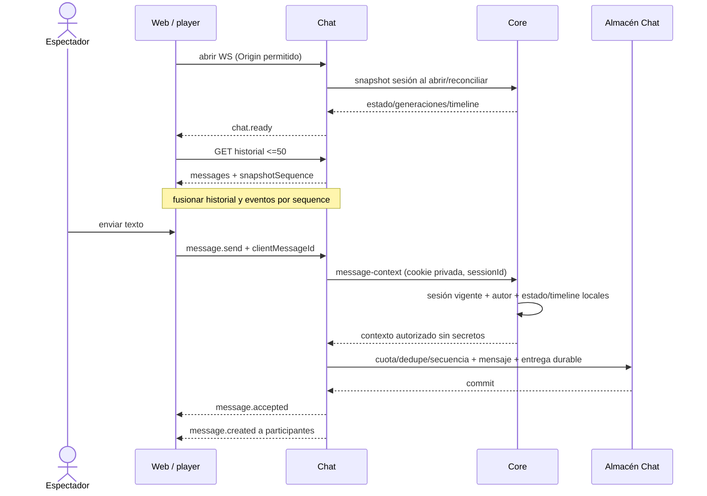

# Flujos de integración — arquitectura P1

**Arquitectura:** ADR-003.
Solo los cruces Core–Chat y Core–Media son integración de negocio por red. Dentro de Core se usan
interfaces locales/transacciones y consultas SQL revisadas. Integration no es una unidad de ejecución.
La fuente de schemas, cuotas, deadlines y errores es contratos_modelo_datos.md.

## A — registro y canal inicial, sin saga

```mermaid
sequenceDiagram
  actor U as Usuario
  participant W as Web
  participant C as Core: Cuentas / Canales
  participant DB as PostgreSQL Core
  U->>W: email, handle, password
  W->>C: POST registrations + Idempotency-Key
  C->>DB: BEGIN; unicidad y resultado por clave
  C->>DB: cuenta ACTIVE + perfil default + canal + operación
  alt commit
    DB-->>C: COMMIT
    C-->>W: 201 ACTIVE + IDs, sin sesión
    W-->>U: registro confirmado; login
  else error antes de commit
    DB-->>C: ROLLBACK completo
    C-->>W: error seguro y recuperable
  end
  Note over W,C: Respuesta perdida: repetir misma clave recupera resultado, sin duplicar
```

No PENDING nuevo, canal provisional, activación por evento ni compensación remota. Un registro no
crea sesión. GET de operación requiere la misma clave idempotente.

## B — configurar y comenzar emisión

```mermaid
sequenceDiagram
  actor S as Streamer
  participant W as Web
  participant C as Core: Cuentas / Canales / Catálogo / Emisiones
  participant M as Media + adaptador
  participant CH as Chat
  W->>C: POST configuración por channelId
  C->>C: sesión usuario, owner, IDs activos; transacción SQL
  C-->>W: streamId, RTMP endpoint y clave una vez
  S->>M: fuente RTMP con clave
  M->>C: autorizar ingest + ingestAttemptId
  C->>C: cupo 1/canal, 5 global; PREPARING; sessionId/generaciones
  C-->>M: resultado idempotente
  M->>C: source-connected + eventId
  M->>C: playback-ready + eventId/path
  C->>M: verificar playlist y segmento reproducibles
  C->>C: commit LIVE/PLAYABLE + outbox de sesión
  C-->>CH: dispatcher HTTPS session-events
  CH-->>C: ACK tras inbox durable
  W->>C: bootstrap local canal/stream
  C-->>W: estado/metadata/manifest vigentes
```

LIVE no espera a Chat ni a un índice Discovery. Estado/metadata/catálogo/owner están en una misma
base. PREPARING vence en 30 s; slots incluyen PREPARING/LIVE/gracia. Timeout callback y reentrega
conservan eventId; generación vieja no altera fuente vigente. No interpretar ACK como HLS probado.

## C — pérdida, gracia, retorno y finalización

Media informa source-lost; Emisiones persiste una sola pérdida/deadline e inicia gracia de 30 s.
Core controla el tiempo y serializa timer/callback, conservando sessionId/streamGeneration. Canal
muestra LIVE/reconectando, Discovery excluye del conjunto PLAYABLE y contexto Chat permite envío.
Recuperación con HLS verificado estrictamente antes de 30 s mantiene sesión. A 30 s o stop owner,
ENDED gana transición única; invalida leases, congela timeline y guarda evento Chat en outbox. Callback
tardío no reabre; fuente posterior crea sessionId nuevo/mayor generación.

P1 una réplica Core, no consenso distribuido ceremonial. Reinicio exige reconstruir tiempo restante
durable sin nueva gracia o finalizar; multi-réplica se habilita después de probar fencing/transferencia.
Un evento Chat atrasado no es permiso: autorización nueva consulta Core y ve ENDED inmediatamente.

## D — metadata, catálogo y búsqueda

Owner PATCH metadata → Core valida sesión/propiedad e IDs de catálogo locales → commit serializado de
campos presentes + metadataVersion → lecturas de canal/Discovery consultan ese commit. Omisión conserva
asociaciones luego inactivadas, edición explícita solo valores activos. Label tombstone conserva
metadata histórica. No cambio a sessionId/timeline ni replicación por StreamMetadataUpdated.

GraphQL Discovery ejecuta una consulta/read model SQL de Core, no lookup HTTP por fila. Canal OFFLINE
sigue apareciendo; títulos/filtros solo PLAYABLE. Viewer ranking deriva del conteo local de leases,
no de conexiones Chat. statusFresh representa evidencia de medio y viewerCountFresh observación de
conteo; si no se confirma PLAYABLE se excluye de streams, estado desconocido no se inventa OFFLINE.

## E — chat y autorización coherente



Una dependencia Core, sin introspección + Profile lookup separados ni muestras periódicas. Sin caché
de autorización para nuevos envíos. Logout/ENDED rechaza toda autorización posterior; operación en
vuelo ya autorizada puede confirmar dentro del presupuesto, sin atomicidad distribuida prometida.
Cuota y dedupe los resuelve Chat de forma consistente entre salas/réplicas. Una caída después de commit
antes del broadcast se recupera durablemente. Snapshot de autor no cambia al editar perfil.

## F — espectadores

Después del primer frame player crea lease de servidor con clave idempotente; token opaco solo header
ViewerLease al heartbeat/cierre. Heartbeat 10 s, vencimiento 30 s, cierre/ENDED inmediato. Conteo cliente
no aceptado. Métrica aproximada de popularidad, nunca permiso/pago ni prueba resistente a bots.
Consulta Discovery usa conteo vigente local con actualización/frescura <=5 s; sin evento de réplica.

## Fallos y recuperación reales

| Fallo | Comportamiento | Recuperación |
| --- | --- | --- |
| PostgreSQL/Core | APIs no disponibles; nuevos registros sin parcial, nuevas escrituras Chat/RTMP fallan cerradas | Restart/readiness + persistencia; replay idempotente de operaciones |
| Excepción en consulta Discovery | Error seguro de campo/endpoint; canal directo puede seguir si Core funciona | Aislar excepción/costo de consulta, sin afirmar otro proceso de Discovery |
| Chat/NoSQL | HLS continúa; UI deshabilita composer; no ACK sin persistencia | Estado de sala por snapshot/outbox; historial/ACK y entrega durable recuperados |
| Media | No LIVE ficticio; PREPARING/gracia/ENDED según evidencia | Callbacks ACK/dedupe/generación, retries/dead-letter operativa |
| Entrega Core→Chat | Estado de sala puede atrasarse; nuevo envío consulta Core y no abre ENDED | Outbox/inbox, backoff/alerta/dead-letter y snapshot; no bloquear LIVE |
| Archivo avatar/banner | No sustituir referencia/objeto anterior ante error | Compensación local de archivo/commit, limpieza periódica de huérfanos |
| Proxy | APIs no se vuelven HTML exitoso; WS falla visible | Health/upstream/correlación, configuración sin secretos |

No se declara aislamiento de caída para Profile/Taxonomy/Channels dentro de Core. Proceso Core caído
puede dejar HLS existente funcionando en Media, pero no hay garantía de permisos nuevos ni control
operativo indefinido. Los flujos futuros permanecen en fases_futuras.md con sus dueños iniciales.
