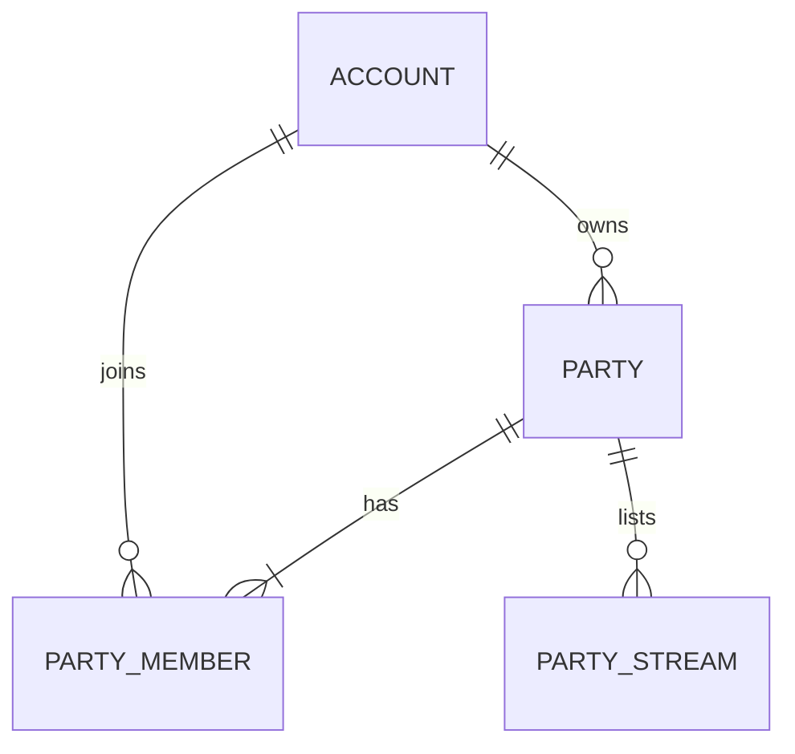

# SPEC-14 Watch Party

- **Módulo:** watch-party (Core)
- **Padre:** Ninguno
- **Prioridad:** Futuro (RF-046…RF-051); implementación anticipada por decisión del equipo del 2026-10-05

## 1. Contexto y problema

Define RF-046…RF-051: una sesión de visualización conjunta donde un usuario reúne varias transmisiones
activas, otros usuarios acceden y cada canal incluido se muestra con su información. El catálogo conserva
estos requisitos como Futuro; [fases futuras](../fases_futuras.md) los asigna a un módulo de Core y aclara
que RF-049 se cumple con varios reproductores, sin mezcla audiovisual. La decisión de ubicación y
alternativas está en [ADR-007](../adr/ADR-007-watch-party-en-core.md).

## 2. Estado del sistema y brecha

No existe implementación previa. Core ya ofrece sesión por cookie, CSRF, canales y perfiles públicos
(interfaces locales). Streaming Rust (PR #7, no integrado al momento de escribir esta SPEC) expone la lectura
pública `GET /api/streams/{streamId}`. Falta el módulo `watchparty` de Core, su esquema SQL y su contrato REST.
Premium (SPEC-16) aún no existe, por lo que «usuario autorizado» se resuelve en esta iteración como usuario con
sesión iniciada.

## 3. Historia de usuario

Como usuario con sesión, quiero crear una sesión de visualización conjunta con varias transmisiones en vivo
y compartir un código para que otros usuarios entren, para ver juntos a varios canales a la vez.

## 4. Alcance

### Dentro de esta iteración

- Crear, consultar y cerrar una sesión; el creador es su propietario y primer miembro.
- Agregar y retirar transmisiones (máximo 4) por parte del propietario.
- Entrar con un código de acceso opaco; rotar el código.
- Leer la sesión con el estado actual de cada transmisión y la información pública de su canal.

### Fuera de esta iteración

- Sincronización de reproducción, presencia, chat de grupo, invitaciones directas y notificaciones.
- Mezcla o transcodificación de video (RF-049 es un diseño multivideo en el cliente).
- Restricción por Premium, listado de «mis sesiones», expulsión de miembros y caducidad automática.
- Interfaz web (la consume el módulo Web cuando se asigne).

### Supuestos acordados (2026-10-05)

- D-01 Crea una sesión cualquier usuario con sesión iniciada.
- D-02 Máximo 4 transmisiones por sesión (la plataforma admite 5 emisiones simultáneas en total).
- D-03 Entrar requiere cuenta y el código de acceso; el código viaja en el enlace.
- D-04 Solo el propietario agrega/retira transmisiones, rota el código y cierra la sesión.
- D-05 Una transmisión que finaliza permanece en la sesión marcada como no disponible hasta que el propietario la retire.
- D-06 Solo se agregan transmisiones en vivo y reproducibles (`availability=PLAYABLE`) en ese momento.
- D-07 El propietario cierra la sesión; no caduca sola.

## 5. Requisitos funcionales

- **RF-046** — Cuando un usuario con sesión solicita crear una sesión con un título válido, el sistema debe crearla
  `OPEN`, hacer propietario y miembro al solicitante y entregar el código de acceso una sola vez.
- **RF-047** — Cuando el propietario agrega una transmisión, el sistema debe verificar con Streaming que está
  reproducible, que no está ya en la sesión y que no se supera el máximo, y debe asociarla a su canal.
- **RF-048** — Cuando el propietario retira una transmisión, el sistema debe quitarla de la sesión; repetir el
  retiro no falla.
- **RF-049** — Mientras un miembro lee la sesión, el sistema debe devolver todas sus transmisiones con su estado
  actual para mostrarlas simultáneamente. Si Streaming no responde, debe conservar la lista y marcar el estado
  como `UNKNOWN`.
- **RF-050** — Cuando un usuario con sesión presenta un código válido de una sesión `OPEN`, el sistema debe
  añadirlo como miembro (idempotente) y devolver la sesión.
- **RF-051** — El sistema debe incluir en cada transmisión la información pública de su canal (handle, nombre
  visible, avatar, descripción y portada) y la del propietario de la sesión, sin datos privados.

Reglas: título 1–100 puntos de código, recortado y sin caracteres de control. Cada sesión tiene a lo sumo 4
transmisiones, sin repetir `streamId`. Un no miembro no puede distinguir una sesión inexistente de una ajena
(`404`). Una sesión cerrada rechaza entrar y cualquier cambio (`409`).

## 6. Criterios de aceptación

- [ ] **CA-01 — Crear.** Dado un usuario con sesión, cuando crea con título «Final», entonces recibe `201`, estado
  `OPEN`, `isOwner=true`, `memberCount=1`, `maxStreams=4` y un `accessCode`; sin sesión recibe `401`; título vacío,
  de más de 100 puntos de código o con control recibe `400`.
- [ ] **CA-02 — Código una vez.** Dado el `accessCode` entregado, cuando se lee la sesión después, entonces
  `accessCode` es `null`; en base de datos solo existe su hash.
- [ ] **CA-03 — Agregar.** Dado el propietario y una transmisión `PLAYABLE`, cuando la agrega, entonces recibe `201`
  y la sesión la lista con su canal; ajeno recibe `404` y miembro no propietario `403`.
- [ ] **CA-04 — Tope y duplicado.** Dada una sesión con 4 transmisiones, cuando agrega otra, entonces `409
  WATCH_PARTY_FULL`; repetir un `streamId` da `409 STREAM_ALREADY_IN_PARTY`; con solicitudes concurrentes nunca
  hay más de 4.
- [ ] **CA-05 — No reproducible.** Dada una transmisión `OFFLINE`, `RECONNECTING` o inexistente, cuando se agrega,
  entonces `409 STREAM_NOT_LIVE` o `404 STREAM_NOT_FOUND`; con Streaming caído `503 STREAMING_UNAVAILABLE` y nada se
  guarda.
- [ ] **CA-06 — Retirar.** Dado el propietario, cuando retira una transmisión presente o ausente, entonces `200`
  y la sesión sin ella.
- [ ] **CA-07 — Entrar.** Dado un código válido y una sesión `OPEN`, cuando otro usuario con sesión entra, entonces
  `200` y `memberCount` sube una sola vez aunque repita; código desconocido `404`; sin sesión `401`.
- [ ] **CA-08 — Leer.** Dado un miembro, cuando lee la sesión, entonces ve título, estado de cada transmisión,
  `viewerCount` y datos públicos de cada canal y del propietario; un no miembro recibe `404`.
- [ ] **CA-09 — Degradación.** Dado Streaming sin respuesta, cuando un miembro lee, entonces recibe `200` con las
  transmisiones en `availability=UNKNOWN` y `statusFresh=false`, y los datos de canal intactos.
- [ ] **CA-10 — Finalizada.** Dada una transmisión que dejó de estar `PLAYABLE`, cuando se lee, entonces sigue en
  la lista con su disponibilidad actual hasta que el propietario la retire (D-05).
- [ ] **CA-11 — Rotar.** Dado el propietario, cuando rota el código, entonces el código anterior deja de entrar,
  el nuevo funciona y los miembros existentes conservan acceso.
- [ ] **CA-12 — Cerrar.** Dado el propietario, cuando cierra, entonces estado `CLOSED`; entrar, agregar, retirar y
  rotar dan `409 WATCH_PARTY_CLOSED`; cerrar de nuevo es idempotente; un miembro no propietario recibe `403`.
- [ ] **CA-13 — Privacidad.** Ninguna respuesta incluye email, credenciales, hash del código ni identidad de otros
  miembros; solo `memberCount`.
- [ ] **CA-14 — CSRF.** Toda mutación sin token CSRF válido recibe `403 CSRF_INVALID`.
- [ ] **CA-15 — Versión.** `partyVersion` inicia en 0 y sube uno por cada cambio efectivo de transmisiones, estado
  o código; las lecturas y los no-op no la incrementan.

## 7. Diseño técnico y datos

- **Ubicación arquitectónica:** módulo `watchparty` de Core (ADR-007). Sin runtime, base ni evento nuevos.
- **Propiedad de datos** (esquema `watchparty`, migración V5):

  `parties(party_id, owner_user_id, title, access_code_hash, status, party_version, created_at_utc, updated_at_utc,
  closed_at_utc)`; `party_members(party_id, user_id, joined_at_utc)`; `party_streams(party_id, stream_id,
  channel_id, added_at_utc)`. `stream_id`/`channel_id` son referencias opacas sin FK. IDs públicos `wp_<32 hex>`.
- **Interfaz backend** (JSON; cookie de sesión; mutaciones con `X-XSRF-TOKEN`):

| Método y ruta | Quién | Éxito | Errores |
| --- | --- | --- | --- |
| `GET /api/watch-parties/csrf` | cualquiera | 200 `{headerName,token}` | — |
| `POST /api/watch-parties` `{title}` | sesión | 201 sesión + `accessCode` | 400, 401 |
| `GET /api/watch-parties/{partyId}` | miembro | 200 sesión | 401, 404 |
| `POST /api/watch-parties/join` `{accessCode}` | sesión | 200 sesión | 400, 401, 404, 409 CLOSED |
| `POST /api/watch-parties/{partyId}/streams` `{streamId}` | propietario | 201 sesión | 400, 401, 403, 404, 409, 503 |
| `DELETE /api/watch-parties/{partyId}/streams/{streamId}` | propietario | 200 sesión | 401, 403, 404, 409 CLOSED |
| `POST /api/watch-parties/{partyId}/access-code/rotate` | propietario | 200 sesión + `accessCode` | 401, 403, 404, 409 CLOSED |
| `POST /api/watch-parties/{partyId}/close` | propietario | 200 sesión | 401, 403, 404 |

  Errores con el envelope común `{code,message,requestId,fieldErrors}`: `AUTH_REQUIRED`, `VALIDATION_ERROR`,
  `WATCH_PARTY_NOT_FOUND`, `WATCH_PARTY_FORBIDDEN`, `WATCH_PARTY_CLOSED`, `WATCH_PARTY_FULL`,
  `STREAM_ALREADY_IN_PARTY`, `STREAM_NOT_FOUND`, `STREAM_NOT_LIVE`, `STREAMING_UNAVAILABLE`.
- **Concurrencia:** las mutaciones bloquean la fila de la sesión (`FOR UPDATE`) dentro de la transacción, como
  Canales, para serializar el tope y los duplicados.
- **Frontend:** fuera de esta SPEC. Contrato para la UI: `maxStreams`, `isOwner`, estado por transmisión.
- **Proxy y despliegue:** `/api/watch-parties/*` → Core. Variable `WATCHPARTY_STREAMING_BASE_URL` (base HTTP
  de Streaming; por defecto `http://localhost:8080`) y timeouts de 1 s (conexión) y 2 s (lectura).
- **Tecnologías:** Java 25, Spring Boot, JDBC, Flyway, PostgreSQL 18 de Core; cliente HTTP del JDK.
  Selección propuesta en ADR-007.

## 8. Dependencias y contratos de integración

| Dependencia/consumidor | Propósito | Contrato o dato intercambiado | Modo de fallo |
| --- | --- | --- | --- |
| Cuentas (Core, local) | Sesión e identidad del solicitante | Interfaz local de introspección de sesión | Sin sesión: `401` |
| Canales/Perfil (Core, local) | Datos públicos de canal y propietario | `ChannelQueries` (lectura publicada) | Canal ausente: la transmisión se trata como no encontrada |
| Streaming Rust (HTTP) | Estado autoritativo de cada transmisión | `GET /api/streams/{streamId}`: `channelId`, `title`, `category`, `status`, `availability`, `statusFresh`, `viewerCount` | Agregar: `503`; leer: `UNKNOWN` |
| Premium (futuro) | Restringir quién crea o entra | Por definir en SPEC-16 | No aplica todavía |
| Web (futuro) | Mostrar varios reproductores | Esta SPEC | — |

## 9. Decisiones y preguntas abiertas

### Decisiones tomadas

- **D-01…D-07** — ver Supuestos acordados (2026-10-05).
- **D-08** — El código de acceso se guarda solo como SHA-256, se muestra una vez y se rota con un endpoint propio.
- **D-09** — La lectura de Streaming es pública y sin credenciales; no se usa su API privada.
- **D-10** — Sesión cerrada responde `409 WATCH_PARTY_CLOSED` de forma uniforme.

### Preguntas abiertas

- **P-01 — no bloqueante** — Límite de sesiones abiertas por usuario (hoy sin límite).
- **P-02 — no bloqueante** — Idempotencia de la creación con `Idempotency-Key` (hoy cada POST crea una sesión).
- **P-03 — no bloqueante** — Retiro automático al finalizar una transmisión; requiere eventos de Streaming.
- **P-04 — no bloqueante** — Prioridad del catálogo (hoy «Futuro») y condición Premium para crear.

## 10. Verificación

| RF/RNF | Prueba o inspección | Evidencia esperada |
| --- | --- | --- |
| RF-046, CA-01/02/15 | Unitarias de reglas y servicio; IT de creación y de hash en base | Resultado de la ejecución Maven |
| RF-047, CA-03/04/05 | IT con Streaming simulado, concurrencia sobre el tope de 4 | Idem |
| RF-048, CA-06 | IT de retiro idempotente | Idem |
| RF-049/051, CA-08/09/10/13 | IT de lectura con Streaming simulado, caído y finalizado; revisión de DTO | Idem |
| RF-050, CA-07/11/12 | IT de entrar, rotar y cerrar | Idem |
| RNF-027/028, CA-14 | IT de sesión, propietario/ajeno y CSRF | Idem |
| Migración V5 | IT de Flyway sobre una base V4 con datos | Idem |

Las pruebas con el servicio Streaming real quedan propuestas hasta integrar el PR #7.

## 11. Esfuerzo, riesgos y consecuencias

- **Esfuerzo:** M. Esquema, ocho operaciones, cliente HTTP a Streaming y pruebas de concurrencia.
- **Riesgos:** dependencia de la forma de `GET /api/streams/{streamId}` mientras el PR #7 no esté integrado;
  fan-out de hasta cuatro llamadas por lectura; sin retiro automático; números de migración compartidos con otros
  módulos Core.
- **Consecuencias:** Watch Party comparte disponibilidad con Core; la sincronización y las restricciones Premium
  se aplazan a otras SPEC.
